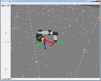

As you already know (since you've somehow reached this point), my name is Nick Rotella.  I'm a roboticist with formal backgrounds in mechanical engineering and computer science (and informal backgrounds in just about everything else, as robotics is an incredibly interdisciplinary field in which I wear many hats and many don't fit my head).

Just like everyone else, for years I've been meaning to start a blog to post ramblings and musings on topics which come up during the course of my work.  I did manage to document a lot of these explorations into robotics, controls, math and so on in my [PhD Notes](../download/NicholasRotellaPhDNotes.pdf){:target="_blank"}, but I've always thought a blog would be a better format to present information in bite-sized chunks so that it might actually prove useful to someone else.

Some posts will be new content, some pulled almost straight from my notes.  Others' blog posts on various topics related to my work in robotics helped me immensely during my PhD, so I hope I can contribute some knowledge which helps someone else in the same way!

{: .center-image height="400px" width="400px"}

I'm also planning on documenting my development of a [python-based robot simulator](https://github.com/nrotella/python-robot-sim){:target="_blank"} using [OpenGL](http://pyopengl.sourceforge.net/){:target="_blank"} and [Qt](https://riverbankcomputing.com/software/pyqt/intro){:target="_blank"} - I started this project recently to maintain (and even sharpen) my knowledge of articulated robotics since I'm no longer working in that area on a day-to-day basis.  The hope is to build up a dynamics simulator organically and document every step in order to demonstrate the challenges involved; once it reaches a certain point, I'll use it to teach concepts in articulated robotics (motion planning, inverse kinematics, inverse dynamics) - and hopefully, eventually, in humanoid robotics (floating base robot control, stability criteria, simplified model-based walking).

Stay tuned for some actual content!
