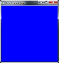
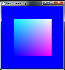
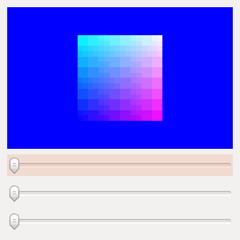
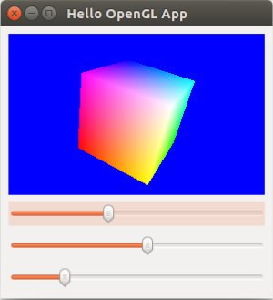

In this tutorial, we'll be writing a small python script which renders a cube in a GUI with a slider to control its rotation.  This will be based on other tutorials, namely [this one](http://www.koljakaehler.de/index.php/projects/14-tutorials/29-qt-and-opengl-programming-in-python){:target="blank_"} but with a bit more detail to explain the process and OpenGL concepts in general. You can download the full script [here](../download/HelloOpenGL.py).

* Table of contents:
{:toc}

# Setup

### PyQt4

There are a number of different frameworks for creating GUIs in python - the built-in option is [TkInter](https://docs.python.org/2/library/tkinter.html){:target="blank_"} which provides a wrapper around the cross-platform [Tk](https://www.tcl.tk/){:target="_blank"} GUI toolkit which has an easy learning curve and works well for small applications, however a popular modern cross-platform solution is [Qt](https://www.qt.io/){:target="_blank"}.

The python port of Qt is known as PyQt, and there are two recent versions - PyQt4 and PyQt5 - which can be installed in either python 2 or 3.  Since there already exist many tutorials using PyQt4, and since the core libraries appear to be much the same between versions, we'll use PyQt4.

This package can be installed in linux with

``` bash
apt-get install python-qt4
```

If you're using Windows, as for many other python packages you can install PyQt4 using ``` pip install ``` on the python wheel downloaded from the [Unofficial Windows Binaries for Python Extension Packages page](https://www.lfd.uci.edu/~gohlke/pythonlibs/#pyqt4){:target="blank_"}.  If you prefer to instead build from source, see [this guide](http://pyqt.sourceforge.net/Docs/PyQt4/installation.html){:target="blank_"}.

### PyOpenGL

There are also a number of different libraries for creating 3D graphics in python, however the most common cross-platform solution is OpenGL - specifically using the [PyOpenGL](http://pyopengl.sourceforge.net/){:target="_blank"} wrapper.  You should be able to install this easily with ```pip install pyopengl``` on linux or again using ```pip install``` on the wheel downloaded [here](https://www.lfd.uci.edu/~gohlke/pythonlibs/#pyopengl){:target="_blank"}.  On Ubuntu 16.04, I found that instead of '''pip''' I had to use

''' bash
apt-get install python-qt4-gl
'''

PyQt uses the same system install of PyOpenGL in its [QtOpenGL](http://pyqt.sourceforge.net/Docs/PyQt4/qtopengl.html){:target="_blank"} module to provide a special OpenGL QWidget which allows easy interfacing.  More on this below.

#### OpenGL Pipelines

Note that the OpenGL functionality we'll be using here is mostly part of the [Fixed Function Pipeline](https://www.khronos.org/opengl/wiki/Fixed_Function_Pipeline){:target="blank_"} and is actually deprecated past OpenGL 3.0 in favor of the use of the [Programmable (Shader-Based) Pipeline](https://www.khronos.org/opengl/wiki/Shader){:target="_blank"} which exploits modern GPU parallelism to render efficiently.  Unfortunately, most tutorials on the web use the deprecated pipeline, and it also happens to be the one I'm used to from working with older simulators.  I might try switching everything to so-called *modern OpenGL* later on, but for now [here's a good read](https://cyrille.rossant.net/shaders-opengl/){:target="_blank"} which explains the differences in simple terms.

### Python IDE

Before we dive into an example of using Qt + OpenGL to create a simple application, you might be wondering what tools to use for developing in python.  There are [many, many, many articles](https://www.google.com/search?q=best+python+ide&rlz=1C1GCEA_enUS780US780&oq=best+python+ide&aqs=chrome..69i57j0l5.2479j0j7&sourceid=chrome&ie=UTF-8){:target="_blank"} dedicated to this in far greater detail than I could ever provide, but I will say that good ol' Emacs can be made into [a great lightweight IDE](https://realpython.com/emacs-the-best-python-editor/){:target="blank_"} with some work (as all things involving Emacs require), with the upside that it integrates nicely into your workflow if you already use Emacs for everything else.

If you're transitioning to python from Matlab and looking for something similar, [Spyder](https://pythonhosted.org/spyder/installation.html){:target="blank_"} is a good choice and comes paired with other tools in a few python distributions.  Having developed in C/C++ using JetBrains' CLion, I've been tempted to try [PyCharm](https://www.jetbrains.com/pycharm/){:target="blank_"} which I've heard great things about (it's not free unless you're a student, though).

# Hello, OpenGL!

Now that we've touched on setup and choice of IDE, let's get started by importing the necessary modules and understanding what they each provide.

```python
from PyQt4 import QtCore      # core Qt functionality
from PyQt4 import QtGui       # extends QtCore with GUI functionality
from PyQt4 import QtOpenGL    # provides QGLWidget, a special OpenGL QWidget

import OpenGL.GL as gl        # python wrapping of OpenGL
from OpenGL import GLU        # OpenGL Utility Library, extends OpenGL functionality

import sys                    # we'll need this later to run our Qt application
```

Without turning this into an [intro to Qt tutorial](https://en.wikibooks.org/wiki/Python_Programming/PyQt4#Hello,_world!){:target="blank_"} (since we really want to focus on OpenGL integration for now), the main window of any application is defined by a class which derives from ```QtGui.QMainWindow```.  Let's create our main window class, and then give it a name and resize it in the initializer:

```python
class MainWindow(QtGui.QMainWindow):

    def __init__(self):
	QtGui.QMainWindow.__init__(self)    # call the init for the parent class

	self.resize(300, 300)
	self.setWindowTitle('Hello OpenGL App')


if __name__ == '__main__':

    app = QtGui.QApplication(sys.argv)

    win = MainWindow()
    win.show()

    sys.exit(app.exec_())
```

If you run everything thus far, a Qt window of the specified size with the name "Hello OpenGL App" should open and be exitable.  How exciting! But how do we render something in that window using OpenGL?  That's where the ```QGLWidget``` comes in.

### QGLWidget

The [QGLWidget](http://doc.qt.io/qt-5/qglwidget.html#details){:target="blank_"} is a Qt widget designed for easily rendering graphics using OpenGL.  We achieve this by subclassing QGLWidget and implementing three provided virtual functions which automatically get called by Qt when necessary:

- ```initializeGL```: Called once to set up the OpenGL rendering context before resize or paint are ever called
- ```resizeGL```: Called once when the window is created and whenever the window is resized to set up the OpenGL viewport and projection
- ```paintGL```: Called when the widget is updated in order to render the scene

Let's subclass QGLWidget and start filling these functions in.

```python
class GLWidget(QtOpenGL.QGLWidget):
    def __init__(self, parent=None):
	self.parent = parent
	QtOpenGL.QGLWidget.__init__(self, parent)
```

In the initializer of our derived class, we call the initializer of the parent ```GLWidget``` class.

```python
    def initializeGL(self):
	self.qglClearColor(QtGui.QColor(0, 0, 255))    # initialize the screen to blue
	gl.glEnable(gl.GL_DEPTH_TEST)                  # enable depth testing
```

[Depth testing](https://learnopengl.com/Advanced-OpenGL/Depth-testing){:target="_blank"} is enabled in the initialize function to cause OpenGL to automatically ensure that "fragments" are rendered properly based on their values in the depth buffer.

```python
    def resizeGL(self, width, height):
	gl.glViewport(0, 0, width, height)
	gl.glMatrixMode(gl.GL_PROJECTION)
	gl.glLoadIdentity()
	aspect = width / float(height)

	GLU.gluPerspective(45.0, aspect, 1.0, 100.0)
	gl.glMatrixMode(gl.GL_MODELVIEW)
```

The ```resizeGL``` function has a bit more setup happening.  First, ```glViewport(x,y,width,height)``` specifies which portion of the window is used for drawing, and is usually set to use the full width and height of the window (which are passed in to ```resizeGL```).

Next, ```glMatrixMode(mode)``` sets the active [matrix stack](https://www.glprogramming.com/red/chapter03.html#name6){:target="blank_"} to the projection stack, which contains the projection transformation used to define the viewing volume.  To define this transformation, we first load the identity matrix to the projection stack with ```glLoadIdentity()``` and then define the [viewing frustrum](https://en.wikipedia.org/wiki/Viewing_frustum){:target="blank_"} with ```gluPerspective(field_of_view, aspect_ratio, z_near, z_far)```:

{: .center-image height="400px" width="400px"}

The viewing volume created by a perspective projection is called a frustrum as shown above; the vertical field of view (FOV) is directly specified in the first argument while the horizontal FOV is defined from the vertical FOV and aspect ratio, and the near and far clipping planes are also inputs.

There is a more general function ```glFrustum``` which can be used to create off-axis perspective projections (indeed, ```gluPerspective``` calls ```glFrustrum``` under the hood).  We could alternatively define the viewing volume using ```glOrtho``` to use an orthographic projection.  This creates a viewing volume which is a rectangular prism and unrealistically causes objects of the same height located at different depths (z-values) to be drawn the same size.  We'll stick with a perspective projection here.

{: .center-image height="400px" width="400px"}

Finally, we set the matrix mode back to ```GL_MODELVIEW``` which is used for all subsequent camera and model transformations.  In general, we should never use ```GL_PROJECTION``` except to define the viewing volume.


```python
    def paintGL(self):
	gl.glClear(gl.GL_COLOR_BUFFER_BIT | gl.GL_DEPTH_BUFFER_BIT)

	# Add rendering code here!
```

The final ```GLWidget``` virtual function to be implemented is ```paintGL```, which is where we'll do all of our rendering.  For now, all we're doing is some pre-rendering housekeeping using ```glClear(bitmask)``` with a bitwise OR of masks which tell OpenGL which buffers to clear.  We clear the color and depth buffers to start our render step from a clean slate each time.

Let's use our newly-completed ```GLWidget``` class by creating an object and setting it as the central widget for our ```MainWindow``` as below.

```python
class MainWindow(QtGui.QMainWindow):

    def __init__(self):
	QtGui.QMainWindow.__init__(self)    # call the init for the parent class

	self.resize(300, 300)
	self.setWindowTitle('Hello OpenGL App')

	glWidget = GLWidget(self)
	self.setCentralWidget(glWidget)
```

All ```QMainWindow``` objects must have a central widget, onto which [other widgets can be docked](http://doc.qt.io/archives/qt-4.8/qt4-mainwindow.html){:target="blank_"}.  Run everything we've written so far and you should see a blank blue window instead of a blank black window, since we used OpenGL to set the color in ```initializeGL```.

{: .center-image height="300px" width="300px"}

Hooray! Let's do something more interesting now that we have our ```GLWidget``` set up.

### Defining Geometry

#### Immediate versus Retained Mode

As far as rendering simple geometry is concerned, there are two modes.  Immediate mode consists of sandwiching drawing commands between ```glBegin``` and ```glEnd``` commands, resulting in poor performance because the GPU must wait for ```glEnd``` and then render immediately.  Retained mode is the modern approach; instead of calls to render immediately each cycle, geometry is defined using so-called *vertex buffer objects (VBOs)* which are sent to and stored on the GPU for rendering.  Unless the VBO needs to be updated, subsequent renderings require no communication between CPU and GPU because the VBO data is stored on the graphics hardware.

### Defining a Cube using VBOs

First, we'll import the VBO class provided by the python OpenGL package, as well as ```numpy``` for general arrays:

```python
from OpenGL.arrays import vbo
import numpy as np
```

Now we're ready to define the geometry of the cube we're drawing.  Let's add a new function to our ```GLWidget``` class called ```initGeometry``` which is where we'll define the cube.

```python
    def initGeometry(self):
	self.cubeVtxArray = np.array(
	    [[0.0, 0.0, 0.0],
	     [1.0, 0.0, 0.0],
	     [1.0, 1.0, 0.0],
	     [0.0, 1.0, 0.0],
	     [0.0, 0.0, 1.0],
	     [1.0, 0.0, 1.0],
	     [1.0, 1.0, 1.0],
	     [0.0, 1.0, 1.0]])
	self.vertVBO = vbo.VBO(np.reshape(self.cubeVtxArray,
					  (1, -1)).astype(np.float32))
	self.vertVBO.bind()
```

First, define the cube vertex positions centered at the origin as a 2D numpy array.  Then, create the vertex position VBO ```vertVBO```, taking care to [reshape](https://docs.scipy.org/doc/numpy/reference/generated/numpy.reshape.html){:target="_blank"} the numpy array to 1D and cast the array elements to ```np.float32``` since OpenGL expects floats (not doubles, which are python's default).  Finally, bind the VBO for use by the GPU.

```python
	self.cubeClrArray = np.array(
	    [[0.0, 0.0, 0.0],
	     [1.0, 0.0, 0.0],
	     [1.0, 1.0, 0.0],
	     [0.0, 1.0, 0.0],
	     [0.0, 0.0, 1.0],
	     [1.0, 0.0, 1.0],
	     [1.0, 1.0, 1.0],
	     [0.0, 1.0, 1.0 ]])
	self.colorVBO = vbo.VBO(np.reshape(self.cubeClrArray,
					   (1, -1)).astype(np.float32))
	self.colorVBO.bind()
```

We create a second VBO to store the color per vertex, which is set arbitrarily to be the same as the vertex positions.  OpenGL will use these vertex colors to color the cube faces with a nice gradient.  Note that we don't actually need a completely new VBO for colors; instead, we could store vertex position and color data in the same VBO by interlacing rows and specifying a *stride* (number of bytes between successive vertex or color data values) when rendering.

```python
	self.cubeIdxArray = np.array(
	    [0, 1, 2, 3,
	     3, 2, 6, 7,
	     1, 0, 4, 5,
	     2, 1, 5, 6,
	     0, 3, 7, 4,
	     7, 6, 5, 4 ])
```

Finally, we specify the vertices which compose each of the six cube faces in a 1D array. All of this geometry setup should get called in ```initializeGL```, which we modfy as

```python
    def initializeGL(self):
    	self.qglClearColor(QtGui.QColor(0, 0, 255))    # initialize the screen to blue
	gl.glEnable(gl.GL_DEPTH_TEST)                  # enable depth testing

	self.initGeometry()
```

### Rendering the Cube

To render the cube, we need to add code to the ```paintGL``` function.  Update it to the following:

```python
    def paintGL(self):
	gl.glClear(gl.GL_COLOR_BUFFER_BIT | gl.GL_DEPTH_BUFFER_BIT)

	gl.glPushMatrix()    # push the current matrix to the current stack

	gl.glTranslate(0.0, 0.0, -50.0)    # third, translate cube to specified depth
	gl.glScale(20.0, 20.0, 20.0)       # second, scale cube
	gl.glTranslate(-0.5, -0.5, -0.5)   # first, translate cube center to origin

	gl.glEnableClientState(gl.GL_VERTEX_ARRAY)
	gl.glEnableClientState(gl.GL_COLOR_ARRAY)

	gl.glVertexPointer(3, gl.GL_FLOAT, 0, self.vertVBO)
	gl.glColorPointer(3, gl.GL_FLOAT, 0, self.colorVBO)

	gl.glDrawElements(gl.GL_QUADS, len(self.cubeIdxArray), gl.GL_UNSIGNED_INT, self.cubeIdxArray)

	gl.glDisableClientState(gl.GL_VERTEX_ARRAY)
	gl.glDisableClientState(gl.GL_COLOR_ARRAY)

	gl.glPopMatrix()    # restore the previous modelview matrix
```

Let's take a look at the new calls, step-by-step:

```python
	gl.glPushMatrix()    # push the current matrix to the current stack

	gl.glTranslate(0.0, 0.0, -50.0)    # third, translate cube to specified depth
	gl.glScale(20.0, 20.0, 20.0)       # second, scale cube
	gl.glTranslate(-0.5, -0.5, -0.5)   # first, translate cube center to origin
```

First, we use ```glPushMatrix()``` to copy the current transformation matrix (since we haven't done anything else, it's the identity) and push it to the current matrix stack (recall this was set to ```GL_MODELVIEW``` after we set up the scene projection).  Then, we apply a series of transformations, building them up *in reverse order* - so we translate the cube center to the origin (this is necessary before scaling or rotating), then scale the cube, then translate it to a large depth so that we can actually see it.

But wait... where is the cube being rendered? Well, we haven't actually rendered anything yet - we're just setting up the transformation which will be applied to the cube, which is rendered with:

```python

	gl.glEnableClientState(gl.GL_VERTEX_ARRAY)
	gl.glEnableClientState(gl.GL_COLOR_ARRAY)

	gl.glVertexPointer(3, gl.GL_FLOAT, 0, self.vertVBO)
	gl.glColorPointer(3, gl.GL_FLOAT, 0, self.colorVBO)

	gl.glDrawElements(gl.GL_QUADS,
			  len(self.cubeIdxArray),
			  gl.GL_UNSIGNED_INT,
			  self.cubeIdxArray)

	gl.glDisableClientState(gl.GL_VERTEX_ARRAY)
	gl.glDisableClientState(gl.GL_COLOR_ARRAY)

	gl.glPopMatrix()    # restore the previous modelview matrix
```

To render the cube, we first enable the vertex and color arrays and then set the pointers to the vertex position and color arrays we created earlier using ```glVertexPointer(size, type, stride, pointer)``` and ```glColorPointer(size, type, stride, pointer)``` so the GPU can access the data.

We then call ```glDrawElements(mode, count, type, indices)``` to render the cube faces as ```GL_QUADS``` using the face indices specified in the ```cubeIdxArray```.  Alternatively, we could have defined the faces directly in the vertex VBO and used ```glDrawArrays``` instead, but this would require duplicate vertices being sent to the GPU.  Using ```glDrawElements``` with an index list is more efficient in such cases.

Finally, we disable the enabled client states (just to be safe) and then pop the current matrix from the modelview stack, resetting the top of the stack to the identity transformation.

#### The Render Loop

Putting it all together yields... nothing!  We have all the code in place, but ```paintGL``` is never actually called.  It's up to us to decide when/how often to render; the simplest way is to set up a timer with ```updateGL``` as a callback (which calls ```paintGL``` automatically) so that rendering happens periodically.  Update the ```MainWindow``` class as follows:

```python
class MainWindow(QtGui.QMainWindow):

    def __init__(self):
	QtGui.QMainWindow.__init__(self)

	self.resize(300, 300)
	self.setWindowTitle('Hello OpenGL App')

	glWidget = GLWidget(self)
	self.setCentralWidget(glWidget)

	timer = QtCore.QTimer(self)
	timer.setInterval(20)   # period, in milliseconds
	timer.timeout.connect(glWidget.updateGL)
	timer.start()
```

We've created a ```QTimer``` object and set it to emit a *signal* every 20 milliseconds (50 Hz) and connect the signal to the *slot* (function) ```updateGL``` provided by the base class which ```GLWidget``` was derived from.  We'll make use of Qt's signals and slots a lot more when we start adding sliders and other GUI elements.

### Adding Rotation Sliders

{: .center-image height="300px" width="300px"}

We now have a cube rendered in our application! Let's add a slider to change its orientation so that we can actually see that it's three-dimensional.  This involves modifying the  ```MainWindow``` class, where we set up the GUI structure.  Note that creating more sophisticated GUIs may necessitate a design tool such as QtCreator (for C++ applications), but for simple GUIs we can add elements manually.

```python
class MainWindow(QtGui.QMainWindow):

    def __init__(self):
        QtGui.QMainWindow.__init__(self)    # call the init for the parent class
        
        self.resize(300, 300)
        self.setWindowTitle('Hello OpenGL App')

        self.glWidget = GLWidget(self)
	self.initGUI()
        
        timer = QtCore.QTimer(self)
        timer.setInterval(20)   # period, in milliseconds
        timer.timeout.connect(self.glWidget.updateGL)
        timer.start()
        
    def initGUI(self):
        central_widget = QtGui.QWidget()
        gui_layout = QtGui.QVBoxLayout()
        central_widget.setLayout(gui_layout)

        self.setCentralWidget(central_widget)

        gui_layout.addWidget(self.glWidget)

        sliderX = QtGui.QSlider(QtCore.Qt.Horizontal)
        sliderX.valueChanged.connect(lambda val: self.glWidget.setRotX(val))

        sliderY = QtGui.QSlider(QtCore.Qt.Horizontal)
        sliderY.valueChanged.connect(lambda val: self.glWidget.setRotY(val))

        sliderZ = QtGui.QSlider(QtCore.Qt.Horizontal)
        sliderZ.valueChanged.connect(lambda val: self.glWidget.setRotZ(val))
        
        gui_layout.addWidget(sliderX)
        gui_layout.addWidget(sliderY)
        gui_layout.addWidget(sliderZ)
```

We've added a new ```initGUI``` function which gets called in place of the original call to set ```glWidget``` as the central widget for the application.  This function encapsulates all GUI layout setup; let's go through it step-by-step.

```python
    def initGUI(self):
        central_widget = QtGui.QWidget()
        gui_layout = QtGui.QVBoxLayout()
        central_widget.setLayout(gui_layout)

	self.setCentralWidget(central_widget)
```

We can structure our Qt GUI by first defining a new central widget, creating a layout for this widget which defines how widgets added to it will be organized (stacked vertically, since we use ```QVBoxLayout```), and then setting the layout for the central widget.  Finally, we set the new widget as the central widget of the ```MainWindow``` class.

```python
        gui_layout.addWidget(self.glWidget)

        sliderX = QtGui.QSlider(QtCore.Qt.Horizontal)
        sliderX.valueChanged.connect(lambda val: self.glWidget.setRotX(val))

        sliderY = QtGui.QSlider(QtCore.Qt.Horizontal)
        sliderY.valueChanged.connect(lambda val: self.glWidget.setRotY(val))

        sliderZ = QtGui.QSlider(QtCore.Qt.Horizontal)
        sliderZ.valueChanged.connect(lambda val: self.glWidget.setRotZ(val))
        
        gui_layout.addWidget(sliderX)
        gui_layout.addWidget(sliderY)
        gui_layout.addWidget(sliderZ)
```

Next, we add widgets to the layout of the central widget, starting with ```glWidget``` on top and then three ```QSlider``` widgets below it.  We connect the ```valueChanged``` signal of each slider to a corresponding slot function which captures the slider value ```val``` and sets the rotation of the cube around an axis.

We add the rotation angles as ```glWidget``` attributes to the ```initializeGL``` function:

```python
    def initializeGL(self):
        self.qglClearColor(QtGui.QColor(0, 0, 255))    # initialize the screen to blue
        gl.glEnable(gl.GL_DEPTH_TEST)                  # enable depth testing

        self.initGeometry()

        self.rotX = 0.0
        self.rotY = 0.0
        self.rotZ = 0.0
```

which get updated from the sliders using the aforementioned setters


```python
    def setRotX(self, val):
        self.rotX = val

    def setRotY(self, val):
        self.rotY = val

    def setRotZ(self, val):
        self.rotZ = val
```

and then update the ```paintGL``` rendering code to use these angles to perform successive rotations of the cube around local axes (we'll go into rotations more in future posts, but the format is axis-angle):

```python
        gl.glTranslate(0.0, 0.0, -50.0)    # third, translate cube to specified depth
        gl.glScale(20.0, 20.0, 20.0)       # second, scale cube
        gl.glRotate(self.rotX, 1.0, 0.0, 0.0)
        gl.glRotate(self.rotY, 0.0, 1.0, 0.0)
        gl.glRotate(self.rotZ, 0.0, 0.0, 1.0)
        gl.glTranslate(-0.5, -0.5, -0.5)   # first, translate cube center to origin
```

The result is the same rendered cube, but with three sliders below it that allow us to rotate it.  You should see something almost, but not quite, entirely unlike the cube below.

{: .center-image height="300px" width="300px"}

Wondering why my cube looks so awful? I used [this nifty tool](https://askubuntu.com/a/201018){:target="_blank"} to record my screen directly to a GIF, and the GIF format has an extremely limited color palette (8 bits, so 256 colors) which is very obvious when trying to display a cube with a bunch of color gradients.  I promise yours will look nicer!

{: .center-image height="300px" width="300px"}

You can download the full script [here](../download/HelloOpenGL.py).
