It's quite a while since I last posted anything, so what better way to break the silence than by documenting one of my favorite Italian-American treats - *struffoli*, or as we southern Italians displaced a few thousand miles and several generations endearingly call them, honeyballs.

It wasn't my intent to use this blog for personal posts, however each passing year of digging out the oil-stained scrap of paper containing the cherished family recipe has led to unavoidable wear and tear.  With the recipe and process digitized, we can now realize sticky fried dough balls from anywhere on Earth, for all of eternity. We are truly living in the future.

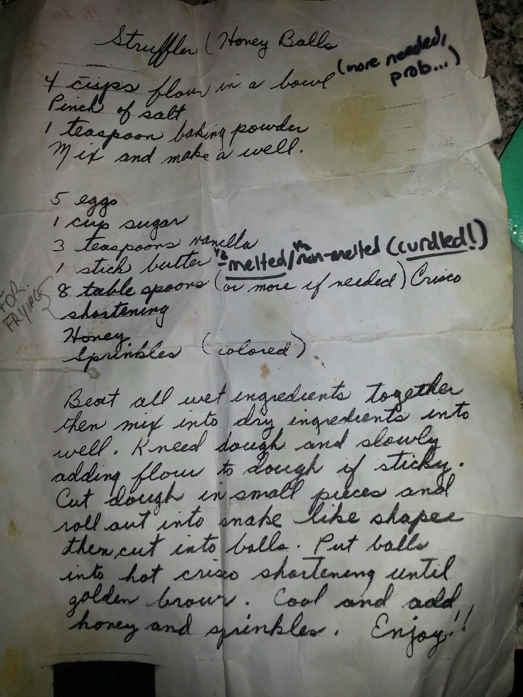{: .center-image height="400px" width="400px"}

Don't you hate how modern recipe sites start with twenty paragraphs of backstory?  Without further ado, here's what you'll need.

# Honeyballs
Prep Time: 15min

Frying Time: \>1hr (this will vary a lot depending on whether anyone likes you, or honeyballs, enough to help out)

Finishing Time: 10min

**Total Time: 1.5-2hr**

## Ingredients

### Dry
- 4 cups flour
- 1 tsp baking power
- pinch of salt

### Wet
- 5 eggs
- 1 cup sugar
- 3 tsp vanilla
- 8 tbsp (one full stick) butter, melted

### Frying
- Vegetable oil (enough to fill the bottom of a small pan or pot an inch)
- A metal, slotted spoon
- Paper towels (for soaking up excess oil)

### Finishing
- Honey (up to you how much, probably a cup or two)
- Small [nonpareils](https://en.wikipedia.org/wiki/Nonpareils) (sprinkles)
- Zest of one orange

## Instructions

### Making the dough

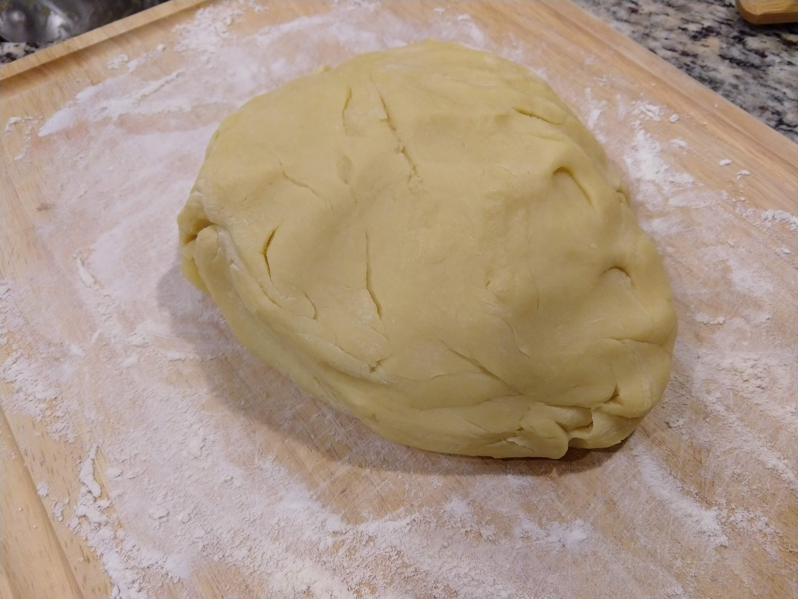{: .center-image height="400px" width="400px"}

First, mix all dry ingredients together in a large bowl. Then, mix wet ingredients together in a separate, smaller bowl.

Pour wet into dry and mix until a dough forms; knead on a floured work surface, adding flour as needed.  The dough should be a little sticky, but you'll probably need an extra half a cup of flour to get it to a point where it's dry enough to shape.

### Frying Setup

Again, this is a very simple recipe - why are these things so expensive in Italian bakeries, then?  The frying step is extremely tedious, especially without a deep fryer.  I'd suggest taking a moment to set up your work area as follows.  From left to right: dough prep area, frying pan, and plate lined with paper towels.

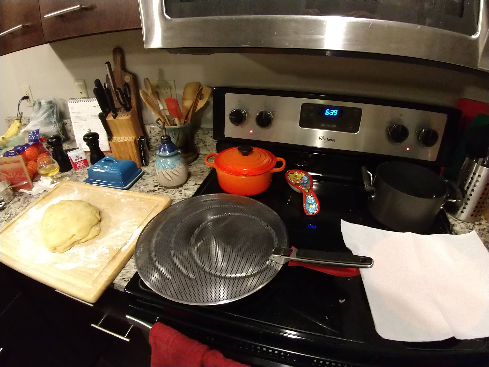{: .center-image height="400px" width="400px"}

Put a pot or deep pan - I strongly recommend a cast iron pan if you have one - on a small burner over medium heat and fill it about 1 inch with vegetable oil. A splashguard for the oil is not necessary (if the oil is spitting, it's probably way too hot) but it's good to have around just in case.  While the oil heats up, get a head start on rolling balls of dough for frying.

### Rolling One Million Tiny Balls of Dough

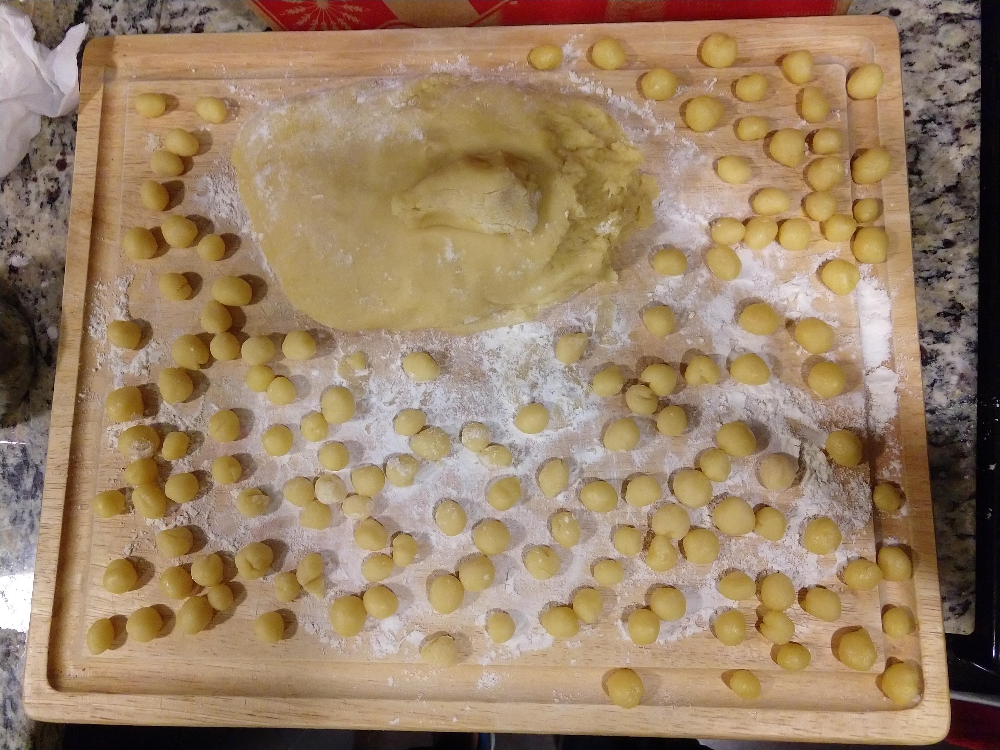{: .center-image height="400px" width="400px"}

Maybe not a million, but it will certainly feel like it after a while. If you have limited time, you might consider halving the dough, wrapping one piece in plastic wrap and storing it in the fridge for a few days.  You could probably freeze it, but I haven't tried.

The size of the balls is entirely up to you - smaller ones will end up a little crunchier, while larger ones will be more cake-y (store-bought ones tend to be larger and even somewhat air-y).  The "correct" size can lead to heated debates during the holidays, but I personally prefer them crunchier.  I try to keep them smaller than a dime on average, but variety is what makes life interesting, so I never try too hard.  Besides, it's usually a rush to the finish; quality control on size is not a priority here.

"){: .center-image height="400px" width="400px"}

### Frying

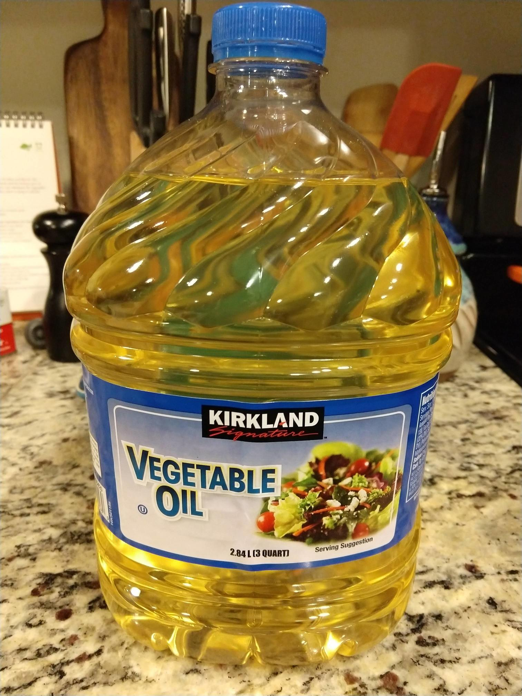{: .center-image height="300px" width="300px"}

After a few minutes of heating, try dropping a ball of dough in the oil.  If it starts to bubble vigorously, you're set.  If your oil is too hot, you'll end up burning the outside and leaving the inside undercooked; too cool, and you'll absorb oil and give them a funky taste.  I had a cooking time of about **one minute** (maybe someday I'll act like a real scientist and buy a thermometer).

{: .center-image height="600px" width="600px"}

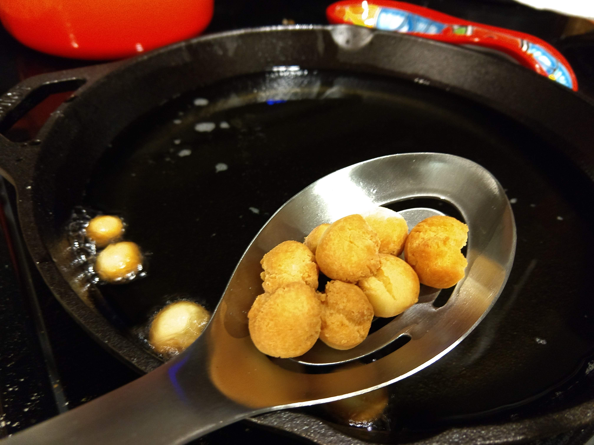{: .center-image height="600px" width="600px"}

Fry until light golden brown (darker if you're encouraging crispiness).  I always find myself needing to lower the temperature a bit halfway through. Use the metal slotted spoon to remove the dough once it fries, shaking off excess oil and transferring to the paper towls.  Keep a bowl nearby to transfer cooled balls from the paper towel when the plate fills up.

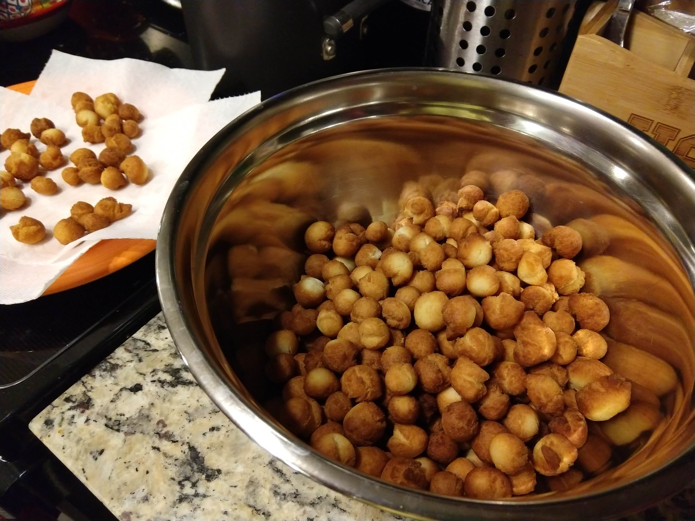{: .center-image height="400px" width="400px"}

You can use a metal slotted spoon to drop the dough balls in many at a time, then stir the oil to break them apart.  You can fit quite a lot in the pan at once, however note that once your oil starts to bubble (see below) you might want to replace it for better results if you still have many to fry.

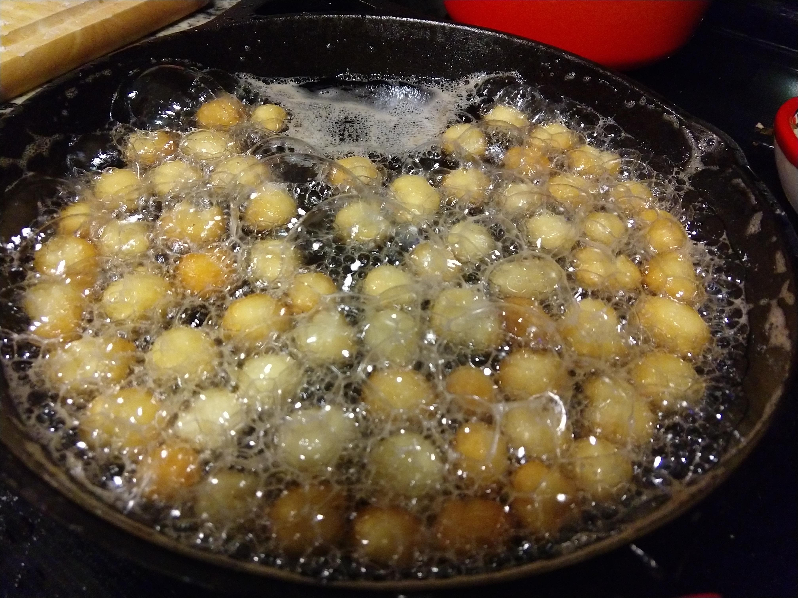{: .center-image height="400px" width="400px"}

### Finishing

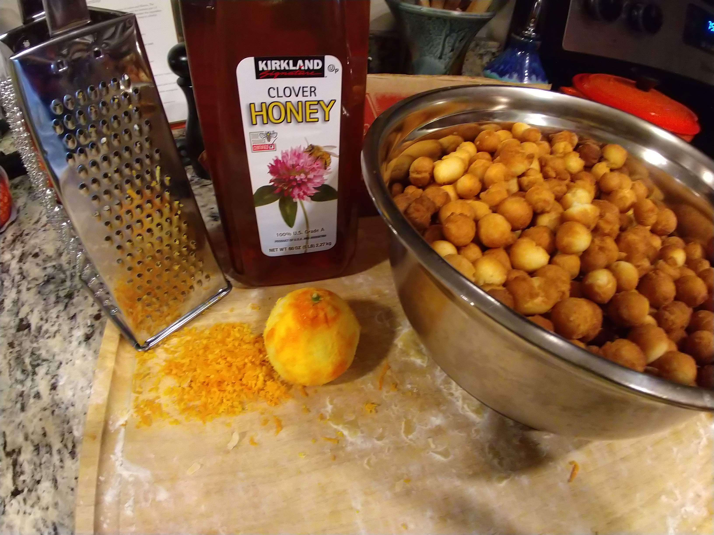{: .center-image height="400px" width="400px"}

Now that you have a huge bowl of tiny fried doughnuts and your entire home smells like a grease trap, you're ready to finish the honeyballs.  First, zest an orange (or tangerine or clementine) with a zester or grater.  Heat about a cup of honey in a small pot over low heat and add some of the zest, stirring as the honey warms up.

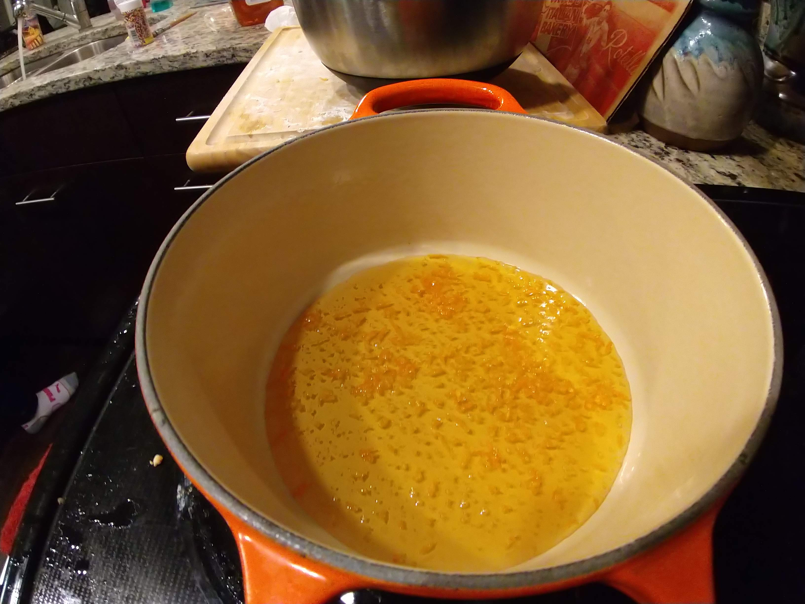{: .center-image height="400px" width="400px"}

Once the honey gets thin and starts to bubble, add a big scoop of fried dough balls to the pot and stir to coat them completely.  Use a slotted spoon to lift the coated balls out, shaking excess honey back into the pot.

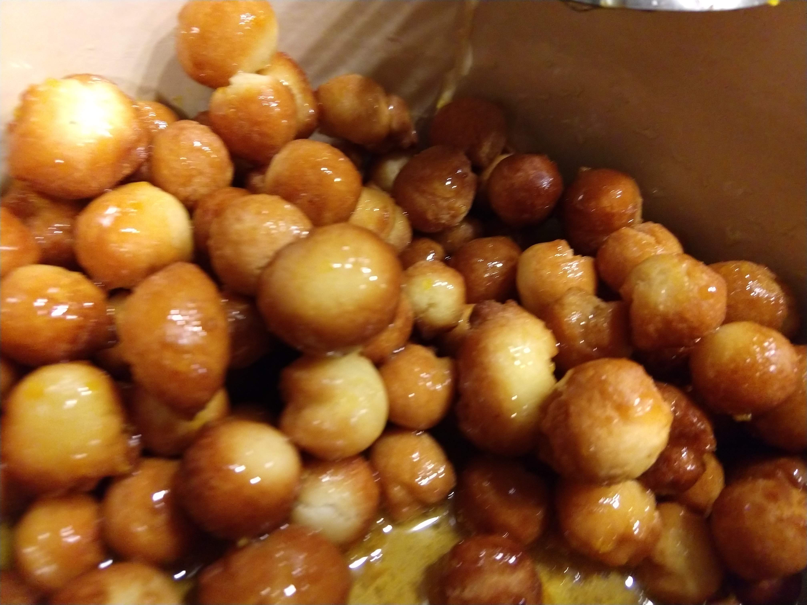{: .center-image height="400px" width="400px"}

Pile the coated honeyballs onto a serving platter, generously cover in sprinkles and add more balls (and honey and zest if needed) to the pot and repeat.  Soon you'll have an enormous pile of delicious honeyballs and will be begging your family and friends to take some!

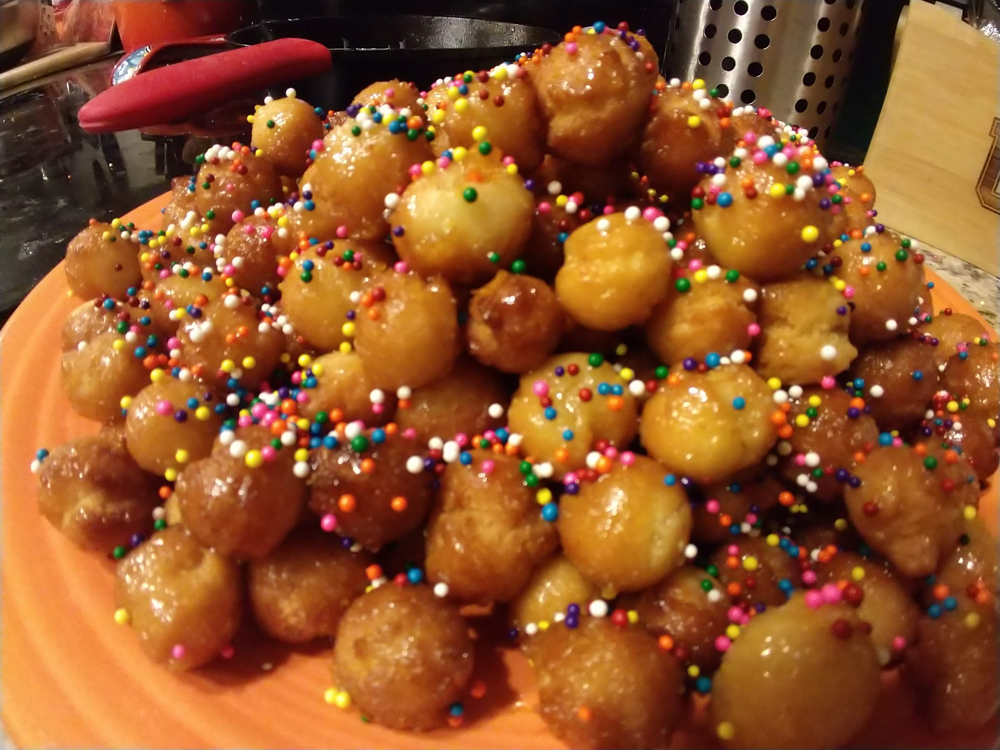{: .center-image height="400px" width="400px"}

