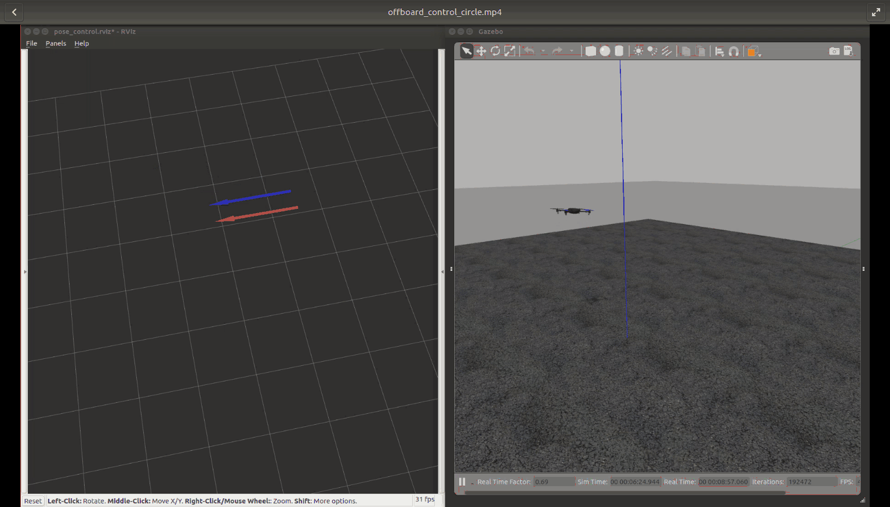

[PX4](https://px4.io/), along with others such as [ArduPilot](http://ardupilot.org/) and the [DJI SDK](https://developer.dji.com/) (which is only partially open-source), is one of the most popular full-stack solutions for UAV control.  The goal of this post is to document some of the basic setup and use information, mostly for myself to refer to later on when digging deeper into the control architecture.

# Setting up PX4 + ROS + Gazebo

We follow the instructions on the page [linux PX4 toolchain installation](https://dev.px4.io/en/setup/dev_env_linux.html) for "Gazebo with ROS."

## Easy Install

The provided script [ubuntu_sim_ros_gazebo.sh](https://raw.githubusercontent.com/PX4/Devguide/master/build_scripts/ubuntu_sim_ros_gazebo.sh):

* Installs ROS Kinetic (which includes Gazebo 7)
* Installs MAVROS
* Installs other dependencies
* Creates and builds a catkin workspace

This "easy install" script assumes that the user is starting from a fresh installation of Ubuntu 16.04 (without ROS, Gazebo, or a catkin workspace).  If you already have a catkin workspace set up, I recommend moving your existing workspace to a backup folder and running the script, then moving your other packages into the new catkin workspace.  One complication is that the catkin workspace created in this installation uses the ```catkin_tools``` build tool while you may be using ```catkin_make``` in your existing workspace.  See [this page](https://catkin-tools.readthedocs.io/en/latest/migration.html) for details on the two tools and how to migrate to ```catkin_tools```, which is preferred.

```sh
cd /tmp # or anywhere else
wget https://raw.githubusercontent.com/PX4/Devguide/master/build_scripts/ubuntu_sim_ros_gazebo.sh
source ubuntu_sim_ros_gazebo.sh
```

You should now have a catkin workspace at ```~/catkin_ws``` which has the ```mavros``` and ```mavlink``` packages build and installed.  Additionally, the script cloned the PX4 source code to ```~/src/Firmware```.

## Upgrading Gazebo

Note that this script installs ROS **kinetic** and **gazebo7** by default; you can check the gazebo version with ```gazebo --version```. However, there are features of newer versions of gazebo (gazebo8 or gazebo9) which might be useful (for example the plotting utility included in version 8+, although I prefer [PlotJuggler](http://wiki.ros.org/plotjuggler) which is a fantastic tool for plotting ROS topics both from rosbag files and in real-time).

To install one of these versions instead, simply remove gazebo7 from your system and install the newer version:

```bash
sudo apt-get remove ros-kinetic-gazebo*
sudo apt-get install ros-kinetic-gazebo9-ros-pkgs ros-kinetic-gazebo9-ros-control ros-kinetic-gazebo9* # change to gazebo8 if desired
```
After installation, check ```gazebo --version``` again to confirm.

## Building PX4

After optionally upgrading gazebo to a newer version, build the PX4 source code:

```sh
cd ~/src/Firmware
make posix_sitl_default gazebo
```

This will run the PX4 control stack in the same console - for now, ```CTRL+C``` out and then set up environment variables for runing the PX4 controller by adding the following to your ```~/.bashrc```:

```sh
# Source the catkin workspace:
source ~/catkin_ws/devel/setup.bash
# Set up PX4 environment variables:  
{
source ~/src/Firmware/Tools/setup_gazebo.bash ~/src/Firmware ~/src/Firmware/build/posix_sitl_default
export ROS_PACKAGE_PATH=$ROS_PACKAGE_PATH:~/src/Firmware/
export ROS_PACKAGE_PATH=$ROS_PACKAGE_PATH:~/src/Firmware/Tools/sitl_gazebo
} > /dev/null # redirect output of exports to null so nothing prints
```

Now, ```source ~/.bashrc``` and launch the Gazebo simulator in communication with the PX4 flight control stack:


```sh
roslaunch px4 posix_sitl.launch
```

In the same terminal, you should now have a "px4" prompt - this is how you interact directly with the flight controller.  As an example, enter ```commander takeoff``` (once the GPS fusion has started) to have PX4 control the drone up, then back down and land.  

**Note: If this didn't launch properly, you may need to reboot your machine - I've occasional had issues with boost mutex errors when things aren't closed properly, but haven't found a solution yet other than rebooting.  This [link](http://answers.gazebosim.org/question/15138/need-help-with-error-when-launch-gazebo-first-time/) suggests that setting the *verbose* argument for ```gazebo_ros``` fixes the issue; this usually fixes the issue for me when running Gazebo alone with ```roslaunch gazebo_ros empty_world.launch``` but not when using the PX4 launch files, for some reason.  So far, I've had much fewer issues using Gazebo 9 than with the default Gazebo 7.**

Alternatively, to launch Gazebo with ROS wrappers:

```sh
roslaunch px4 mavros_posix_sitl.launch
```

With MAVROS running, you should see many topics (using ```rostopic list```) which start with */mavros* -these allow communication to PX4 via ROS, allowing us to do **offboard control** and interact with the PX4 control stack indirectly through ROS.  See below for information on how to use this functionality to control the simulated drone.

## Writing an Offboard Controller using ROS
Following the [MAVROS Offboard Example](https://dev.px4.io/en/ros/mavros_offboard.html), we now write a simple "offboard" controller which is intended to run on a "companion computer," compute commands (position, velocity, attitude etc) and set them as desired (target) states to be tracked by the lower-level PX4 flight controllers.  

### Tracking a Circular Trajectory
The first offboard control node we'll write tracks a circle in the X-Y plane at a fixed height (Z position).  This node is based off the [MAVROS Offboard Control Example](https://dev.px4.io/en/ros/mavros_offboard.html) provided in the PX4 documentation.[^eigen]

[^eigen]: (Optional) Install Eigen:

	Though we don't use it in this example, it is useful to install the C++ linear algebra library [Eigen](http://eigen.tuxfamily.org/index.php?title=Main_Page) for further development.  Eigen is a header-only, open-source linear algebra library; it can be installed by downloading the [latest version](http://bitbucket.org/eigen/eigen/get/3.3.5.tar.bz2) as follows:

	  ```bash
	  cd /tmp
	  wget http://bitbucket.org/eigen/eigen/get/3.3.5.tar.bz2
	  tar xvjf 3.3.5.tar.bz2
	  cd eigen-eigen-b3f3d4950030
	  mkdir build_dir && cd build_dir
	  cmake ..
	  sudo make install
	  ```

	  You should now have the Eigen headers properly installed in ```/usr/include/eigen3/Eigen/``` and be able to include them in your catkin and other C++ projects.

The simple offboard controller which implements the circle tracking task is shown below:

```cpp
#include <ros/ros.h>
#include <geometry_msgs/PoseStamped.h>
#include <geometry_msgs/Twist.h>
#include <mavros_msgs/CommandBool.h>
#include <mavros_msgs/SetMode.h>
#include <mavros_msgs/State.h>

mavros_msgs::State current_state;

void state_callback(const mavros_msgs::State::ConstPtr& msg){
  current_state = *msg;
}

int main(int argc, char **argv)
{
  ros::init(argc, argv, "offb_node_feedback");
  ros::NodeHandle nh;

  ros::Subscriber state_sub = nh.subscribe<mavros_msgs::State>
    ("mavros/state", 10, state_callback);
  ros::Publisher local_pos_pub = nh.advertise<geometry_msgs::PoseStamped>
    ("mavros/setpoint_position/local", 10);
  ros::Publisher local_vel_pub = nh.advertise<geometry_msgs::Twist>
    ("mavros/setpoint_velocity/cmd_vel_unstamped", 10);
  ros::ServiceClient arming_client = nh.serviceClient<mavros_msgs::CommandBool>
    ("mavros/cmd/arming");
  ros::ServiceClient set_mode_client = nh.serviceClient<mavros_msgs::SetMode>
    ("mavros/set_mode");

  //the setpoint publishing rate MUST be faster than 2Hz
  ros::Rate rate(20.0);

  ROS_INFO("Initializing...");
  // wait for FCU connection
  while(ros::ok() && !current_state.connected){
    ros::spinOnce();
    rate.sleep();
  }

  ROS_INFO("Connected.");

  geometry_msgs::PoseStamped pose;
  pose.header.frame_id = "map";
  pose.pose.position.x = 0;
  pose.pose.position.y = 0;
  pose.pose.position.z = 2;

  geometry_msgs::Twist vel;
  vel.linear.x = 0.0;
  vel.linear.y = 0.0;
  vel.linear.z = 0.0;
  vel.angular.x = 0.0;
  vel.angular.y = 0.0;
  vel.angular.z = 0.0;
  
  //send a few setpoints before starting
  for(int i = 100; ros::ok() && i > 0; --i){
    local_pos_pub.publish(pose);
    ros::spinOnce();
    rate.sleep();
  }

  mavros_msgs::SetMode offb_set_mode;
  offb_set_mode.request.custom_mode = "OFFBOARD";

  mavros_msgs::CommandBool arm_cmd;
  arm_cmd.request.value = true;

  ros::Time last_request = ros::Time::now();

  ros::Time time_start = ros::Time::now();  
  while(ros::ok()){
    if( current_state.mode != "OFFBOARD" &&
	(ros::Time::now() - last_request > ros::Duration(5.0))){
      if( set_mode_client.call(offb_set_mode) &&
	  offb_set_mode.response.mode_sent){
	ROS_INFO("Offboard enabled");
      }
      last_request = ros::Time::now();
    } else {
      if( !current_state.armed &&
	  (ros::Time::now() - last_request > ros::Duration(5.0))){
	if( arming_client.call(arm_cmd) &&
	    arm_cmd.response.success){
	  ROS_INFO("Vehicle armed");
	}
	last_request = ros::Time::now();
      }
    }
    
    // Update the desired pose:
    pose.pose.position.x = sin(2.0*M_PI*0.1*(ros::Time::now()-time_start).toSec());
    pose.pose.position.y = cos(2.0*M_PI*0.1*(ros::Time::now()-time_start).toSec());

    //Update the desired velocity:
    vel.linear.x = 2.0*M_PI*0.1*cos(2.0*M_PI*0.1*(ros::Time::now()-time_start).toSec());
    vel.linear.y = -2.0*M_PI*0.1*sin(2.0*M_PI*0.1*(ros::Time::now()-time_start).toSec());
    
    local_pos_pub.publish(pose);
    local_vel_pub.publish(vel);

    ros::spinOnce();
    rate.sleep();
  }

  return 0;
}
```


After building this node in your catkin workspace and assuming PX4/MAVROS are set up as above, ```roslaunch px4 posix_sitl.launch``` and then run the offboard control node.   Once everything launches and PX4 is initialized (namely the simulated GPS must be initialized which takes a few seconds), you should see the following in the PX4 console:

```bash
[ INFO] [1541439015.044509096, 17.272000000]: WP: mission received
INFO  [logger] Start file log (type: mission)
INFO  [logger] Opened mission log file: ./mission_log/2018-11-05/17_30_15.ulg
INFO  [commander] Takeoff detected
```

at which point the drone will take off and start tracking the circular reference trajectory.  Refer to Rviz to see how well the actual pose (topic ```/mavros/local_position/pose```) is tracking the reference pose (topic ```/mavros/setpoint_position/local```) is being tracked visually using pose arrows, or open [rqt_plot](http://wiki.ros.org/rqt_plot) to plot the pose in real time (more on this in a different tutorial).

{: .center-image}

