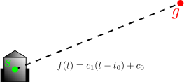
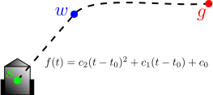
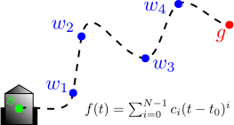
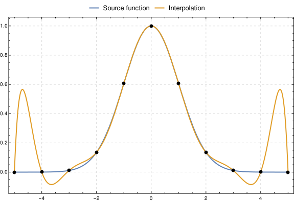
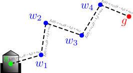
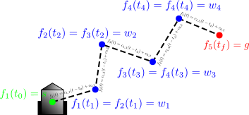
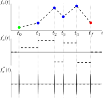

The Kalman Filter is something while completely alluded me and my peers during undergrad, and even took me some time in graduate school to really understand. I've since implemented variations of this estimator countless times for a variety of different problems. Despite having been formulated about half a century ago (!!), I feel it's a tool that every engineer and scientist should keep in their back pocket.

I plan to spend a few blog posts introducing the concepts of data fitting, least squares estimation and finally the Kalman Filter because they're so fundametially important in robotics and controls overall. This might take some time to build up to, but I feel it's good to have some background in simpler estimation problems beforehand.

* Table of contents:
{:toc}

# The data fitting problem

## Interpolation

Suppose you have a mobile robot like the one shown below. You wish to move the robot from the start point $$s$$ (in green) to the goal point $$g$$ (in red) along the line between the two points, starting at time $$t_{0}$$ and ending at time $$t_{f}$$.

{: .center-image}

To accomplish this, you need to parameterize its path with respect to time in order to sample the line at each control cycle and send the target position to a lower-level controller. We thus need to find constants $$c_{0}, c_{1}$$ which define the line

$$
f(t) = c_{1}(t-t_{0}) + c_{0}
$$

such that

$$
\begin{align*}
f(t_{0}) &= c_{1}(t_{0}-t_{0}) + c_{0} = s\\
f(t_{f}) &= c_{1}(t_{f}-t_{0}) + c_{0} = g
\end{align*}
$$

In the first constraint above, substituting the initial condition at $$t=t_{0}$$ immediately revealed $$c_{0} = s$$; substituting this into the final condition yields

$$
\begin{align*}
f(t_{f}) &= c_{1}(t_{f}-t_{0}) + c_{0} = g\\
c_{1} &= \frac{g-s}{t_{f}-t_{0}}
\end{align*}
$$

So the path parameterized in time is simply

$$
f(t) = \frac{g-s}{t-t_{0}}(t-t_{0}) + s
$$

Assuming we have some controller which takes 2d position as an input and computes motor commands, we can now control the robot position at any control frequency. Let's take a second, though, and reexamine this problem posed in matrix form:

$$
\begin{bmatrix}
1 & t_{0}-t_{0}\\
1 & t_{f}-t_{0}
\end{bmatrix}
\begin{bmatrix}
c_{0}\\ c_{1}
\end{bmatrix}
=
\begin{bmatrix}
1 & 0\\
1 & t_{f}-t_{0}
\end{bmatrix}
\begin{bmatrix}
c_{0}\\ c_{1}
\end{bmatrix}
=
\begin{bmatrix}
s\\ g	
\end{bmatrix}
$$

If you multiply this out following matrix multiplcation rules, you'll end up with exactly the boundary conditions we stated above. To solve it, let's take the inverse of the 2x2 matrix. Recall that

$$
\begin{bmatrix}
a & b\\
c & d
\end{bmatrix}^{-1}
=
\frac{1}{ad-bc}
\begin{bmatrix}
d & -b\\
-c & a
\end{bmatrix}
$$

Applying this to our path-finding problem, we have

$$
\begin{bmatrix}
c_{0}\\ c_{1}
\end{bmatrix}
=
\frac{1}{(1)(t_{f}-t_{0})-(0)(1)}
\begin{bmatrix}
t_{f}-t_{0} & -0\\
-1 & 1
\end{bmatrix}
\begin{bmatrix}
s\\ g
\end{bmatrix}
=
\frac{1}{t_{f}-t_{0}}
\begin{bmatrix}
(t_{f}-t_{0})s\\
-s + g
\end{bmatrix}
$$

which, as expected, simplifies to the same answer as before:

$$
f(t) = \frac{g-s}{t-t_{0}}(t-t_{0}) + s
$$

Now, what if we desire - for example, in order collect images of something in particular - the robot to pass through some waypoint $$w$$ at time $$t_{w}$$ as it moves to the goal position?

{: .center-image}

We clearly can't parameterize its path with a line anymore. We increased the number of constraints (desired positions at desired times) by one, so intuitively we need to increase the number of *degrees of freedom (DoFs)* (variables which define our trajectory) by one as well.  Sticking with polynomials, this implies a quadratic function

$$
f(t) = c_{s}(t-t_{0})^{2} + c_{1}(t-t_{0}) + c_{0}
$$

such that

$$
\begin{align*}
f(t_{0}) &= s\\
f(t_{w}) &= w\\
f(t_{f}) &= g
\end{align*}
$$

Again, we know from the initial condition that $$c_{0}=s$$, and we can use the midpoint and end conditions to solve simultaneously for the other constants $$c_{1}, c_{2}$$.  Let's rephrase the problem in matrix form:

$$
\begin{bmatrix}
1 & t_{0}-t_{0} & (t_{0}-t_{0})^{2}\\
1 & t_{w}-t_{0} & (t_{w}-t_{0})^{2}\\
1 & t_{f}-t_{0} & (t_{f}-t_{0})^{2}
\end{bmatrix}
\begin{bmatrix}
c_{0}\\ c_{1}\\ c_{2}
\end{bmatrix}
=
\begin{bmatrix}
s\\ w\\ g
\end{bmatrix}
$$

We can again see that $$c_{0}=s$$, but solving for $$\{c_{1},c_{2}\}$$ is now more complicated to do by simultaneous equations. We know from before, though, that we can just invert the "timing" matrix to get the answer. You can look up the closed-form expression for the inversion of a 3x3 matrix, but who cares what it looks like? The point is that **we need a polynomial of order $$N-1$$ to interpolate (exactly pass through) $$N$$ points, and it can be written in the form $$Ax=b$$.**

{: .center-image}

For $$N$$ points including $$N-2$$ waypoints $$\{w_{1}, w_{2}, \ldots, w_{N-1}$$ the problem in general becomes:

$$
\begin{bmatrix}
1 & t_{0}-t_{0} & (t_{0}-t_{0})^{2} & \cdots & (t_{0}-t_{0})^{N-1}\\
1 & t_{w_{1}}-t_{0} & (t_{w_{1}}-t_{0})^{2} & \cdots & (t_{w_{1}}-t_{0})^{N-1}\\
1 & t_{w_{2}}-t_{0} & (t_{w_{2}}-t_{0})^{2} & \cdots & (t_{w_{2}}-t_{0})^{N-1}\\
\vdots & \vdots & \vdots & \ddots & \vdots\\
1 & t_{f}-t_{0} & (t_{f}-t_{0})^{2} & \cdots & (t_{f}-t_{0})^{N-1}
\end{bmatrix}
\begin{bmatrix}
c_{0}\\ c_{1}\\ c_{2}\\ \vdots\\	 c_{N-1}
\end{bmatrix}
=
\begin{bmatrix}
s\\ w_{1}\\ w_{2}\\ \vdots\\ g
\end{bmatrix}
$$

### Examining the problem

Based on what we worked through above, we can solve for the interpolating polynomial **as long as the matrix $$A$$ is invertible**. When does this break down?

We can see in the single waypoint case that choosing $$t_{w}=t_{0}$$ or $$t_{f}=t_{0}$$, among other singularities, clearly makes $$A$$ non-invertible; see below for $$t_{w}=t_{0}$$:

$$
\begin{bmatrix}
1 & 0 & 0\\
1 & \mathbf{0} & 0\\
1 & t_{f}-t_{0} & (t_{f}-t_{0})^{2}
\end{bmatrix}
\begin{bmatrix}
c_{0}\\ c_{1}\\ c_{2}
\end{bmatrix}
=
\begin{bmatrix}
s\\ w\\ g
\end{bmatrix}
$$

Why is that? Choosing the waypoint timing in such a manner means that a diagonal element of $$A$$ becomes zero, and since the product of the diagonal elements of a square matrix is equal to the product of its eigenvalues, one of the eigenvalues of $$A$$ must be zero. This is proves (in one of many ways) that $$A$$ has no inverse!

Obviously, it makes no physical sense for the waypoint times to be equal, so we don't have to worry so much about this edge case. Unfortunately, we have a couple more fundamental issues: first of all, the $$A$$ matrix in our problem is a [Vandermonde Matrix](https://en.wikipedia.org/wiki/Vandermonde_matrix) which is a form of matrix known to have poor *conditioning*. It's beyond the scope of this pose to get into what the *condition* of a matrix means, but suffice to say that taking the inverse of a matrix with poor conditioning (a high *condition number*) can lead to huge numerical errors.

Second, as the number of points $$N$$ grows, we need higher and higher order polynomials. If we choose our waypoints roughly equidistant in time - a common choice when working with sampled data - then we run into another stability issues known as [Runge's phenomenon](https://en.wikipedia.org/wiki/Runge%27s_phenomenon).

{: .center-image}

How do we deal with the fact that our problem as posed has poor numerical stability? The truth is that interpolation using high-order polynomials of the above form isn't a great idea. It can help to use different *basis functions* like the [Lagrange](https://en.wikipedia.org/wiki/Lagrange_polynomial) or [Netwon](https://en.wikipedia.org/wiki/Newton_polynomial) polynomials, but the truth is that interpolation as we've posed it isn't really the best way to fit a function to these points - let's take a look at a better method.

## Piecewise Interpolation

We can avoid the issues inherent in fitting a single, high-order polynomial to $$N$$ points by instead **fitting a set of N-1 low-order polynomials** to the data.

For example, if we instead use *piecewise linear interpolation* between the same points $$\{s,w_{1},w_{2},w_{3},w_{4},g\}$$ at respective times $$\{t_{0},t_{1},t_{2},t_{3},t_{4},t_{f}\}$$ we get the path shown below:

{: .center-image}

Solving for the equations of each line is exactly the same as the very first problem - just repeated a number of times from start to goal, enforcing that **the value at the beginning of a line segment is equal to the value at the end of the previous line segment**.  These are called *continuity conditions* because they ensure that the segments are continuous (have no jumps in value) where they meet. Let's take a look at these conditions for the multiple waypoint interpolation problem below.

{: .center-image}

### Effects on control

For many simply planning a position path, this works well enough. The problem is that many robots are controlled by specifying desired *velocity* and/or *acceleration* rather than position! Let's take a look at one position dimension (say, $$x$$) and its derivatives (velocity and acceleration):

{: .center-image}

The position is continuous, but the *velocity* is not - there are discrete jumps at each waypoint. Even worse, there is no acceleration reference to follow - it's zero the whole time, and at the waypoints it's undefined due to the *jump discontinuities* in velocity!

Sending a discontinuous command to a controller - in particular, the derivative (D) portion of a PID controller - can easily cause instability if gains are too high, forcing you to reduce the *bandwidth* of your controller to be robust to such jumps. Now we see that **the interpolation strategy you choose has a direct impact on how well you can track the desired motion!**

For controlling a physical system, we usually desire an interpolation scheme which at least guarantees continuity up to acceleration. Why? I'm glad you asked.

Because $$F=ma$$! Let's assume that the low-level control command we send to a robot is a force - think the lift force per rotor in a multirotor drone - then $$F=ma$$ tells us that if we know the desired acceleration of the center of mass of the robot $$a$$ and the robot's mass $$m$$, then we know how much total force $$F$$ we need to send. This is a *second-order* system, meaning that its dynamics are written on the level of accelerations (some form of $$F=ma$$) - which is the case for many physical systems. Of course, it all depends how we want to model the system, which depends on what the low-level control command we send is; for example, in a multirotor system we might send force commands at some level, but beneath this is a controller which maps force to motor current. If we model our system with current as the input, we'll get a higher-order system than second-order, but typically we would choose to stack a force controller on top of a motor current controller rather than build the dynamics of the rotors themselves into our system model.  This is a discussion about control system design, which we're not going to go into any further for now.  

The mathematical term for second-order continuity of derivatives is $$C^{2}$$ *smoothness*, meaning that two derivatives of $$f(t)$$ are continuous. The minimum order piecewise polynomial that we should consider is then *cubic*. Enter the cubic spline.

You've probably heard of splines before (anyone else remember SimCity 2000's mockumathematical *reticulating splines* loading step?) but maybe you don't understand what they are. You may have even used them for something (they're very popular in graphics as well) but all the math was hidden within the library you used.  It turns out that (a) they're fairly simple (b) they avoid all the issues with interpolation we've encountered thus far and (c) they can be solved for very efficiently using linear algebra.

## Cubic splines

As discussed above, instead of a single interpolating polynomial of order $$N-1$$, we can find a set of *piecewise* interpolating polynomials of lower order.  The order of polynomial to be used depends on the desired properties of the interpolant; typically, this means continuity of derivatives of up to a certain order. For example, the piecewise linear trajectory we introduced above is $$C^{0}$$ smooth; a piecewise quadratic is $$C^{1}$$ smooth; a piecewise cubic is $$C^{2}$$ smooth and so on.  Since physical systems are usually second-order, piecewise cubic polynomials are often a good choice - though for higher orders of smoothness piecewise quintic (fifth-order) polynomials are sometimes used. 

A *spline* is nothing more than a collection of piecewise polynomials of a certain order (cubic, quintic, etc) with derivative continuity enforced at interior waypoints and boundary conditions enforced at the ends. We won't go through the full derivation here, but instead set up the problem and discuss the solution.

A piecewise cubic function $$f(t)$$ interpolating $$N$$ waypoints at times $$\{t_{0}, t_{1}, \cdots t_{N-1}\}$$ can be written as a set of $$M=N-1$$ cubic polynomials

$$
f(t) = 
\begin{cases}
f_{1}(t) = c_{0,1} + c_{1,1}t + c_{2,1}t^{2} + c_{3,1}t^{3} & t\in [t_{0}, t_{1}]\\
f_{2}(t) = c_{0,2} + c_{1,2}t + c_{2,2}t^{2} + c_{3,2}t^{3} & t\in [t_{1}, t_{2}]\\
\vdots & \vdots\\
f_{M}(t) = c_{0,N-1} + c_{1,M}t + c_{2,M}t^{2} + c_{3,M}t^{3} & t\in [t_{M-1}, t_{M}]\\
\end{cases}
$$

This piecewise interpolating polynomial is subject to continuity constraints of zeroth, first and second orders at all interior waypoints (called *knots*), resulting in a total of $$3(M-1)$$ constraints, as well as interpolation constraints which ensure the function $$f(t)$$ passes through the waypoints at the specified time (resulting in $$M+1$$ more constraints).  This yields a total of $$4M-2$$ constraints with a total of $$4M$$ coefficients - two more constraints are needed!

There are a number of different ways to specify the remaining two constraints required to solve the interpolation problem, but among the most popular are:

 * Natural boundary conditions - end knots have zero second derivative
 * Specified boundary conditions - the second derivative at each end knot is a specified value
 * Not-a-knot - the first and last interior knots have further continuity of third derivatives, which for a cubic polynomial means that $$f_{1}(t)=f_{2}(t)$$ and $$f_{M-1}(t)=f_{M}(t)$$ and hence these knots are effectively *not knots*, since the functions surrounding them must be identical
 * Clamped boundary conditions - the first derivative at the end knots is zero
 * Complete boundary conditions - the first derivative at each end knot is a specified value

Given the interpolation and continuity constraints plus additional boundary conditions, the cubic spline interpolation problem is written in matrix form as a *tridiagonal* matrix which can be efficiently solved using a [TDMA (Tridiagonal Matrix Algorithm)}(https://en.wikipedia.org/wiki/Tridiagonal_matrix_algorithm) solver. Thus, not only are splines very flexible, but they're very fast to compute!

For in-depth details on putting the above problem into the form of a tridagonal matrix system (lots of algebra!)see [this paper](https://www.math.uh.edu/~jingqiu/math4364/spline.pdf) for an excellent summary. Also, keep in mind that this is just one way (probably the most straightforward to understand) to set up the spline problem; in practice, many libraries use [B-splines](https://en.wikipedia.org/wiki/B-spline) which are *basis functions* for splines of a particular degree (meaning that any spline of that degree can be respresented as a linear combination of B-splines). This reduces the problem to solving for the coefficients in the B-spline basis, but the result is the same.

### Removing the dependence on time

The way in which we specify splines as waypoints at specific times (which implicitly imposes derivative information) means that the resulting trajectory is a function of time.  This may not be the desired goal - for example, consider the problem of moving through waypoints at a desired (and even variable) *speed* rather than at specified times. This is somewhat like an amusement park ride in which the vehicle follows rails but allows the rider to control the speed. Not super common in practical applications, but it's something I've encountered and the solution is interesting.

The speed and acceleration along a spline determined by waypoints at specific times are certainly non-constant; these derivatives vary along the trajectory to ensure smoothness in interpolation.  How do we instead generate a smooth trajectory to be followed at a specified speed without explicit timing information?

The proper way to accomplish this is to re-parameterize the spline in terms of *arclength* (distance traveled along the spline) rather than in terms of time.  The spline can then be followed at a constant, desired *arclength rate of change* aka speed along a trajectory.  Unfortunately, this re-parameterization cannot be done in closed-form; there are a number of ways to accomplish this (see [this paper](https://www.geometrictools.com/Documentation/MovingAlongCurveSpecifiedSpeed.pdf) for a great explanation) but the general algorithm is as follows:

 1. Build a spline without specified waypoint times, for example spacing waypoints apart by one second nominally
 2. Sample the spline at many times in the nominal range
 3. Compute cumulative arclength along the curve by computing distances between the sampled points (assuming they are line segments)
 4. Fit a piecewise linear (or higher order) function relating arclength to sample time points
 5. For an input time $$t$$ and desired speed along the curve $$v_{des}$$, compute the desired arclength as $$s=t*v_{des}$$ and use the linear fit to find the corresponding time $$\tilde{t}$$
 6. Return the spline sampled at $$\tilde{t}$$ which, for a series of times, should yield an arclength rate of change of $$v_{des}$$

This method is seen to work quite well, and will work even better if the spline is sampled at a finer resolution and higher-order piecewise fit is used in the fourth step.  Alternatively, a simple method is to build a spline normally but first determine the waypoint times from the specified $$v_{des}$$ in such a way that the *average* velocity along the curve per segment is $$v_{des}$$.  This can be combined with the more exact approach above by using this idea to build a spline in the first step (rather than using nominal waypoint timings).  This improvement should help ensure that sampling the spline at regular intervals in step two will yield a good approximation for the fit in step four.