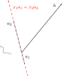
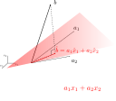

The most fundamental problem in linear algebra is also seemingly the most innocuous: solve $$Ax=b$$ for the unknown vector $$x$$ given a matrix $$A$$ and a vector $$b$$. 

$$
\begin{bmatrix}
a_{1,1} & a_{1,2} & \cdots & a_{1,n}\\
a_{1,2} & a_{2,2} & \cdots & a_{2,n}\\
\vdots & \vdots & \ddots & \vdots\\
a_{m,1} & a_{m,2} & \cdots & a_{m,n}
\end{bmatrix}
\begin{bmatrix}
x_{1}\\ x_{2}\\ \vdots\\ x_{n}
\end{bmatrix}
=
\begin{bmatrix}
b_{1}\\ b_{2}\\ \vdots\\ b_{m}
\end{bmatrix}
$$

Yet, by examing this one problem for all different kinds of matrices $$A$$, you can teach an entire course spanning everything from simple Gaussian elimination to eigenvalues, SVD, PCA and beyond. If you're unsure what these words mean and haven't checked out Gilbert Strang's text and accompanying online course [Introduction to Linear Algebra](http://math.mit.edu/~gs/linearalgebra/), I *highly* recommend you take the time to work through it. The intuition I gained from it was truly transformative in my robotics studies!

* Table of contents:
{:toc}

# Solving $$Ax=b$$ in two dimensions

Let's start simple. *Reaaaally* simple. Consider the following $$Ax=b$$ problem:

$$
\begin{bmatrix}
a_{1,1} & a_{1,2}\\
a_{2,1} & a_{2,2}
\end{bmatrix}
\begin{bmatrix}
x_{1}\\
x_{2}
\end{bmatrix}
=
\begin{bmatrix}
b_{1}\\ b_{2}
\end{bmatrix}
$$

Viewing matrix multiplication as a linear combination of columns of $$A$$, we rewrite this as

$$
\begin{bmatrix}
a_{1,1}\\
a_{2,1}
\end{bmatrix}
x_{1} +
\begin{bmatrix}
a_{1,2}\\
a_{2,2}
\end{bmatrix}
x_{2}
=
a_{1}x_{1} + a_{2}x_{2}
=
b
$$

In other words, our $$A$$ matrix is composed of column vectors $$a_{1}$$ and $$a_{2}$$ in $$R^{2}$$ (two-dimensional vector space of real numbers), and we're looking for scalar multipliers $$x_{1}$$ and $$x_{2}$$ which scale and add these column vectors into the vector $$b$$. This is illustrated geometrically below.

{: .center-image}

It's clear that with the right combination of $$a_{1}$$ and $$a_{2}$$ we can produce $$b$$; the solution vector $$x$$ has its effect illustrated below:

{: .center-image}

However, this is just one possible problem $$Ax=b$$ for which a graphical solution is easy - but is there always a solution to this form of problem? Take a look at the linear system illustrated below:

{: .center-image}

In this case, the columns of $$A$$ are multiples of one another - in linear algebra terms, they are *linearly dependent*. This means that the possible $$b$$ vectors we can reach via a combination of $$a_{1}$$ and $$a_{2}$$ is limited to the red line. Unless our $$b$$ happens to fall along this line, ther is **no solution**.

Let's take it a step further - this situation is the same as if we only had *one* of the column vectors in $$A$$, making $$Ax=b$$ become:

$$
\begin{bmatrix}
a_{1,1}\\
a_{2,1}
\end{bmatrix}
\begin{bmatrix}
x
\end{bmatrix}
=
\begin{bmatrix}
b_{1}\\ b_{2}
\end{bmatrix}
$$

as shown below:

{: .center-image}

We obviously can't solve $$ax=b$$ *exactly* because we can't scale $$a$$ into this $$b$$, but we can solve it *approximately* by finding a scalar $$\hat{x}$$ which gets us to $$\hat{b}=a\hat{x}$$, a vector *as close as possible* to $$b$$ along the direction of $$a$$.

That begs the question: what does it mean for $$a\hat{x}\approx b$$? Naturally, we want the **distance** between the true $$b$$ and the approximate $$\hat{b}$$ to be minimized. This begs another question: how do we define distance between vectors? There's actually a lot to explain here which we won't go into, but suffice to say that there are *infinite* ways to define what's called a **distance metric** on a vector space - the most popular, which you're probably familiar with, is the **Euclidean distance**:

$$
d(b,\hat{b}) = \sqrt{(b_{1}-\hat{b}_{1})^{2}+(b_{2}-\hat{b}_{2})^{2}}
$$

for our specific case in $$R^{2}$$, or more generally:

$$
d(a,b) = \sqrt{\sum_{i=1}^{n} (b_{i}-a_{i})^{2}} = ||(b-a)^{T}(b-a)||_{2}
$$

for vectors in $$R^{n}$$. This is also known as the $$L^{2}$$ distance, $$L^{2}$$ norm or simply the 2-norm, and reflects the way we naturally think about distance in a physical space. Since this norm is the square root of the sum of squares of differences in coordinates, minimizing it to solve $$Ax=b$$ gives us the name of the **least squares** solution.

The general case is the $$L^{p}$$ distance/norm:

$$
d(a,b) = \left(\sum_{i=1}^{n}|b_{i}-a_{i}|^{p}\right)^{1/p} = ||b-a||_{p}
$$

where the notation
$$
||x_{p}||
$$ denotes the *p-norm* of the vector $$x\in R^{n}$$. See below for more details on what this general norm means, or skip ahead to the least-squares solution in 2d.

> ## A detour on vector norms
>
>Remember how I mentioned there are *infinite* possible distance metrics? Well, each metric is defined by its *norm*, which is the distance function for the space and must satisfy a number of [conditions](https://en.wikipedia.org/wiki/Norm_(mathematics)#Definition) to be a proper metric. The class of $$L^{p}$$ norms is just one infinite set within the infinite possible norms, but certainly the most common.
>
>Here, the scalar $$p\geq 1$$ is arbitrary - for the Euclidean norm it's $$p=2$$, but for example, the so-called *Manhattan norm* has $$p=1$$. The choice of $$p$$ basically warps the sense of distance in a space, which can be useful for different applications. For example, $$p=2$$ amplifies the distance of outliers in a set of points due to the quadratic term, making it a good choice in clustering over the $$p=1$$ norm - which just takes the sum of absolute values of all vector entries, based on the above general form - for very scattered data. In the example of penalized regression problems, the 1-norm is used to impose an *L1 penalty* which encourages solution vectors having many zeros.  And so on.
>
> Other than the 1-norm and 2-norm, the $$\infty$$-norm is also common; in the limit, this norm is simply a *max* operation:
>
> $$
> ||x||_{\infty} = \mbox{max}(|x_{1}|,|x_{2}|,\ldots, |x_{n}|)
> $$
>
>Below are lines of constant norm for distance in 2d space, for the common 1, 2, and $$\infty$$ norms.
>
> {: .center-image}
>
> These three vector norms are likely the only ones you'll encounter in practice. Without going into detail, though, the concept of a distance metric is more general than just vector norms.  How do you compute the distance between two matrices? How about the distance between two rotations?  These are also possible, but we've detoured far enough for now.

# The least-squares solution

Recall that we were looking for an *approximate* solution to the problem $$Ax=b$$ for the case in which $$b$$ doesn't lie along the direction of $$A$$, and argued that the best *approximate* solution $$\hat{b}$$ minimizes *distance* to $$b$$.

## Geometric solution

Another way to frame the problem takes a geometric approach. The approximate solution $$\hat{b}$$ is the *projection* of $$b$$ along the direction of $$a$$; minimizing the distance between $$b$$ and $$\hat{b}$$ is the same as minimizing the *projection error*, $$e=b-a\hat{x}$$.

How do we minimize $$e$$? Geometrically, you can think of it this way: the projection error should be in a direction *perpendicular* to the direction of $$a$$. This means the approximate solution captures as much information as possible along the direction of $$a$$, so whatever's "left over", $$e$$, must be in a direction perpendicular to $$a$$:

$$
a \perp e
$$

as depicted below:

{: .center-image}

To write this out mathematically, we'll need to use the *dot product* between vectors; see below for more details, or skip past to the solution.

> ### The dot (inner) product
>
> What does it mean for two vectors to be perpendicular, or in the language of linear algebra, *orthogonal*? First we need to introduce the *dot product* (or *inner* product in higher dimensions) between two vectors:
>
> $$
> a\cdot b = a_{1}b_{1} + a_{2}b_{2} + \cdots + a_{n}b_{n}
> $$
>
> We can also write the dot product using matrix math:
>
> $$
> a\cdot b = a^{T}b =
> \begin{bmatrix}
> a_{1} & a_{2} & \cdots & a_{n}
> \end{bmatrix}
> \begin{bmatrix}
> b_{1}\\ b_{2}\\ \vdots\\ b_{n}
> \end{bmatrix}
> =
> a_{1}b_{1} + a_{2}b_{2} + \cdots + a_{n}b_{n}
> $$
>
> The dot product allows us to compute the angle $$\theta$$ between two vectors
>
> $$
> a\cdot b = a^{T}b = ||a||||b||\cos{\theta}
> $$
>
> Since $$\cos{\theta}\rightarrow 0$$ as $$\theta\rightarrow \pi/2$$, we see that **the dot product goes to zero when the two vectors are orthogonal**.

To find $$\hat{x}$$ such that the projection error $$e=b-a\hat{x}$$ is orthogonal to $$a$$, we require

$$
\begin{align*}
a\perp e\rightarrow a^{T}e &= 0\\
a^{T}(b-a\hat{x}) &= 0\\
a^{T}b-a^{T}a\hat{x} &= 0\\
a^{T}a\hat{x} &= a^{T}b\\
\rightarrow \hat{x} &= \frac{a^{T}b}{a^{T}a}
\end{align*}
$$

Using this approximate solution, we can compute the projected point $$\hat{b}$$ as follows:

$$
\begin{align*}
\hat{b} &= a\hat{x}\\
\hat{b} &= a\frac{a^{T}b}{a^{T}a}\\
\hat{b} &= \left(\frac{aa^{T}}{a^{T}a}\right)b\\
\hat{b} &= P_{a}b
\end{align*}
$$
 
By rearranging the solution, we can form the *projection matrix* $$P_{a}$$ which projects *any* vector along $$a$$! We can thus compute $$P_{a}$$ once and use it for any $$b$$ that comes along; this is a common "trick" in practice for problems which retain the same structure (matrix $$A$$) but potentially different *right-hand-side* vectors $$b$$.

What does the projection error vector look like in terms of the solution?

$$
e=b-\hat{b}=b-P_{a}b=(I-P_{a})b
$$

We thus find the *complementary* projection matrix $$I-P_{a}$$ which projects onto the direction orthogonal to $$a$$, giving us whatever's "left over". These are useful projections to be aware of in practice.

### Three dimensions

Now let's look at the three-dimensional case of $$Ax=b$$ with $$A\in R^{3\times 2}$$, so we only have two *linearly-independent* column vectors:

$$
\begin{bmatrix}
a_{1,1} & a_{1,2}\\
a_{2,1} & a_{2,2}\\
a_{3,1} & a_{3,2}
\end{bmatrix}
\begin{bmatrix}
x_{1}\\ x_{2}
\end{bmatrix}
=
\begin{bmatrix}
b_{1}\\ b_{2}\\ b_{3}
\end{bmatrix}
$$

which multiplies (viewing matrix multiplication as a linear combination of columns) to

$$
\begin{bmatrix}
a_{1,1}\\
a_{2,1}\\
a_{3,1}
\end{bmatrix}
x_{1} +
\begin{bmatrix}
a_{1,2}\\
a_{2,2}\\
a_{3,2}
\end{bmatrix}
x_{2}
=
a_{1}x_{1} + a_{2}x_{2}
=
b
$$

This is depicted in the figure below.

{: .center-image}

As in the two-dimensional case, we seek a linear combination of the columns of $$A$$ - denoted $$a_{1}$$ and $$a_{2}$$ - which is equal to the vector $$b$$. These column vectors are said to *span* the red plane (which extends infinitely in all directions) - this means that every point on the plane can be written as a *linear combination* of $$a_{1}$$ and $$a_{2}$$.  It follows that any point outside the plane - for example, $$b$$ here - cannot be written as such, meaning that there is no exact solution - only an *approximate* one. In the previous case, we projected a point onto a line defined by a vector $$a$$; now, we're projecting a point onto a *plane* defined by the columns of a matrix $$A$$. You can start to see how this problem scales to higher dimensions.

We seek an approximate solution $$\hat{x}$$ whose projection error $$e=b-A\hat{x}$$ is orthogonal to both $$a_{1}$$ and $$a_{2}$$, and thus orthogonal or *normal* to the plane as depicted. The problem is thus to find $$\hat{x}$$ such that

$$
a_{1} \perp e \quad \mbox{and} \quad a_{2} \perp e
$$

Which leads to simultaneous equations

$$
\begin{align*}
a_{1}\perp e\rightarrow a_{1}^{T}A\hat{x} &= a_{1}^{T}b\\
a_{2}\perp e\rightarrow a_{2}^{T}A\hat{x} &= a_{2}^{T}b\\
\end{align*}
$$

which we can combine and solve as follows:

$$
\begin{align*}
\begin{bmatrix}
a_{1}^{T}\\
a_{2}^{T}
\end{bmatrix}
A\hat{x}
&=
\begin{bmatrix}
a_{1}^{T}\\
a_{2}^{T}
\end{bmatrix}
b\\
A^{T}A\hat{x}
&=
A^{T}b\\
\rightarrow \hat{x} &= (A^{T}A)^{-1}A^{T}b
\end{align*}
$$

This form of solution is known as the *normal equations* because the projection error is *normal* to the plane. It's also known the *least-squares* solution to $$Ax=b$$ because it minimizes the sum of squares of projection error as shown in the next section.

We've now derived the normal equations in two dimensions (projection onto a *line*, where $$A$$ had size $$2\times 1$$) and three dimensions (projection onto a *plane*, where $$A$$ had size $$3\times 2$$). What about higher dimensions? In these cases of $$Ax=b$$, we seek a projection onto a *hyperplane* of arbitrary dimension. While we can't draw these situations, the **solution has exactly the same form**; let's approach the arbitrary dimension case using calculus to solve it.

## Calculus-based solution

Earlier, we discussed how to define distance in a vector space, and have settled on the $$L^{2}$$ or *Euclidean* norm.  For the problem $$Ax=b$$ where $$A\in R^{m\times n}$$ with arbitrarty $$m>n$$, we thus seek an $$x$$ which minimizes

$$
||b-\hat{b}||_{2} = ||b-Ax||_{2} = \sqrt{(b-Ax)^{T}(b-Ax)}
$$

To put the problem in a nicer form, we can instead minimize the *squared* distance, since the $$x$$ minimizing distance will certainly minimize squared distance as well. We thus wish to minimize:

$$
\begin{align*}
||b-\hat{b}||_{2}^{2} = ||b-Ax||_{2}^{2} &= (b-Ax)^{T}(b-Ax)\\
&= x^{T}A^{T}Ax - x^{T}A^{T}b - b^{T}Ax + b^{T}b\\
&= x^{T}A^{T}Ax - 2x^{T}A^{T}b + b^{T}b
\end{align*}
$$

where we multiplied out the problem and used the fact that $$x^{T}A^{T}b=b^{T}Ax$$. From calculus, we know that to minimize or maximize a function $$f(x)$$ with respect to $$x$$, we need to find the point(s) at which its *gradient* (generalized derivative), denoted $$\nabla f(x)$$, are zero. We thus set $$\nabla f(x)=0$$ and solve for $$x$$:

$$
\nabla f(x) = \nabla \left(x^{T}A^{T}Ax - 2A^{T}x + b^{T}b\right)
$$
 
Here I'm going to defer to the fantastic [Matrix Cookbook](https://www.math.uwaterloo.ca/~hwolkowi/matrixcookbook.pdf) to explain how to take the gradients above. The result is

$$
\begin{align*}
\nabla f(x) &= \left(A^{T}A + (A^{T}A)^{T}\right)x - 2A^{T}b\\
&= 2A^{T}Ax + 2A^{T}b
\end{align*}
$$

since $$(A^{T}A)^{T}=A^{T}A$$ because $$A^{T}A$$ is symmetric. Setting the above equal to zero and solving for the minimum $$x$$:

$$
\begin{align*}
\nabla f(x) &= 0\\
2A^{T}Ax - 2A^{T}b &= 0\\
A^{T}Ax &= A^{T}b\\
x &= (A^{T}A)^{-1}A^{T}b
\end{align*}
$$

This is identical to the solution we obtained above by inspecting the geometry of the lower-dimensional case.

# Conclusions

While the previous section shows the typical method for deriving the normal equations, it requires some knowledge of multivariable calculus. I find linear algebra to be much more intuitive when understood geometrically, so I wanted to present the two approaches side-by-side. Again, for a fantastic intuitive introduction to linear algebra which relies heavily on geometry, be sure to read through [Gilbert Strang's textbook](http://math.mit.edu/~gs/linearalgebra/) and/or follow the accompanying open-source course.
