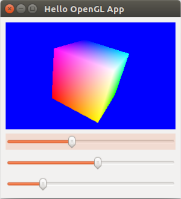

In this tutorial, we'll pick up where we left off on [learning to render graphics using OpenGL](https://nrotella.github.io/journal/first-steps-python-qt-opengl.html) and start incrementally writing a simple robot simulator in python using Qt and OpenGL. Last time, we discussed how to install these libraries and walked through a simple interactive cube GUI; check out the previous tutorial or find the script [here](../download/HelloOpenGL.py).

I'm starting this as a fun side project for me to become a better python developer while creating robotics "mini lectures" paired with example code. I'm a strong believer in open-source software and education, and have benefitted from countless blogs like this one in the past. Plus, it gives me the opportunity to keep some lesser-used robotics knowledge fresh in my mind, since I've been working more on perception than control lately. I hope someone out there can learn from this blog as I pass the knowledge along :)

* Table of contents:
{:toc}

# Recap

In the previous tutorial of this series, we created a simple GUI containing an OpenGL rendering of a multicolored cube and some sliders for rotating the cube.

{: .center-image height="300px" width="300px"}

This was a good first foray into the basics of writing GUI and graphics code in python; now that we've got the basic structure of such an application down, let's work from there to start writing a simple simulator. We'll accomplish a few things in this tutorial:

1. Define a ground plane for our simulator and render it
2. Implement a simple adjustable-view camera
3. Create a graphics object defining a vector
4. Combine three vectors into an axes graphics object

# Ground Plane

The multicolored cube was a good place to start in understanding the OpenGL rendering process, but the most basic object we need in a robot simulator is the ground plane. Let's encapsulate this functionality in a new ```GroundGraphics``` class for portability and define the geometry in its constructor:

```python
class GroundGraphics(object):
    """
    This class defines a grid (triangular mesh) representing the ground plane. The render
    function must be called from the main paintGL rendering function.

    """

    def __init__(self, length, width):
        """ Initialize the ground graphics object.

        Initialize the ground graphics object.

        Args:
            length (float): Length of the ground grid, in meters.
            width (float): Width of the ground grid, in meters.

        Returns:
            (None)

        """

        # Store the grid dimensions and compute number of squares and vertices
        self.len = length
        self.w = width
        self.res = 10
        self.n_sq = self.res**2
        self.n_vert = 6 * self.n_sq

        # Define the vertex (x,y,z) values as a grid:
        self.vx = np.linspace(-0.5*self.len, 0.5*self.len, self.res + 1)
        self.vy = np.linspace(-0.5*self.w, 0.5*self.w, self.res + 1)
        self.vz = np.zeros((self.res + 1, self.res + 1))

        self.vert = np.zeros((self.n_vert, 3))

        # Organize the vertices into triangles for storing in a VBO:
        sq_ind = 0
        for i in range(self.res):
            for j in range(self.res):
                # Upper triangle in square:
                self.vert[6 * sq_ind,:] = np.array([self.vx[i], self.vy[j], self.vz[i, j]])
                self.vert[6 * sq_ind + 1,:] = np.array([self.vx[i+1], self.vy[j+1], self.vz[i+1, j+1]])
                self.vert[6 * sq_ind + 2,:] = np.array([self.vx[i], self.vy[j+1], self.vz[i, j+1]])

                # Lower triangle in square:
                self.vert[6 * sq_ind + 3,:] = np.array([self.vx[i], self.vy[j], self.vz[i, j]])
                self.vert[6 * sq_ind + 4,:] = np.array([self.vx[i+1], self.vy[j], self.vz[i+1, j]])
                self.vert[6 * sq_ind + 5,:] = np.array([self.vx[i+1], self.vy[j+1], self.vz[i+1, j+1]])

                sq_ind += 1

        # Pack the triangle vertices into a dedicated VBO:
        self.vert_stride = 12 # number of bytes between successive triangles
        self.vert_vbo = vbo.VBO(np.reshape(self.vert, (1,-1), order='C').astype(np.float32))
```

## Geometry

Let's break down the geometry initialization a bit. First, we use the input ```length``` and ```width``` dimensions to define the number of squares ```n_sq``` in the grid, the number of triangle vertices ```n_vert``` in the grid (two triangles per square times three vertices per triangle) and arrays of all possible vertex positions in the ```x```, ```y``` and ```z``` dimensions:

```python

        # Store the grid dimensions and compute number of squares and vertices
        self.len = length
        self.w = width
        self.res = 10
        self.n_sq = self.res**2
        self.n_vert = 6 * self.n_sq

        # Define the vertex (x,y,z) values as a grid:
        self.vx = np.linspace(-0.5*self.len, 0.5*self.len, self.res + 1)
        self.vy = np.linspace(-0.5*self.w, 0.5*self.w, self.res + 1)
        self.vz = np.zeros((self.res + 1, self.res + 1))
```

Then, we iterate over each square in the grid and store the positions of the six vertices composing the two triangles which define that square:

```python
        self.vert = np.zeros((self.n_vert, 3))

        # Organize the vertices into triangles for storing in a VBO:
        sq_ind = 0
        for i in range(self.res):
            for j in range(self.res):
                # Upper triangle in square:
                self.vert[6 * sq_ind,:] = np.array([self.vx[i], self.vy[j], self.vz[i, j]])
                self.vert[6 * sq_ind + 1,:] = np.array([self.vx[i+1], self.vy[j+1], self.vz[i+1, j+1]])
                self.vert[6 * sq_ind + 2,:] = np.array([self.vx[i], self.vy[j+1], self.vz[i, j+1]])

                # Lower triangle in square:
                self.vert[6 * sq_ind + 3,:] = np.array([self.vx[i], self.vy[j], self.vz[i, j]])
                self.vert[6 * sq_ind + 4,:] = np.array([self.vx[i+1], self.vy[j], self.vz[i+1, j]])
                self.vert[6 * sq_ind + 5,:] = np.array([self.vx[i+1], self.vy[j+1], self.vz[i+1, j+1]])

                sq_ind += 1

```

This last bit is a little obtuse, but the idea is that we pack the triangle vertices into a VBO, which will later be rendered by interpreting the packed data as a collection of triangles with a specified *stride* or byte offset between triangles (12, since each of three verticles is stored by default as a 32bit float in numpy):

```python
        # Pack the triangle vertices into a dedicated VBO:
        self.vert_stride = 12 # number of bytes between successive triangles
        self.vert_vbo = vbo.VBO(np.reshape(self.vert, (1,-1), order='C').astype(np.float32))
```

## Rendering

Now that the geometry has been defined in the ```GroundObject``` constructor, we need to define how its geometry is rendered in another class member called ```render```. This member funcion should be called from the ```paintGL``` function we overrode last time to render the cube:

```python
    def render(self):
        """ Renders the ground plane graphics object.

        Render the ground plane graphics using the geometry defined in the constructor.
        This function must be called from the main paintGL rendering function.

        Args:
            (None)

        Returns:
            (None)

        """


        gl.glPushMatrix()

        try:
            # Bind the vertex data buffer to the VBO all future rendering
            # (or until unbound with 'unbind'):
            self.vert_vbo.bind()

            # Set the vertex pointer for rendering:
            gl.glEnableClientState(gl.GL_VERTEX_ARRAY)
            gl.glVertexPointer(3, gl.GL_FLOAT, self.vert_stride, self.vert_vbo)

            # Set the polygons to have front and back faces and to not be filled:
            gl.glColor3f(1.0, 1.0, 1.0)
            gl.glPolygonMode(gl.GL_FRONT_AND_BACK, gl.GL_LINE)

            # Render triangle edges using the loaded vertex pointer data:
            gl.glDrawArrays(gl.GL_TRIANGLES, 0, self.n_vert)

            # Set the polygons to have front and back faces and to not be filled:
            gl.glColor3f(0.5, 0.5, 0.5)
            gl.glPolygonMode(gl.GL_FRONT_AND_BACK, gl.GL_FILL)

            # Render triangle faces using the loaded vertex pointer data:
            gl.glDrawArrays(gl.GL_TRIANGLES, 0, self.n_vert)

        except Exception as e:
            print(e)

        finally:
            self.vert_vbo.unbind()
            gl.glDisableClientState(gl.GL_VERTEX_ARRAY)

            gl.glPopMatrix()
```

The general rendering process should look similar to rendering the cube - it's sandwiched by calls to ```glPushMatrix``` and ```glPopMatrix``` and has calls to ```glVertexPointer(size, type, stride, pointer)``` for loading in the VBO, but instead of ```glDrawElements``` we now use ```glDrawArrays```. This lets us easily render geometric primitives - here, triangles as specified by passing in ```GL_TRIANGLES``` - from the VBO.

We actually render the triangles twice here - once for the black edges, and then once for the grey faces. The ```glPolygonMode``` function allows us to specify whether to render the triangle with only edges (```GL_LINE```) or faces (```GL_FILL```). After rendering, we make sure to unbind the VBO since we're done with it.

## Usage

To use the ground plane we defined, let's add an instance as a class member in our trusty ```GLWidget``` class' ```initializeGL``` member function, which should now look as follows:

```python
    def initializeGL(self):
        """ Initializes OpenGL functionality and geometry.

        Virtual function provided by QGLWidget, called once at the beginning of application.
        OpenGL and geometry initialization is performed here.

        Args:
            (None)

        Returns:
            (None)

        """

        # Convenience function, calls glClearColor under the hood.
        # QColor is specified as RGB ints (0-255).  Specify this clear
        # color once and call glClear(GL_COLOR_BUFFER_BIT) before each
        # round of rendering (in paintGL):
        self.qglClearColor(QtGui.QColor(100, 100, 100)) # a grey background
                
        # Enable the depth buffer:
        gl.glEnable(gl.GL_DEPTH_TEST)

        # Initialize the user-specified geometry
        self.initGeometry()

        # Initialize the ground plane graphics geometry
        self.ground_graphics = GroundGraphics(length=10.0, width=10.0)
```

Defining the ground plane is as simple as creating the object with desired dimensions! Also note that we can safely remove all code which previously defined the cube from ```initGeometry()```, along with the sliders for rotating it. I won't go through every change, but you can always check the ```git diff``` to see what I mean.

To ensure the ground plane is rendered, make sure your ```paintGL``` function looks as follows:

```python
    def paintGL(self):
        """ Defines behavior of OpenGL window when resized.

        Virtual function provided by QGLWidget, called from QGLWidget method updateGL.
        All user rendering code should be defined here.

        Args:
            (None)

        Returns:
            (None)

        """
        
        # Start from a blank slate each render by clearing buffers
        gl.glClear(gl.GL_COLOR_BUFFER_BIT | gl.GL_DEPTH_BUFFER_BIT)
        
        self.ground_graphics.render()
```

That's it! The ground plane will now be defined at the start and rendered every cycle.

# An adjustable camera

Before we can visualize our ground plane, it will help tremendously to make our camera (view) adjustable via user input.

## Setting the camera view

The main function we need to add to our class is one which updates the camera view based on the current camera state, which we'll make adjustable in a bit. The ```update_view``` function accomplishes this as follows:

```python
    def update_view(self):
        """ Updates the camera view using current camera state.

        Function to be called after updating any camera state variable in order to update
        the camera view. Converts spherical camera coordinates to a Cartesian position for
        the eye of the camera, with the center position (focal point) fixed at the origin.

        Args:
            (None)

        Returns:
            (None)

        """

        self.eye_pos = np.array([self.eye_r*np.sin(self.eye_phi)*np.cos(self.eye_th),
                                 self.eye_r*np.sin(self.eye_phi)*np.sin(self.eye_th),
                                 self.eye_r*np.cos(self.eye_phi)])
        up_vec = np.array([0.0, 0.0, 1.0])
        gl.glLoadIdentity()
        GLU.gluLookAt(*np.concatenate((self.eye_pos, self.center_pos, up_vec)))
```

In OpenGL, the camera view is set with ```gluLookAt(eyeX,eyeY,eyeZ,centerX,centerY,centerZ,upX,upY,upZ)``` where the eye is the camera position, the center is the focal point and the up vector fixes the camera orientation.

We choose to adjust the camera in a *spherical* coordinate frame with the origin as the fixed center (focal) point because it's easy and feels natural, though there are certainly other ways to define an adjustable camera in 3D space. The spherical camera coordinates are radius (distance from origin/center) $$r$$, azimuth angle $$\theta$$ and elevation angle $$\phi$$ as shown below.

{: .center-image}

We thus convert the camera's current spherical coordinates to Cartesian coordinates using the formula

$$
p_{eye} =
\begin{bmatrix}p_{eye_{x}}\\p_{eye_{y}}\\p_{eye_{z}}\end{bmatrix}
=
\begin{bmatrix}
r\sin{\phi}\cos{\theta}\\
r\sin{\phi}\sin{\theta}\\
r\cos{\phi}
\end{bmatrix}
$$

which is implemented as

```python
        self.eye_pos = np.array([self.eye_r*np.sin(self.eye_phi)*np.cos(self.eye_th),
                                 self.eye_r*np.sin(self.eye_phi)*np.sin(self.eye_th),
                                 self.eye_r*np.cos(self.eye_phi)])
```

We then simply pass the eye position, fixed center position and "up" vector ```up_vec``` (which just points in +z) to ```gluLookAt``` with a concatenation to join the numpy arrays and an asterisk to unpack them to the required individual arguments:

```python
        up_vec = np.array([0.0, 0.0, 1.0])
        gl.glLoadIdentity()
        GLU.gluLookAt(*np.concatenate((self.eye_pos, self.center_pos, up_vec)))
```

## Adjusting the camera

Now, we need to tie user input to the camera state (spherical coordinates). This is as simple as overriding the ```keyPressEvent(event)``` function provided by the Qt base class in our main class!

```python
    def keyPressEvent(self, event):
        """ Defines callbacks for keypress events.

        Implement override for virtual function provided by Qt base class for defining
        keypress event callbacks, for example manipulating the primary view camera.

        Args:
            event (QKeyEvent): Screen width in pixels.
            height (int): Screen height in pixels.

        Returns:
            (None)

        """
        
        if type(event) == QtGui.QKeyEvent:
            if event.key() == QtCore.Qt.Key_W:
                # Hold W to decrease range (zoom in)
                self.eye_r -= 0.5
                self.update_view()
                
            elif event.key() == QtCore.Qt.Key_S:
                # Hold S to increase range (zoom out)
                self.eye_r += 0.5
                self.update_view()

            elif event.key() == QtCore.Qt.Key_Down:
                # Hold DOWNARROW to increase elevation angle 
                self.eye_phi += 0.05
                self.update_view()

            elif event.key() == QtCore.Qt.Key_Up:
                # Hold UPARROW to decrease elevation angle
                self.eye_phi -= 0.05
                self.update_view()

            elif event.key() == QtCore.Qt.Key_Right:
                # Hold RIGHTARROW to increase azimuth angle
                self.eye_th += 0.05
                self.update_view()

            elif event.key() == QtCore.Qt.Key_Left:
                # Hold LEFTARROW to decrease azimuth angle
                self.eye_th -= 0.05
                self.update_view()
```

The above is fairly self-explanatory - on a keypress, the overriden ```keyPressEvent``` class captures a ```QKeyEvent``` variable ```event``` which contains information about the press. We check which key was pressed and handle it accordingly, using W/S to zoom in/out, left/right arrows to rotate in azimuth, and up/down arrows to rotate in elevation. Each time the camera state is changed, we call ```update_view``` to move the camera accordingly.

## Testing it out

One final required addition is to set the initial camera state, since we adjust it incrementally in the keypress callbacks. This should be added to ```initializeGL```:

```python
        # Initialize the camera state and set the initial view
        self.eye_r = 20.0     # camera range, in meters
        self.eye_th = 1.0     # camera azimuth angle, in radians
        self.eye_phi = 1.0    # camera elevation angle, in radians
        self.center_pos = np.array([0.0, 0.0, 0.0])
        self.update_view()

        # Set focus to the window
        self.setFocusPolicy(QtCore.Qt.StrongFocus)
```

We also set the focus to the window to ensure our keypresses take effect. That's it! Run the script and use the keys to manipulate the camera and view the ground plane as below.

{: .center-image}

# Vector and Axes graphics

Next, let's add a simple graphics object for an oriented vector (3D arrow) which we'll build on to create an axes (coordinate frame) graphics object.

## Vector graphics

As we did for the ground plane, let's encapsulate our vector in a class for portability. The full class is show below and broken up step-by-step:

```python
class VectorGraphics(object):
    """
    Class for rendering a three-dimensional vector.

    """

    def __init__(self):
        self.quadric = GLU.gluNewQuadric()
        GLU.gluQuadricNormals(self.quadric, gl.GLU.GLU_SMOOTH) #Create Smooth Normals
        GLU.gluQuadricTexture(self.quadric, gl.GL_TRUE) #Create Texture Coords
```

The vector object geometry is much simpler than the ground object because it's just two primitives - a cylindrical shaft and a conical head. In fact, both are implemented as a cylinder in OpenGL - and, in turn, a cylinder is one member of the class of *quadric* shapes (those that can be defined by a quadratic function).

We thus create a quadric with ```gluNewQuadric()``` in the arrow object's constructor and pass it to the rendering functions below.

```python
    def render(self, start, dir, length, width, color):

        if length > 0.0:
            # Compute the angle-axis rotation require to orient the vector along dir:
            up_vec = np.array([0.0, 0.0, 1.0])
            axis = np.cross(up_vec, dir)
            trip_prod = np.linalg.det(np.dstack((up_vec, dir, axis)))
            if trip_prod > 0:
                angle = np.arccos(np.dot(up_vec, dir))
            else:
                angle = 2*np.pi - np.arccos(np.dot(up_vec, dir))
```

We specify the vector by passing in a start position ```start``` and unit direction vector ```dir```, as well as length, width (diameter) and color values. In rendering the vector, we actually need to rotate it from its default orientation so it lies along the specified direction - we thus compute the required axis-angle rotation for this step.

```python
            # Draw the shaft using a cylinder:
            gl.glPushMatrix()
            gl.glColor3f(*color)
            gl.glTranslatef(*start)
            gl.glRotate((180.0/np.pi)*angle, *axis)
            GLU.gluCylinder(self.quadric, width, width, length, 100, 10)
            gl.glPopMatrix()

            # Draw the head using a cylinder having zero width on top:
            gl.glPushMatrix()
            gl.glColor3f(*color)
            gl.glTranslatef(*start)
            gl.glRotate((180.0/np.pi)*angle, *axis)
            gl.glTranslatef(0.0, 0.0, length)
            GLU.gluCylinder(self.quadric, 2.0*width, 0.0, 0.1*length, 100, 10)
            gl.glPopMatrix()
```

After rotating the cylinders accordingly, we use ```gluCylinder(quadric, base, top, height, slices, stacks)``` in the ```render``` function to render it; here, ```slices``` and ```stacks``` refer to the rendering discretization along the lengthwise and diametric axes, respectively.

Note that we create the head by simply passing in a value for ```base``` wider than the shaft, zero for ```top``` so that it comes to a point, and some fraction of the shaft ```length``` for the head length.

## Axes graphics

Now that we have an arrow object, we can easily render three arrows in orthogonal directions to create an axes object:

```python
class AxesGraphics(object):
    """
    Class for rendering an axes (frame vectors) object.

    """

    def __init__(self):
        self.x_axis = VectorGraphics()
        self.y_axis = VectorGraphics()
        self.z_axis = VectorGraphics()

    def render(self, R, t):
        self.x_axis.render(t, R[:,0],
                           0.3, 0.01, np.array([1.0, 0.0, 0.0]))
        self.y_axis.render(t, R[:,1],
                           0.3, 0.01, np.array([0.0, 1.0, 0.0]))
        self.z_axis.render(t, R[:,2],
                           0.3, 0.01, np.array([0.0, 0.0, 1.0]))
```

We create three vector objects in the constructor and render them using the specified frame pose, which is define by an orientation matrix ```R``` and a translation vector ```t```. For now, we leave the arrow dimensions set to hardcoded values.

Let's render a frame! It's always useful to visualize the global coordinate frame at its origin, so let's add to ```initializeGL```:

```python
# Initialize the origin axes graphics geometry
self.origin_axes_graphics = AxesGraphics()
```

and then render it in ```paintGL``` as follows:

```python
self.origin_axes_graphics.render(np.identity(3), np.zeros(3))
```

Run the simulator script should now produce the ground plane with axes graphics visualizing the global coordinate frame.

{: .center-image}

# Wrapping up

In this tutorial, we took the simple "hello world" OpenGL application from last time and built it out into a still simple but solid base for a robot simulator. With a functional camera and basic graphics objects in place, we'll next do some code refactoring before adding robot kinemtics, state and visualiztion.