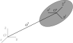
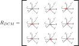
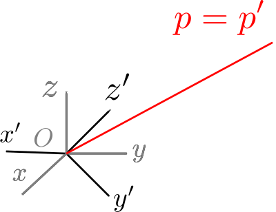
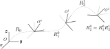
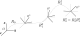
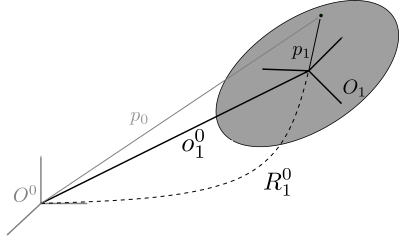
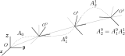

In order to proceed with writing a simple robot simulator, there are a number of mathematical concepts that must be introduced before we can describe the motion of a manipulator.

In this post, I'll be pulling sections from [my PhD notes](https://nrotella.github.io/download/NicholasRotellaPhDNotes.pdf) which, in turn, were largely taken from the excellent introductory text [Modeling and Control of Robot Manipulators](https://www.springer.com/gp/book/9781852332211).

The resulting simple geometry module introduced at the end of this post can be found [in this GitHub commit](https://github.com/nrotella/python-robot-sim/commit/7a55009d53c1104a78293ce11a230fd8e13b2ea5).

* Table of contents:
{:toc}

# Rigid body pose

The position and orientation (together, **pose**) of a rigid body in space can be
described with respect to a fixed coordinate frame in terms of a **translation** from the
fixed frame's origin and **rotation** about the axes of the fixed frame. Here, we let $$O$$ denote the fixed coordinate frame and $$O'$$ the body coordinate frame, as shown below.

{: .center-image}

As shown, the fixed coordinate frame with origin $$O$$ is specified by unit axes
$$\mathbf{x}$$, $$\mathbf{y}$$ and $$\mathbf{z}$$, while the body coordinate frame with
origin $$O'$$ be specified by unit axes $$\mathbf{x'}$$, $$\mathbf{y'}$$ and
$$\mathbf{z'}$$.

## Translation

The **translation** of frame $$O'$$ with respect to frame $$O$$ is

$$
\mathbf{o'} = o'_{x}\mathbf{x} + o'_{y}\mathbf{y} + o'_{z}\mathbf{z}
$$

which can be written, in terms of the axes of the fixed frame, as the vector
$$\mathbf{o'} = [o'_{x}, o'_{y}, o'_{z}]^{T}$$.

## Rotation

The **rotation** of the body frame with respect to the fixed frame is specified
by expressing the axes of the body frame in terms of the axes of the fixed
frame.  This yields

$$
\begin{align}
\mathbf{x'} &= x'_{x}\mathbf{x} + x'_{y}\mathbf{y} + x'_{z}\mathbf{z} \\
\mathbf{y'} &= y'_{x}\mathbf{x} + y'_{y}\mathbf{y} + y'_{z}\mathbf{z} \\
\mathbf{z'} &= z'_{x}\mathbf{x} + z'_{y}\mathbf{y} + z'_{z}\mathbf{z} \\
\end{align}
$$

These relations can be expressed compactly in the **rotation matrix**

$$
R =
\begin{pmatrix}
 & & \\
\mathbf{x'} & \mathbf{y'} & \mathbf{z'} \\
 & & 
\end{pmatrix} =
\begin{pmatrix}
x'_{x} & y'_{x} & z'_{x} \\
x'_{y} & y'_{y} & z'_{y} \\ 
x'_{z} & y'_{z} & z'_{z} \\
\end{pmatrix} = 
\begin{pmatrix}
\mathbf{x'}^{T}\mathbf{x} & \mathbf{y'}^{T}\mathbf{x} &\mathbf{z'}^{T}\mathbf{x} \\
\mathbf{x'}^{T}\mathbf{y} & \mathbf{y'}^{T}\mathbf{y} &\mathbf{z'}^{T}\mathbf{y} \\
\mathbf{x'}^{T}\mathbf{z} & \mathbf{y'}^{T}\mathbf{z} &\mathbf{z'}^{T}\mathbf{z}
\end{pmatrix}
$$

This matrix simply describes the body frame's axes in terms of the axes of the fixed frame. The rightmost expression can be verified by substituting in the definitions of $$\mathbf{x'}$$, $$\mathbf{y'}$$ and $$\mathbf{z'}$$ from above and using the fact that these axes vectors are *mutually orthogonal* (actually, mutually *orthonormal* since they are unit vectors).  This means that dot products between different axes vectors are zero, eg if we denote $$\mathbf{x'}$$, $$\mathbf{y'}$$ and $$\mathbf{z'}$$ instead by $$\mathbf{e_{1}}$$, $$\mathbf{e_{2}}$$ and $$\mathbf{e_{3}}$$ respectively:

$$
e_{i}^{T}e_{j} =
\begin{cases}
1 \quad \mbox{if} \quad i=j\\
0 \quad \mbox{if} \quad i\neq j
\end{cases}
$$

Also recall that the dot product can be written

$$
e_{i}^{T}e_{j}=||e_{i}||||e_{j}||\cos{\theta_{i,j}}
$$

where $$\theta_{i,j}$$ is the angle between the vectors. Since the axes of both body and fixed frames are unit vectors, we can rewrite the orientation of the body frame as

$$
R =
\begin{pmatrix}
\cos{\theta_{x',x}} & \cos{\theta_{y',x}} & \cos{\theta_{z',x}} \\
\cos{\theta_{x',y}} & \cos{\theta_{y',y}} & \cos{\theta_{z',y}} \\
\cos{\theta_{x',z}} & \cos{\theta_{y',z}} & \cos{\theta_{z',z}}
\end{pmatrix}
$$

where $$\theta_{i,j}$$ again describes the angle between two axes unit vectors of the fixed and body frames.  For this reason, the rotation matrix is sometimes referred to as the **direction cosine matrix** or **DCM** (where each element is referred to as a **direction cosine**).

{: .center-image}

Now, let's take a quick look at propertis of the rotation matrix and how it's used.

### Inverse rotations

If the rotation matrix $$R$$ represents the orientation of the body frame with respect to the fixed frame, then its **inverse** $$R^{-1}$$ represents the opposite rotation - the orientation of the fixed frame with respect to the body frame.

Recall from above that the columns of the rotation matrix were said to be *mutually orthogonal* - we call this an **orthogonal matrix** which has the special property that its inverse is equal to its transpose:

$$
R^{-1}=R^{T}
$$

This makes transforming between frames easy and computationally-efficient. In addition, as was mentioned above, the columns of a rotation matrix are all *unit vectors*.  This means its columns are *mutually orthonormal*, or in other words, $$R$$ is an **orthonormal matrix**.

### Representing a vector in different frames

Consider two frames with the same origin $$O$$ but different sets of unit
axes, as shown below.

{: .center-image}

A vector $$\mathbf{p}$$ can be described in terms of the first frame as
$$\mathbf{p} = [p_{x}, p_{y}, p_{z}]^{T}$$ and in terms of the second frame as
$$\mathbf{p'} = [p'_{x}, p'_{y}, p'_{z}]^{T}$$.  Since these vectors correspond to
the same point in space, we must have $$\mathbf{p} = \mathbf{p'}$$ and thus 

$$
\mathbf{p} = p'_{x}\mathbf{x'} + p'_{y}\mathbf{y'} + p'_{z}\mathbf{z'} =
\begin{pmatrix}
 & & \\
\mathbf{x'} & \mathbf{y'} & \mathbf{z'} \\
 & & \\
\end{pmatrix} \mathbf{p'}
$$
 
This is, from above, $$\mathbf{p} = R\mathbf{p'}$$; $$R$$ is the rotation matrix which
transforms the vector from the second frame to the first.  Since $$R$$ is
orthogonal, the inverse transformation is $$\mathbf{p'} = R^{T}\mathbf{p}$$.

Note that since $$R$$ is an orthogonal transformation we have

$$
||R\mathbf{p'}|| = (R\mathbf{p'})^{T}(R\mathbf{p'}) =
\mathbf{p'}^{T}R^{T}R\mathbf{p'} = \mathbf{p'}^{T}\mathbf{p'} = ||\mathbf{p'}|| 
$$

The matrix $$R$$ therefore does not change the norm of the vector but only its
direction, which is a property we expect from pure rotation.

### Composing multiple successive rotations

Consider a point $$\mathbf{p}$$ in space and its representations in the frames
$$O^{0}$$, $$O^{1}$$ and $$O^{2}$$ having a common origin $$O$$. We introduce the noration $$R_{i}^{j}$$ to denote
the rotation matrix describing the orientation of frame $$i$$ with respect to
frame $$j$$; then we have

$$
\mathbf{p^{1}} = R_{2}^{1}\mathbf{p^{2}}
$$

We also have, using the equation above, 

$$ 
\mathbf{p^{0}} = R_{1}^{0}\mathbf{p^{1}} = R_{1}^{0}R_{2}^{1}\mathbf{p^{2}}
$$

Finally, we can write 
$$
\mathbf{p^{0}} = R_{2}^{0}\mathbf{p^{2}} = R_{1}^{0}R_{2}^{1}\mathbf{p^{2}}
$$

From the above equation it is obvious that we must have

$$
R_{2}^{0} = R_{1}^{0}R_{2}^{1}
$$

Here it is interpreted that a frame aligned with $$O^{0}$$ is first rotated
into alignment with $$O^{1}$$ with $$R_{1}^{0}$$ and then this frame is rotated
into alignment with frame $$O^{2}$$ using $$R_{2}^{1}$$.  That is, **successive
rotations can be applied to a vector via post-multiplication of the
corresponding rotation matrices following the order of rotations**.

{: .center-image}

The overall 
rotation is therefore expressed as the composition of partial rotations; each rotation 
is defined with respect to the axes of the *current frame in the sequence*. When each rotation is made instead with respect to the axes of a *fixed
frame*, the elementary rotation matrices are premultiplied in the order in which
the rotations are applied.

{: .center-image}

---

There's a LOT more to be said about representing rotations in three dimensions, but that will have to wait for a dedicated post. For now, the point is that we understand what a rotation matrix is and how it's formed from the axes of the fixed frame and frame of interest (here, the frame attached to a rigid body).

## Homogeneous Transformations

We've seen what it means to express the **translation** and **rotation** of one frame with respect to another, but for the sake of convenience we'd like to be able to desribe the full **pose** in one mathematical expression.

Recall from above that a point $$p_{1}$$ on a rigid body in frame $$O^{1}$$ is fully specified with respect to a fixed reference frame $$O^{0}$$ by a vector $$\mathbf{o}_{1}^{0}$$ describing the origin
of Frame 1 with respect to Frame 0 and a rotation matrix $$R_{1}^{0}$$ describing
the orientation of Frame 1 with respect to Frame 0.

{: .center-image}

The position of point P in Frame 0 is then

$$
\mathbf{p}^{0} = \mathbf{o}_{1}^{0} + R_{1}^{0}\mathbf{p}^{1}
$$

This specifies a *coordinate transformation* of a vector between the two
frames.  The inverse transformation comes from premultiplying both sides of the
above equation by $${R_{1}^{0}}^{T}=R_{0}^{1}$$ and solving for $$p^{1}$$; this
leads to

$$
p^{1} = -R_{0}^{1}o_{1}^{0} + R_{0}^{1}p^{0}
$$

These transformations can be expressed in a more compact form by converting to
*homogeneous representations* given by

$$
\begin{align*}
\tilde{p}^{0} &= A_{1}^{0}\tilde{p}^{1} \\
&=
\begin{pmatrix}
R_{1}^{0} & o_{1}^{0} \\
0^{T} & 1
\end{pmatrix}
\begin{pmatrix}
p^{1} \\
1
\end{pmatrix}
\end{align*}
$$

and, for the inverse transform,

$$
\begin{align*}

\tilde{p}^{1} = A_{0}^{1}\tilde{p}_{0} &= (A_{1}^{0})^{-1}\tilde{p}^{0}\\
&=
\begin{pmatrix}
R_{0}^{1} & -R_{0}^{1}o_{1}^{0} \\
0^{T} & 1
\end{pmatrix}
\begin{pmatrix}
p^{0} \\
1
\end{pmatrix}
\end{align*}
$$

where $$\tilde{p} = [p, 1]^{T}$$ is a *homogeneous vector* and $$A_{0}^{1}$$ and $$A_{1}^{0}$$ are *homogeneous transformation matrices*.  It is important to note that, in general, homogeneous transformation matrices are NOT orthogonal, so unlike for rotation matrices we do not have $$A^{-1}=A^{T}$$.

Successive homogeneous transformations are composed in the same manner as for rotation matrices:

$$
\tilde{p}^{0} = A_{1}^{0}A_{2}^{1}\cdots A_{n}^{n-1}\tilde{p}^{n}
$$

{: .center-image}

As before, note that post-multiplication is used because these matrices are all defined with respect to the preceding frame in the chain - this will be useful in defining a systematic way to transform between links of a robot manipulator. When transformations are all defined relative to the same fixed frame, we pre-multiply them as was done for pure rotations above.

# Python geometry module

Now that we've introduced homogeneous transformations to represent rigid body pose, let's start to implement a basic geometry module which we'll call ```geometry.py```. The following is the first-pass at a ```HomogeneousTransform``` class which allows for simple representation and manipulation of a rigid body pose:

```python
class HomogeneousTransform(object):
    """ 
    Class implementing a three-dimensional homogeneous transformation.

    This class implements a homogeneous transformation, which is the combination of a rotation R 
    and a translation t stored as a 4x4 matrix of the form: 
    
    T = [R11 R12 R13 t1x
         R21 R22 R23 t2
         R31 R32 R33 t3
         0   0   0    1]

    Transforms can operate directly on homogeneous vectors of the form [x y z 1] using matrix 
    math. Defaults to the identity transformation if no rotation/translation are specified. The
    transformation can be accessed as either a rotation/translation or matrix via attributes which
    are kept in sync as the transformation is updated

    Attributes:
        matrix (4x4 numpy array): The homogeneous transformation as a matrix.

    """

    def __init__(self, rotation=None, translation=None, matrix=None):
        """ 
	Initialize a homogeneous transformation.

        "Overloaded" constructor which initializes a transformation object from either a 4x4 
        matrix OR the combination of a rotation matrix and translation vector. If all three 
        inputs are None, the default is the identity transformation.

   	Args:			
            rotation (3x3 numpy array): Rotation matrix.
            translation (3x1 numpy array): Translation vector.
            matrix (4x4 numpy array): Homogeneous transformation matrix.
 
	"""
        if matrix is not None:
            self._mat = matrix

        else:
            if rotation is None:
                rotation = np.identity(3)

            if translation is None:
                translation = np.zeros((3,1))
            
            self.set(rotation, translation)

            
    def __mul__(self, other):
        """
        Multiplies HomogeneousTransform objects using their underlying matrices.

        Args:
            other (HomogeneousTransform): Right-hand-side transform to multiply.

        Returns:
            (HomogeneousTransform): Resultant composed homogeneous transformation.
    
        """
        return HomogeneousTransform(matrix=self._mat.dot(other.mat))

        
    @property
    def mat(self):
        return self._mat


    @mat.setter
    def mat(self, value):
        self._mat = value

    
    def set(self, rotation, translation):
        """ Set the transformation's rotation and translation.

        Args:
            rotation (3x3 numpy array): Rotation matrix.
            translation (3x1 numpy array): Translation vector.

        Returns:
            (None)
        
        """
        self._mat = np.block([
            [rotation, translation.reshape(3,1)],
            [np.zeros((1,3)), 1.0]
        ])
        
    def inv(self):
        """ Returns the inverse of the homogeneous transformation.

        Args:
            (None)

        Returns:
            (HomogeneousTransform): Inverse homogeneous transformation.

        """
        R = self._mat[:3,:3].T
        t = -(self._mat[:3,:3].T).dot(self._mat[:3,3])
        return HomogeneousTransform(rotation=R, translation=t)

    
    def R(self):
        """ Returns the rotation portion of the transformation.

        Args:
            (None)

        Returns:
            (3x3 numpy array): Rotation matrix.
                
        """
        return self._mat[:3,:3]

    
    def Rx(self):
        """ Returns the x-axis of the rotation portion of the transformation.

        Args:
            (None)

        Returns:
            (3x1 numpy array): Rotation matrix x-axis vector.
                
        """
        return self._mat[:3,0]

    
    def Ry(self):
        """ Returns the y-axis of the rotation portion of the transformation.

        Args:
            (None)

        Returns:
            (3x1 numpy array): Rotation matrix y-axis vector.
                
        """
        return self._mat[:3,1]

    
    def Rz(self):
        """ Returns the z-axis of the rotation portion of the transformation.

        Args:
            (None)

        Returns:
            (3x1 numpy array): Rotation matrix z-axis vector.
                
        """
        return self._mat[:3,2]

    
    def t(self):
        """ Returns the translation portion of the transformation.

        Args:
            (None)

        Returns:
            (3x1 numpy array): Translation vector.
                
        """
        return self._mat[:3,-1]

    
    def tx(self):
        """ Returns the x component of the translation portion of the transformation.

        Args:
            (None)

        Returns:
            (float): Translation vector.
                
        """
        return self._mat[0,-1]

    
    def ty(self):
        """ Returns the y component of the translation portion of the transformation.

        Args:
            (None)

        Returns:
            (float): Translation vector.
                
        """
        return self._mat[1,-1]

    
    def tz(self):
        """ Returns the z component of the translation portion of the transformation.

        Args:
            (None)

        Returns:
            (float): Translation vector.
                
        """
        return self._mat[2,-1]

```

This class stores the transformation internally as a ```numpy``` matrix but provides direct access to the rotation and translation components as needed for general use. The inverse transformation is computed as introduced in the theory above, and multiplication has been overloaded for composing successive transformations.

This is by no means a complete homogeneous transformation class; we'll expand it in future posts as needed. Rotations in particular can be *very* tricky, though, and adding new functionality to this geometry module could mean that we accidentally break old functionality. For this reason, let's quickly introduce **unit tests** in our python project.

## Unit testing

First of all: **what is a unit test?** Very simply, it's a layer of software testing which ensures that a small piece of code (or *unit*, for example a single function/method) generates an expected output for a known input. This allows us to test that low-level functionality of code does not change in unexpected ways as the codebase evolves. Unit tests are often run automatically on the server containing the codebase whenever new changes are pushed to ensure nothing has broken. 

"){: .center-image width="200px"}

Unit testing is just one level (the lowest) of software testing; after testing individual units, we can test them in groups for integration and then system level testing and so on.

There are a couple of ways to implement unit tests in python, including the built-in [unittest](https://docs.python.org/2/library/unittest.html) framework and the popular [pytest](https://docs.pytest.org/en/latest/) framework. We'll stick with ```pytest``` here as it seems to be the more popular choice as of this writing.

First, we need to create a ```test``` directory inside the project, and add a blank initialization file to it:

```
cd MY_PROJECT
mkdir test
touch test/__init__.py
```

Now, we add a file called ```test_MY_UNIT.py``` where ```MY_UNIT``` describes whatever you'll be testing - for example, we'll add ```test_geometry.py``` for geometry module tests. In that file, we add the following:

```python
#!/usr/bin/env/python

import pytest

from geometry import HomogeneousTransform
from scipy.stats import special_ortho_group
import numpy as np

def test_homogeneous_transform():
    """
    Test inversion and multiplication of HomogeneousTransform objects.
    
    Test that a random HomogeneousTransform object T1 returns the 4x4 identity matrix when
    multiplied by its inverse transform, T1.inv().

    """
    R = special_ortho_group.rvs(3)
    t = np.random.rand(3,1)
    T1 = HomogeneousTransform(R, t)

    result = T1.inv() * T1

    np.testing.assert_array_almost_equal(result.mat, np.identity(4))
```

Here we added a single unit test for the ```HomogeneousTransform``` class which checks that a randomly-generated transform, multiplied by its inverse, results in (something [very close](https://docs.scipy.org/doc/numpy/reference/generated/numpy.testing.assert_array_equal.html) to) the identity transformation. This is just one example of a decently-comprehensive unit test for this class: it involves initialization of an object, inversion of its transform and overloaded multiplication.

To run this test - and any others we add later in new ```test_MY_MODULE.py``` files in the ```test/``` directory, we simply run

```
cd MY_PROJECT
pytest
```

That's it! You should see some output confirming that the test passed. Yay!

## Aside: switch to python3 (if you haven't already)

To take advantage of some python3-specific unit testing features, we need to ensure the existing python simulator runs with ```python3``` instead of ```python2```. First, we make sure ```python3``` is the default (assuming it's installed already) by adding the line

```bash
alias python=python3
```

To the ```.bashrc``` file. Re-source this file again and subsequent calls to python should call ```python3```. Next, we need to install some python3 versions of Qt and OpenGL as follows:

```bash
sudo apt-get install python3-pyqt4 python3-qt4-gl python3-pyqt4.qtopengl python3-opengl 
```

# Wrapping up

We introduced the basics for 3D geometry, including rotations, translations and homogeneous transforms.  We then wrote a simple geometry module containing a homogeneous transformation class and a unit test for it. Next time, we'll build on this foundation to derive the kinematics of arbitrary robot manipulators and implement a python kinematics module.