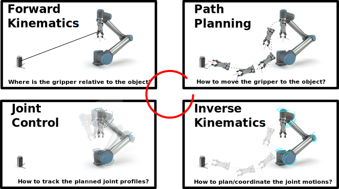
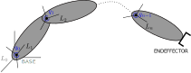
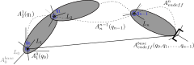
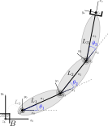
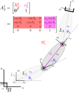
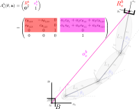
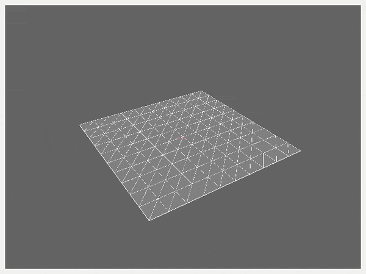

In this series of tutorials, we'll go over the basics of manipulator robot kinematics. This involves parameterizing the geometry of the robot in a standardized fashion, allowing us to compute the pose of each link - including the endeffector, where the robot typically interacts with the environment - in terms of the joint variables. This is known as *direct* kinematics. We'll then present *differential* kinematics which defines how changes in the joint variables relate to changes in link poses. Finally, we'll investigate the problem of *inverting* the kinematics equations in order to compute how the joints need to be controlled to achieve a desired motion of the robot's endeffector.

* Table of contents:
{:toc}

# The Fixed-Base Manipulator

Let's begin by introducing the type of robot we'll initially be modeling and controlling in our simulator - a **fixed-base manpulator**.

The robot consists of a chain of rigid **links** connected by controllable **joints** - typically electric motors or pneumatic/hydraulic piston linkages.  One end of the chain is constrained to a **base** - for example, rigidly fixed to the ground or a tabletop - while the other end is connected to an **endeffector** - for example, a gripper - for interaction with the environment.

"){: .center-image}

Fixed-base manipulators are a good place to start learning about kinematics, dynamics and control; much of the theory translates to legged robots, with the main difference being that **manipulators are inherently stable** (can't fall over).

Consider a simple grasping task shown below; the three key components of manipulator control we'll go over are manipulator **forward kinematics**, endeffector **path planning** and manipulator **inverse kinematics**.

{: .center-image }

These form a sort-of **closed loop control** - starting from forward kinematics to determine where the gripper is in space, followed by path planning and inverse kinematics for manipulator trajectory planning, and then joint-level control to move individual joints according to the plan.

In this post we'll start with forward kinematics, learning how to parameterize the manipulator geometry based on a standardized form so that we can compute the pose of each link from measured joint angles.

# Forward (Direct) Kinematics

The goal of *forward (direct) kinematics* is to find a mapping - via a sequence of
homogeneous transformations - which descibes the pose of the end-effector with
respect to the base in terms of the joint variables.

> ## A note on terminology
>
> The term **forward** in this context refers to a function which takes the joint state as input and outputs the Cartesian state of link(s). More generally, we say that forward kinematics maps from the *joint space* to the so-called *operational space* where we "operate on" (interact with) the environment. As we'll introduce later, the opposite is **inverse** kinematics which maps from the operational space back into the joint space.
>
> The term **direct** refers to the fact that we're mapping from joint *positions* to operational space Cartesian *pose*. It's also useful to work with **differential** kinematics, which maps joint *velocities* to Cartesian *twist* (linear + angular velocity).
>
> So, in total, we have four different ways of looking at manipulator kinematics - **forward direct**, **forward differential**, **inverse direct**, and **inverse differential**. We'll talk about forward direct kinematics in this post and forward differential kinematics in the next post. We'll leave all of inverse kinematics to a future post.

## Problem setup

Consider an open chain of $$n+1$$ links connected by $$n$$ joints as shown below.

{: .center-image}

Here, the first link - Link 0 - is the fixed base. Each joint, denoted by $$q_{i}$$, provides the structure with a
single *degree of freedom* (DOF). Notice that joint $$q_{i-1}$$ is always the first to affect link $$i$$; this difference in indexing is a common cause of confusion.

Attached to each link from 0 (base) to $$n$$ is the *link frame* denoted by $$L_{i}$$; the coordinate transformation from frame $$n$$ to frame $$0$$ is
then

$$
A_{n}^{0}(\mathbf{q}) = A_{1}^{0}(q_{1})A_{2}^{1}(q_{2})\cdots
A_{n}^{n-1}(q_{n})
$$

where each homogeneous transformation $$A_{i}^{i-1}$$ is incremental (defined relative to the
preceding link) and is thus a function of only one joint variable.

{: .center-image}

The direct
kinematics function from the end-effector to the base also requires
transformations from link 0 to the base and from link $$n$$ to the end-effector;
these are typically constant transformations. The direct kinematics function is
thus written as

$$
A_{endeff}^{base}(\mathbf{q}) = A_{0}^{b}A_{n}^{0}(\mathbf{q})A_{endeff}^{n}
$$

where we introduce $$\mathbf{q}=[q_{0},q_{1},\ldots,q_{n-1}]$$ to denote the *vector* of all joint states.

### RobotState class

Before we can go any further, we'll need to describe the **state** of the robot used for kinematics calculations. The robot state consists of both the *current* configuration and the *desired* configuration, the latter of which comes from motion planning (eg inverse kinematics).

We'll consider the state of the robot to be simply (for now) the current joint state, the desired joint state and the parameters which define the physical structure of the robot. We'll define the parameters according to a standard known as the *Denavit-Hartenberg* system later in this tutorial.

```python
class RobotState(object):
    """ Class storing robot geometry and all joint states of the robot.

    This class stores the state of the robot, which is considered to be arrays of the current and 
    desired joint values and their derivatives, initialized from an input set of DH parameters 
    which define the robot geometry.
    
    """
    
    def __init__(self, robot_params):
        """ Initialize the robot state from Denavit-Hartenberg (DH) parameters.

        Constructor which initializes the robot state, storing the DH parameters and parsing the
        joint state values into arrays of JointState type.
        
        Args:
            robot_params (RobotParams): Set of DH parameters describing robot geometry.

        """
        self.robot = robot_params
        self.joint_state = [JointState(self.robot.default_th[i], self.robot.dh_d[i])
                            for i in range(self.robot.n_dofs)]
        self.joint_state_des = [JointState(self.robot.default_th[i], self.robot.dh_d[i])
                                for i in range(self.robot.n_dofs)]
```

## Defining link frames

In the previous section, we described loosely how direct kinematics allows us to compute the homogeneous transform of the endeffector - or any frame in between - relative to the base. We also
introduced *link frames* and made the choice to locate them each at the origin of the preceding joint. However, we didn't actually describe how to *define* the axes of each link frame - and as it turns out, there are a number of reasonable ways to go about this. Probably the most well-known is the Denavit-Hartenberg convention.

### Denavit-Hartenberg Convention

This convention describes how to define the link frames such
that computation of the direct kinematics function is accomplished in a general,
systematic fashion. It's a bit complicated to visualize in three dimensions, so if it's still confusing I suggest [checking out this video](https://www.youtube.com/watch?v=rA9tm0gTln8) which does a great job at visualizing the process of defining frames. That said, the basic rules are as follows.

#### Defining link frames

The frame corresponding to the $$i^{th}$$ link is located at
joint $$i-1$$ and is defined as follows:

 * Choose the z-axis $$z_{i}$$ of each frame through the axis of the joint.
 * Locate the origin of the frame at the intersection of $$z_{i}$$ and the
  common normal to $$z_{i}$$ and $$z_{i-1}$$.  If $$z_{i}$$ and $$z_{i-1}$$ intersect,
  this is the location of the origin.
 * Choose the x-axis $$x_{i}$$ along the common normal to $$z_{i}$$ and
  $$z_{i-1}$$.  If these z-axes intersect, choose $$x_{i}$$ to be $$z_{i-1}\times
  z_{i}$$.
 * Finally, choose $$y_{i}$$ to complete a right-handed coordinate frame.

Consider the three-link *planar* (z-axes are out of the page) manipulator having three revolute joints as below:

{: .center-image}

| Link | θ | d | α | a |
|:----:|:----:|:----:|:----:|:-----:|
| 1 | θ<sub>1</sub> | 0 | 0 | a<sub>1</sub> |
| 2 | θ<sub>2</sub> | 0 | 0 | a<sub>2</sub> |
| 3 | θ<sub>3</sub> | 0 | 0 | a<sub>3</sub> |

In total, there are $$n$$ links and $$n+1$$ frames (one at each joint and one at the endeffector).  With the frames chosen as above, we can uniquely specify the manipulator geometry with four parameters:

 * $$\theta_{i}$$ is the angle between $$x_{i}$$ and $$x_{i-1}$$ about $$z_{i-1}$$. It's only variable for a **revolute joint**, otherwise it's a fixed offset angle.
 * $$d_{i}$$ is the distance between the origins of frames $$i$$ and $$i-1$$
  along the direction of axis $$z_{i-1}$$. It's only variable for a **prismatic joint**, otherwise it's a fixed distance offset. Obviously $$d_{i}=0$$ for a planar manipulator like the one above.
 * $$\alpha_{i}$$ is the angle between axes $$z_{i-1}$$ and $$z_{i}$$ about
  $$x_{i}$$; this is always a fixed offset angle.
 * $$a_{i}$$ is the distance between the axes $$z_{i-1}$$ and $$z_{i}$$ along the
  direction of axis $$x_{i}$$ (common normal between z-axes); this is always a fixed offset distance.

Note that we consider **each joint to have one DOF**, meaning only one of $$\theta_{i}$$ and $$d_{i}$$ can be variable for each link.  More complex joints having multiple DOFs (eg spherical joints like your shoulder) are treated as combinations of single-DOF joints sharing the same origin. More on that later.

#### JointState class

Now that we have the full robot state defined in terms of the joint state, we need to define what exactly the state of each individual joint is. As introduced above, each joint is either **revolute**, meaning $$\theta$$ (```th``` in code) is variable, or **prismatic**, meaning $$d$$ (```d``` in code) is variable. We thus store variables for both types of joints in our ```JointState``` class, along with variables for their derivatives. Additionally, we store the **input** or **effort** for the joint, ```u```, which will be provided by a controller.

```python
class JointState(object):
    """ Class storing the state of an individual robot joint.

    Following the DH parameter system for describing robot geometry, this class stores the joint 
    type (revolute or prismatic) as well as the value of each joint and its time derivatives. 

    """
    
    def __init__(self, th, d):
        """ Constructor initializing an individual joint state.

        Initializes the state of a single joint from passed revolute and prismatic joint values,
        storing each and their derivatives as well as the joint actuation effort.
        
        Args:
            th (float): Revolute joint value, in radians.
            d (float): Prismatic joint value, in meters.

        """
        # Joint is revolute by default.
        self.jtype = robot_defs.JTYPE_REVOLUTE

        self.th = th
        self.thd = 0.0
        self.thdd = 0.0

        self.d = d
        self.dd = 0.0
        self.ddd = 0.0

        self.u = 0.0

    def set_th(self, val):
        """ Set the joint angle. Needed for lambda functions. """
        self.th = val

    def set_thd(self, val):
        """ Set the joint velocity. Needed for lambda functions. """
        self.thd = val

    def set_d(self, val):
        """ Set the joint displacement. Needed for lambda functions. """
        self.d = val

    def set_u(self, val):
        """ Set the actuator-applied joint torque. Needed for lambda functions. """
        self.u = val
```


#### Computing link transforms

In this setup, Link $$i$$ is located between Frames $$i$$ and $$i-1$$; the homogeneous
transformation between these frames as a general function of the DH parameters $$\{\theta,d,\alpha,a\}$$ is given by

$$
A_{i}^{i-1}(\theta_{i},d_{i},\alpha_{i},a_{i}) = 
\begin{pmatrix}
\cos{\theta_{i}} & -\sin{\theta_{i}}\cos{\alpha_{i}} & \sin{\theta_{i}}\sin{\alpha_{i}} &
a_{i}\cos{\theta_{i}}\\

\sin{\theta_{i}} & \cos{\theta_{i}}\cos{\alpha_{i}} & -\cos{\theta_{i}}\sin{\alpha_{i}} &
a_{i}\sin{\theta_{i}}\\

0 & \sin{\alpha_{i}} & \cos{\alpha_{i}} & d_{i}\\

0 & 0 & 0 & 1
\end{pmatrix}
$$

In python we can compute this transformation matrix as follows:

```python
            # Use the homogeneous transformation for link i-1 and the incremental homogeneous
            # transformation between link i-1 and link i frames to compute the transformation
            # for link i:
            joint_tf[i+1].mat = joint_tf[i].mat.dot(
                np.array([[np.cos(th), -np.sin(th)*np.cos(alpha), np.sin(th)*np.sin(alpha), a*np.cos(th)],
                          [np.sin(th), np.cos(th)*np.cos(alpha), -np.cos(th)*np.sin(alpha), a*np.sin(th)],
                          [0.0, np.sin(alpha), np.cos(alpha), d],
                          [0.0, 0.0, 0.0, 1.0]]))
```

Consider again the three-link planar arm, for which we've highlighted the homogeneous transformation between the first and second link:

{: .center-image}

Note that since $$\alpha_{2}=0$$ and $$d_{2}=0$$, the rotational and translational portions of the transformation matrix $$A_{2}^{1}$$ are two-dimensional, as expected for a planar arm. This is not the case for more complex manipulators, as we will see below.

The ultimate goal is generally to compute the endeffector pose (rotation + translation), since this is usually the point on the robot which interacts with the world. Since the three links are identical in this case, the homogeneous transformation between successive links is

$$
A_{i}^{i-1}(\theta_{i},a_{i}) = 
\begin{pmatrix}
c_{\theta_{i}} & -s_{\theta_{i}} & 0 & a_{i}c_{\theta_{i}}\\
s_{\theta_{i}} & c_{\theta_{i}} & 0 & a_{i}s_{\theta_{i}}\\
0 & 0 & 1 & 0\\
0 & 0 & 0 & 1
\end{pmatrix}
$$

where we introduce $$\cos{x}=c_{x}$$ and $$\sin{x}=s_{x}$$ for brevity. The homogeneous transformation which describes the pose of the endeffector relative to the base is composed as intriduced earlier:

$$
A_{e}^{b}(\mathbf{\theta},\mathbf{a}) = A_{0}^{b}A_{1}^{0}(\theta_{1},a_{1})A_{2}^{1}(\theta_{2},a_{2})A_{e}^{2}(\theta_{3},a_{3})
$$

Substituting in the transform definitions (including the base to frame zero transform, which is the identity since they are identical frames) we have

$$
A_{e}^{b}(\mathbf{\theta},\mathbf{a})
=
\begin{pmatrix}
1 & 0 & 0 & 0\\
0 & 1 & 0 & 0\\
0 & 0 & 1 & 0\\
0 & 0 & 0 & 1
\end{pmatrix}
\begin{pmatrix}
c_{\theta_{1}} & -s_{\theta_{1}} & 0 & a_{1}c_{\theta_{1}}\\
s_{\theta_{1}} & c_{\theta_{1}} & 0 & a_{1}s_{\theta_{1}}\\
0 & 0 & 1 & 0\\
0 & 0 & 0 & 1
\end{pmatrix}
\begin{pmatrix}
c_{\theta_{2}} & -s_{\theta_{2}} & 0 & a_{2}c_{\theta_{2}}\\
s_{\theta_{2}} & c_{\theta_{2}} & 0 & a_{2}s_{\theta_{2}}\\
0 & 0 & 1 & 0\\
0 & 0 & 0 & 1
\end{pmatrix}
\begin{pmatrix}
c_{\theta_{3}} & -s_{\theta_{3}} & 0 & a_{3}c_{\theta_{3}}\\
s_{\theta_{3}} & c_{\theta_{3}} & 0 & a_{3}s_{\theta_{3}}\\
0 & 0 & 1 & 0\\
0 & 0 & 0 & 1
\end{pmatrix}
$$

which multiplies out to

$$
A_{e}^{b}(\mathbf{\theta},\mathbf{a})
=
\begin{pmatrix}
c_{\theta_{123}} & -s_{\theta_{123}} & 0 & a_{1}c_{\theta_{1}}+a_{2}c_{\theta_{12}}+a_{3}c_{\theta_{123}}\\
s_{\theta_{123}} & c_{\theta_{123}} & 0 & a_{1}s_{\theta_{1}}+a_{2}s_{\theta_{12}}+a_{3}s_{\theta_{123}}\\
0 & 0 & 1 & 0\\
0 & 0 & 0 & 1
\end{pmatrix}
$$

where we introduce the notation $$c_{xy}=\cos{x}\cos{y}$$ and $$s_{xy}=\sin{x}\sin{y}$$ and so forth. Illustrated graphically:

{: .center-image}

Whew! Before we move on, let's introduce some python code for computing the homogeneous transformations of each link in the chain, from base to endeffector:

```python
    def compute_link_motion(self, base_tf, joint_state):

        # Create the output arrays:
        joint_tf = [tf.HomogeneousTransform() for i in range(self.robot.n_dofs + 1)]
        link_tf = [tf.HomogeneousTransform() for i in range(self.robot.n_links + 1)]

        # Compute homogeneous transformations specifying each link's pose relative to the
        # world frame:
        joint_tf[0].mat = base_tf.mat
        link_tf[0].mat = joint_tf[0].mat

        # We start with h_tf[1] which corresponds to link frame 0, since the base is included:
        for i in range(self.robot.n_dofs):

            # First, get the DH parameters for the link:
            a = self.robot.dh_a[i]
            alpha = self.robot.dh_alpha[i]
            d = joint_state[i].d
            th = joint_state[i].th

            # Use the homogeneous transformation for link i-1 and the incremental homogeneous
            # transformation between link i-1 and link i frames to compute the transformation
            # for link i:
            joint_tf[i+1].mat = joint_tf[i].mat.dot(
                np.array([[np.cos(th), -np.sin(th)*np.cos(alpha), np.sin(th)*np.sin(alpha), a*np.cos(th)],
                          [np.sin(th), np.cos(th)*np.cos(alpha), -np.cos(th)*np.sin(alpha), a*np.sin(th)],
                          [0.0, np.sin(alpha), np.cos(alpha), d],
                          [0.0, 0.0, 0.0, 1.0]]))
            link_tf[i+1].mat = joint_tf[i+1].mat
```

This function uses the DH parameters stored in the ```RobotClass``` and iterates over the links, computing their transforms using the above theory.

Now, let's check out some more complex manipulator structures now. Disclaimer: I copied the following diagrams from the aforementioned text (Siciliano et al) but plan to revisit this and create some nicer-looking 3d diagrams for these structures.

#### Case study 2: spherical arm

The *spherical arm* consists of two co-located revolute joints, followed by our first prismatic (translation) joint. Note that both $$\theta_{2}$$ and $$d_{2}$$ are nonzero; however, only one of these can be variable for a single joint. In this case, $$\theta_{2}$$ is the joint's DOF and $$d_{2}$$ is fixed. This is made clear from the use of a cylinder to illustrate the joint; a prismatic joint is shown as a cube, eg for the DOF $$d_{3}$$.

"){: .center-image}

| Link | θ | d | α | a |
|:----:|:----:|:----:|:----:|:-----:|
| 1 | θ<sub>1</sub> | 0 | -π/2 | 0 |
| 2 | θ<sub>2</sub> | d<sub>2</sub> | π/2 | 0 |
| 3 | 0 | d<sub>3</sub> | 0 | 0 |

#### Case study 3: anthropomorphic arm

The *anthropomorphic arm* is essentially a vertical two-link planar arm (latter two joints) with the first DOF providing rotation of the remainder of the structure within the (ground) plane.

"){: .center-image}

| Link | θ | d | α | a |
|:----:|:----:|:----:|:----:|:-----:|
| 1 | θ<sub>1</sub> | 0 | π/2 | 0 |
| 2 | θ<sub>2</sub> | 0 | 0 | a<sub>2</sub> |
| 3 | θ<sub>3</sub> | 0 | 0 | a<sub>3</sub> |

# Visualizing the robot with OpenGL

We now know how to mathematically describe the robot in terms of link frames, and have introduced some code to implement this description. Now, we return to the simulator itself and implement a basic ```RobotGraphics``` class to visualize the manipulator.

## Graphics refactoring

In the [last simulator tutorial](https://nrotella.github.io/journal/initial-simulator-graphics-opengl.html), we rendered a simple ground plane, added axes and vector graphics, and set up a basic keyboard-controlled camera:

{: .center-image}


Before we add robot graphics to this simulator, let's do a little refactoring to make our graphics code more modular. We move the [GroundGraphics](https://github.com/nrotella/python-robot-sim/blob/master/simulator.py#L14-L114), [AxesGraphics](https://github.com/nrotella/python-robot-sim/blob/master/simulator.py#L158-L175) and [VectorGraphics](https://github.com/nrotella/python-robot-sim/blob/master/simulator.py#L117-L155) classes from the main simulator file into a new ```graphics_objects.py``` file. Eventually, we could even move everything to a dedicated graphics module as it becomes more complex.

In this new file we'll also add a class called ```GraphicsOptions``` to store any user-configurable options related to graphics that we add. For example, we anticipate wanting the ability to switch to a wireframe view, change the alpha transparency, and visualize robot joint/link frames all on the fly:

```python
class GraphicsOptions(object):
    """ Class for setting graphics options, normally via user input. """

    def __init__(self, n_dofs):
        self.n_dofs = n_dofs

        self.draw_wireframe = False

        self.use_alpha = False

        self.draw_joint_frame = np.array((self.n_dofs+1)*[False])
        self.draw_joint_frame[0] = True  # always draw the base frame

    def set_draw_wireframe(self, draw_bool):
        self.draw_wireframe = draw_bool

    def toggle_draw_wireframe(self):
        self.draw_wireframe = not self.draw_wireframe

    def set_use_alpha(self, alpha_bool):
        self.use_alpha = alpha_bool

    def toggle_use_alpha(self):
        self.use_alpha = not self.use_alpha

    def set_draw_joint_frame(self, joint_id, draw_bool):
        if joint_id >= 0 and joint_id <= self.n_dofs+1:
            self.draw_joint_frame[joint_id] = draw_bool

    def toggle_draw_joint_frame(self, joint_id):
        if joint_id >= 0 and joint_id < self.n_dofs+1:
            self.draw_joint_frame[joint_id] = not self.draw_joint_frame[joint_id]

    def toggle_draw_all_joint_frames(self):
        # If all the frames are currently drawn, turn them all off:
        if np.all(self.draw_joint_frame):
            for i in range(self.n_dofs+1):
                self.draw_joint_frame[i] = False
            self.draw_joint_frame[0] = True  # always draw the base frame
        # Otherwise, turn them all on:
        else:
            for i in range(self.n_dofs+1):
                self.draw_joint_frame[i] = True
```

We'll create an instance of this class in the simulator file and connect [keypress callbacks in the usual place](https://github.com/nrotella/python-robot-sim/blob/master/simulator.py#L247-L290) to the different graphics options, allowing the visualization to change with keyboard input:

```python
	    .
	    .
	    .

            elif event.key() == QtCore.Qt.Key_T:
                self.graphics_options.toggle_draw_wireframe()

            elif event.key() == QtCore.Qt.Key_0:
                self.graphics_options.toggle_draw_all_joint_frames()

            elif event.key() == QtCore.Qt.Key_1:
                self.graphics_options.toggle_draw_joint_frame(1)

            elif event.key() == QtCore.Qt.Key_2:
                self.graphics_options.toggle_draw_joint_frame(2)

            elif event.key() == QtCore.Qt.Key_3:
                self.graphics_options.toggle_draw_joint_frame(3)

            elif event.key() == QtCore.Qt.Key_4:
                self.graphics_options.toggle_draw_joint_frame(4)

            elif event.key() == QtCore.Qt.Key_5:
                self.graphics_options.toggle_draw_joint_frame(5)

            elif event.key() == QtCore.Qt.Key_6:
                self.graphics_options.toggle_draw_joint_frame(6)

            elif event.key() == QtCore.Qt.Key_7:
                self.graphics_options.toggle_draw_joint_frame(7)

            elif event.key() == QtCore.Qt.Key_8:
                self.graphics_options.toggle_draw_joint_frame(8)

            elif event.key() == QtCore.Qt.Key_9:
                self.graphics_options.toggle_draw_joint_frame(9)
```

Finally, we introduce a number of defined constants for rendering in a new ```graphics_defs.py``` file. These include sizes and colors for links, joints and so on.

## The RobotGraphics class

Now we're ready to add the main class used to visualize the manipulator into our ```graphics_objects.py``` file. We start with the class definition:

```python
class RobotGraphics(object):
    """ Class for rendering the robot geometry.

    This class implements visualization of the robot geometry from kinematics and graphics
    options. Links and joints are rendered using quadrics (cylinders). Link/joint frames 
    are rendered as AxesGraphics objects and can be toggled per frame via graphics options.
    All graphics have their sizes, colors, etc specified in the graphics_defs file as
    defined constants used for rendering.

    """

    def __init__(self):
        self.quadric = GLU.gluNewQuadric()
        GLU.gluQuadricNormals(self.quadric, GLU.GLU_SMOOTH)  # create Smooth Normals
        GLU.gluQuadricTexture(self.quadric, gl.GL_TRUE)  # create Texture Coords
        GLU.gluQuadricDrawStyle(self.quadric, GLU.GLU_FILL)
        self.vec_graphics = VectorGraphics()
        self.axes_graphics = AxesGraphics()
```

where we create quadrics for rendering primitives like cylinders, as well as more complex graphics we defined last time (axes and vectors). These will be reused for rendering different portions of the robot geometry below:

```python
    def render(self, kinematics, options):
        """ Render the robot graphics given the current kinematic state and graphics options.

	Renders the robot graphics given an updated kinematics class instance and options for
	visualization set from user input.

	Args:
	    kinematics (Kinematics): Updated robot kinematics object
	    options (GraphicsOptions): Graphics rendering options object

	Returns:
	    (None)
 
	 """
        # Change to wireframe graphics if desired:
        if options.draw_wireframe:
            GLU.gluQuadricDrawStyle(self.quadric, GLU.GLU_LINE)
        else:
            GLU.gluQuadricDrawStyle(self.quadric, GLU.GLU_FILL)

        if options.use_alpha:
            gl.glEnable(gl.GL_BLEND)
            gl.glBlendFunc(gl.GL_SRC_ALPHA, gl.GL_ONE_MINUS_SRC_ALPHA)
        else:
            gl.glDisable(gl.GL_BLEND)
```

First we check for options which specify how to render the robot graphics - these include wireframe and alpha values. We saw 
        # Draw each link as a cylinder:
        for i in range(1, kinematics.robot.n_links + 1):
            link_len = np.linalg.norm(kinematics.h_tf[i].t() - kinematics.h_tf[i-1].t())
            ang, ax = angle_axis_from_vec_dir(np.array([0.0, 0.0, 1.0]),
                                                 (kinematics.h_tf[i].t() -
                                                  kinematics.h_tf[i-1].t()))

            gl.glPushMatrix()
            gl.glColor4f(gdefs.LINK_COLOR_R,
                         gdefs.LINK_COLOR_G,
                         gdefs.LINK_COLOR_B,
                         gdefs.ROBOT_ALPHA)
            gl.glTranslatef(*kinematics.h_tf[i-1].t())
            gl.glRotate((180.0/np.pi)*ang, *ax)
            GLU.gluCylinder(self.quadric, gdefs.LINK_CYLINDER_RAD, gdefs.LINK_CYLINDER_RAD,
                            link_len, gdefs.CYLINDER_SLICES, gdefs.CYLINDER_STACKS)
            gl.glPopMatrix()

        # Draw each joint frame using an AxesGraphic object if desired (always draw base):
        for i in range(kinematics.robot.n_dofs+1):
            if options.draw_joint_frame[i]:
                self.axes_graphics.render(kinematics.h_tf[i])

        # Draw each joint as a cylinder aligned with the joint axis:
        for i in range(1, kinematics.robot.n_dofs + 1):
            ang, ax = angle_axis_from_vec_dir(np.array([0.0, 0.0, 1.0]),
                                                 kinematics.h_tf[i-1].Rz())
            gl.glPushMatrix()
            gl.glColor4f(gdefs.JOINT_COLOR_R,
                         gdefs.JOINT_COLOR_G,
                         gdefs.JOINT_COLOR_B,
                         gdefs.ROBOT_ALPHA)
            gl.glTranslatef(*kinematics.h_tf[i-1].t())
            gl.glRotate((180.0/np.pi)*ang, *ax)
            gl.glTranslatef(0.0, 0.0, -0.5*gdefs.JOINT_CYLINDER_LEN)
            GLU.gluCylinder(self.quadric, gdefs.JOINT_CYLINDER_RAD, gdefs.JOINT_CYLINDER_RAD,
                            gdefs.JOINT_CYLINDER_LEN, gdefs.CYLINDER_SLICES, gdefs.CYLINDER_STACKS)
            #gl.glDisable(gl.GL_BLEND)
            gl.glPopMatrix()

            # Draw a disk for the top of the joint actuator:
            gl.glPushMatrix()
            gl.glColor4f(gdefs.JOINT_COLOR_R,
                         gdefs.JOINT_COLOR_G,
                         gdefs.JOINT_COLOR_B,
                         gdefs.ROBOT_ALPHA)
            gl.glTranslatef(*kinematics.h_tf[i-1].t())
            gl.glRotate((180.0/np.pi)*ang, *ax)
            gl.glTranslatef(0.0, 0.0, 0.5*gdefs.JOINT_CYLINDER_LEN)
            GLU.gluDisk(self.quadric, 0.0, gdefs.JOINT_CYLINDER_RAD,
                        gdefs.DISK_SLICES, gdefs.DISK_STACKS)
            gl.glPopMatrix()

            # Draw a disk for the bottom of the joint actuator:
            gl.glPushMatrix()
            gl.glColor4f(gdefs.JOINT_COLOR_R,
                         gdefs.JOINT_COLOR_G,
                         gdefs.JOINT_COLOR_B,
                         gdefs.ROBOT_ALPHA)
            gl.glTranslatef(*kinematics.h_tf[i-1].t())
            gl.glRotate((180.0/np.pi)*ang, *ax)
            gl.glTranslatef(0.0, 0.0, -0.5*gdefs.JOINT_CYLINDER_LEN)
            GLU.gluDisk(self.quadric, 0.0, gdefs.JOINT_CYLINDER_RAD,
                        gdefs.DISK_SLICES, gdefs.DISK_STACKS)
            gl.glPopMatrix()

        # Draw the endeffector as a sphere:
        gl.glPushMatrix()
        gl.glColor4f(gdefs.ENDEFF_COLOR_R,
                     gdefs.ENDEFF_COLOR_G,
                     gdefs.ENDEFF_COLOR_B,
                     gdefs.ROBOT_ALPHA)
        gl.glTranslatef(*kinematics.h_tf[-1].t())
        GLU.gluSphere(self.quadric, gdefs.ENDEFF_SPHERE_RAD,
                      gdefs.SPHERE_SLICES, gdefs.SPHERE_STACKS)
        gl.glPopMatrix()

        # Draw the link centers of mass as spheres:
        for i in range(kinematics.robot.n_links + 1):
            gl.glPushMatrix()
            gl.glColor4f(gdefs.LINK_COM_COLOR_R,
                         gdefs.LINK_COM_COLOR_G,
                         gdefs.LINK_COM_COLOR_B,
                         gdefs.ROBOT_ALPHA)
            gl.glTranslatef(*(kinematics.link_com[i]))
            GLU.gluSphere(self.quadric, gdefs.LINK_COM_SPHERE_RAD,
                          gdefs.SPHERE_SLICES, gdefs.SPHERE_STACKS)
            gl.glPopMatrix()
```

# Wrapping up

In this tutorial, we introduced the basics for defining manipulator link frames via Denavit-Hartenberg parameters, as well as computing the incremental homogeneous transformations between successive links. We worked through the specifics for a three-link planar arm and a more complex anthropomorphic arm. Next, we'll implement classes to define general manipulator kinematics based on this theory.