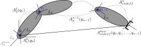
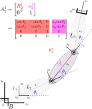

In this tutorial, we'll go over the basics of manipulator robot kinematics. This involves parameterizing the geometry of the robot in a standardized fashion, allowing us to compute the pose of each link - including the endeffector, where the robot typically interacts with the environment - in terms of the joint variables. We'll then present *differential* kinematics which defines how changes in the joint variables relate to changes in link poses. Finally, we'll investigate the problem of *inverting* the differential kinematics equations in order to compute how the joints need to be controlled to achieve a desired motion of the robot's endeffector.

* Table of contents:
{:toc}

# Forward (Direct) Kinematics

A robotics manipulator consists of a series of rigid bodies or *links*
connected by means of *joints*.  Joints can be of two types:
*revolute* (rotational) and *prismatic* (translational).  The entire
structure of the manipulator is formed by the links and joints and is known as a
*kinematic chain*.  One end of the chain is constrained to a *base*
while the other end is usually connected to an *end-effector* for
manipulation of objects in space.

The goal of *forward (direct) kinematics* is to find a mapping - via a sequence of
homogeneous transformations - which descibes the pose of the end-effector with
respect to the base in terms of the joint variables.

> ## A note on terminology
>
> The term **forward** in this context refers to a function which takes the joint state as input and outputs the Cartesian state of link(s). More generally, we say that forward kinematics maps from the *joint space* to the so-called *operational space* where we "operate on" (interact with) the environment. As we'll introduce later, the opposite is **inverse** kinematics which maps from the operational space back into the joint space.
>
> The term **direct** refers to the fact that we're mapping from joint *positions* to operational space Cartesian *pose*. It's also useful to work with **differential** kinematics, which maps joint *velocities* to Cartesian *twist* (linear + angular velocity).

> So, in total, we have four different ways of looking at manipulator kinematics - **forward direct**, **forward differential**, **inverse direct**, and **inverse differential**. We'll talk about forward kinematics in this post, and leave inverse kinematics to a future post.

## Problem setup

Consider an open chain of $$n+1$$ links connected by $$n$$ joints as shown below.

{: .center-image}

Here, the first link - Link 0 - is the fixed base. Each joint, denoted by $$q_{i}$$, provides the structure with a
single *degree of freedom* (DOF). Notice that joint $$q_{i-1}$$ is always the first to affect link $$i$$; this difference in indexing is a common cause of confusion.

Attached to each link from 0 (base) to $$n$$ is the *link frame* denoted by $$L_{i}$$; the coordinate transformation from frame $$n$$ to frame $$0$$ is
then

$$
A_{n}^{0}(\mathbf{q}) = A_{1}^{0}(q_{1})A_{2}^{1}(q_{2})\cdots
A_{n}^{n-1}(q_{n})
$$

where each homogeneous transformation $$A_{i}^{i-1}$$ is incremental (defined relative to the
preceding link) and is thus a function of only one joint variable.

{: .center-image}

The direct
kinematics function from the end-effector to the base also requires
transformations from link 0 to the base and from link $$n$$ to the end-effector;
these are typically constant transformations. The direct kinematics function is
thus written as

$$
A_{endeff}^{base}(\mathbf{q}) = A_{0}^{b}A_{n}^{0}(\mathbf{q})A_{endeff}^{n}
$$

where we introduce $$\mathbf{q}=[q_{0},q_{1},\ldots,q_{n-1}]$$ to denote the *vector* of all joint states.

## Defining link frames

In the previous section, we described loosely how direct kinematics allows us to compute the homogeneous transform of the endeffector - or any frame in between - relative to the base. We also
introduced *link frames* and made the choice to locate them each at the origin of the preceding joint. However, we didn't actually describe how to *define* the axes of each link frame - and as it turns out, there are a number of reasonable ways to go about this. Probably the most well-known is the Denavit-Hartenberg convention.

### Denavit-Hartenberg Convention

This convention describes how to define the link frames such
that computation of the direct kinematics function is accomplished in a general,
systematic fashion. It's a bit complicated to visualize in three dimensions, so if it's still confusing I suggest [checking out this video](https://www.youtube.com/watch?v=rA9tm0gTln8) which does a great job at visualizing the process of defining frames. That said, the basic rules are as follows.

#### Defining link frames

The frame corresponding to the $$i^{th}$$ link is located at
joint $$i-1$$ and is defined as follows:

 * Choose the z-axis $$z_{i}$$ of each frame through the axis of the joint.
 * Locate the origin of the frame at the intersection of $$z_{i}$$ and the
  common normal to $$z_{i}$$ and $$z_{i-1}$$.  If $$z_{i}$$ and $$z_{i-1}$$ intersect,
  this is the location of the origin.
 * Choose the x-axis $$x_{i}$$ along the common normal to $$z_{i}$$ and
  $$z_{i-1}$$.  If these z-axes intersect, choose $$x_{i}$$ to be $$z_{i-1}\times
  z_{i}$$.
 * Finally, choose $$y_{i}$$ to complete a right-handed coordinate frame.

Consider the three-link *planar* (z-axes are out of the page) manipulator having three revolute joints as below:

{: .center-image}

| Link | θ | d | α | a |
|:----:|:----:|:----:|:----:|:-----:|
| 1 | θ1 | 0 | 0 | a1 |
| 2 | θ2 | 0 | 0 | a2 |
| 3 | θ3 | 0 | 0 | a3 |

In total, there are $$n$$ links and $$n+1$$ frames (one at each joint and one at the endeffector).  With the frames chosen as above, we can uniquely specify the manipulator geometry with four parameters:

 * $$\theta_{i}$$ is the angle between $$x_{i}$$ and $$x_{i-1}$$ about $$z_{i-1}$$. It's only variable for a **revolute joint**, otherwise it's a fixed offset angle.
 * $$d_{i}$$ is the distance between the origins of frames $$i$$ and $$i-1$$
  along the direction of axis $$z_{i-1}$$. It's only variable for a **prismatic joint**, otherwise it's a fixed distance offset. Obviously $$d_{i}=0$$ for a planar manipulator like the one above.
 * $$\alpha_{i}$$ is the angle between axes $$z_{i-1}$$ and $$z_{i}$$ about
  $$x_{i}$$; this is always a fixed offset angle.
 * $$a_{i}$$ is the distance between the axes $$z_{i-1}$$ and $$z_{i}$$ along the
  direction of axis $$x_{i}$$ (common normal between z-axes); this is always a fixed offset distance.

Note that we consider **each joint to have one DOF**, meaning only one of $$\theta_{i}$$ and $$d_{i}$$ can be variable for each link.  More complex joints having multiple DOFs (eg spherical joints like your shoulder) are treated as combinations of single-DOF joints sharing the same origin. More on that later.

#### Computing link transforms

In this setup, Link $$i$$ is located between Frames $$i$$ and $$i-1$$; the homogeneous
transformation between these frames as a general function of the DH parameters $$\{\theta,d,\alpha,a\}$$ is given by

$$
A_{i}^{i-1}(\theta_{i},d_{i},\alpha_{i},a_{i}) = 
\begin{pmatrix}
\cos{\theta_{i}} & -\sin{\theta_{i}}\cos{\alpha_{i}} & \sin{\theta_{i}}\sin{\alpha_{i}} &
a_{i}\cos{\theta_{i}}\\

\sin{\theta_{i}} & \cos{\theta_{i}}\cos{\alpha_{i}} & -\cos{\theta_{i}}\sin{\alpha_{i}} &
a_{i}\sin{\theta_{i}}\\

0 & \sin{\alpha_{i}} & \cos{\alpha_{i}} & d_{i}\\

0 & 0 & 0 & 1
\end{pmatrix}
$$

Consider again the three-link planar arm, for which we've highlighted the homogeneous transformation between the first and second link:

{: .center-image}

Note that since $$\alpha_{2}=0$$ and $$d_{2}=0$$, the rotational and translational portions of the transformation matrix $$A_{2}^{1}$$ are two-dimensional, as expected for a planar arm. This is not the case for more complex manipulators, as we will see below.

The ultimate goal is generally to compute the endeffector pose (rotation + translation), since this is usually the point on the robot which interacts with the world. Since the three links are identical in this case, the homogeneous transformation between successive links is

$$
A_{i}^{i-1}(\theta_{i},a_{i}) = 
\begin{pmatrix}
c_{\theta_{i}} & -s_{\theta_{i}} & 0 & a_{i}c_{\theta_{i}}\\
s_{\theta_{i}} & c_{\theta_{i}} & 0 & a_{i}s_{\theta_{i}}\\
0 & 0 & 1 & 0\\
0 & 0 & 0 & 1
\end{pmatrix}
$$

where we introduce $$\cos{x}=c_{x}$$ and $$\sin{x}=s_{x}$$ for brevity. The homogeneous transformation which describes the pose of the endeffector relative to the base is composed as intriduced earlier:

$$
A_{e}^{b}(\mathbf{\theta},\mathbf{a}) = A_{0}^{b}A_{1}^{0}(\theta_{1},a_{1})A_{2}^{1}(\theta_{2},a_{2})A_{e}^{2}(\theta_{3},a_{3})
$$

Substituting in the transform definitions (including the base to frame zero transform, which is the identity since they are identical frames) we have

$$
A_{e}^{b}(\mathbf{\theta},\mathbf{a})
=
\begin{pmatrix}
1 & 0 & 0 & 0\\
0 & 1 & 0 & 0\\
0 & 0 & 1 & 0\\
0 & 0 & 0 & 1
\end{pmatrix}
\begin{pmatrix}
c_{\theta_{1}} & -s_{\theta_{1}} & 0 & a_{1}c_{\theta_{1}}\\
s_{\theta_{1}} & c_{\theta_{1}} & 0 & a_{1}s_{\theta_{1}}\\
0 & 0 & 1 & 0\\
0 & 0 & 0 & 1
\end{pmatrix}
\begin{pmatrix}
c_{\theta_{2}} & -s_{\theta_{2}} & 0 & a_{2}c_{\theta_{2}}\\
s_{\theta_{2}} & c_{\theta_{2}} & 0 & a_{2}s_{\theta_{2}}\\
0 & 0 & 1 & 0\\
0 & 0 & 0 & 1
\end{pmatrix}
\begin{pmatrix}
c_{\theta_{3}} & -s_{\theta_{3}} & 0 & a_{3}c_{\theta_{3}}\\
s_{\theta_{3}} & c_{\theta_{3}} & 0 & a_{3}s_{\theta_{3}}\\
0 & 0 & 1 & 0\\
0 & 0 & 0 & 1
\end{pmatrix}
$$

which multiplies out to

$$
A_{e}^{b}(\mathbf{\theta},\mathbf{a})
=
\begin{pmatrix}
c_{\theta_{123}} & -s_{\theta_{123}} & 0 & a_{1}c_{\theta_{1}}+a_{2}c_{\theta_{12}}+a_{3}c_{\theta_{123}}\\
s_{\theta_{123}} & c_{\theta_{123}} & 0 & a_{1}s_{\theta_{1}}+a_{2}s_{\theta_{12}}+a_{3}s_{\theta_{123}}\\
0 & 0 & 1 & 0\\
0 & 0 & 0 & 1
\end{pmatrix}
$$

where we introduce the notation $$c_{xy}=\cos{x}\cos{y}$$ and $$s_{xy}=\sin{x}\sin{y}$$ and so forth. Illustrated graphically:

{: .center-image}

Whew! Let's check out some more complex manipulator structures now.

#### Case study 2: spherical arm

The *spherical arm* consists of two co-located revolute joints, followed by our first prismatic (translation) joint. Note that both $$\theta_{2}$$ and $$d_{2}$$ are nonzero; however, only one of these can be variable for a single joint. In this case, $$\theta_{2}$$ is the joint's DOF and $$d_{2}$$ is fixed. This is made clear from the use of a cylinder to illustrate the joint; a prismatic joint is shown as a cube, eg for the DOF $$d_{3}$$.

"){: .center-image}

| Link | θ | d | α | a |
|:----:|:----:|:----:|:----:|:-----:|
| 1 | θ1 | 0 | -π/2 | 0 |
| 2 | θ2 | d2 | π/2 | 0 |
| 3 | 0 | d3 | 0 | 0 |

#### Case study 3: anthropomorphic arm

The *anthropomorphic arm* is essentially a vertical two-link planar arm (latter two joints) with the first DOF providing rotation of the remainder of the structure within the (ground) plane.

"){: .center-image}

| Link | θ | d | α | a |
|:----:|:----:|:----:|:----:|:-----:|
| 1 | θ1 | 0 | π/2 | 0 |
| 2 | θ2 | 0 | 0 | a2 |
| 3 | θ3 | 0 | 0 | a3 |

# Forward Differential Kinematics

So far, we've discussed how to parameterize coordinate frames in a kinematic chain via the Denavit-Hartenberg parameters and compute the pose of the links (namely, the endeffector) as a function of the joint variables and robot geometry via **forward direct** kinematics.

In order to compute derivatives of the link poses - in geometric terms, link *twists* - from derivatives of the joint variables, we use **forward differential** kinematics. This mapping is described by a matrix
called the **Jacobian**.

There are two ways to arrive at such a mapping - the first is called the
*geometric* Jacobian and the second is called the *analytical*
Jacobian.  

The geometric Jacobian is derived in a manner similar to that of the
direct kinematics function in which one sums up the contributions of each
individual joint velocity to the total end-effector velocity; this mapping
is configuration-dependent.  

The analytical Jacobian results from differentiating the direct kinematics
function (when this function describes the pose with reference to a minimal
representation in operational space) with respect to the joint variables.

## Geometric Jacobian

For an n-DOF manipulator we have the direct kinematics equation

$$
T_{e}(\mathbf{q}) = 
\begin{pmatrix}
R_{e}(\mathbf{q}) & & \mathbf{p}_{e}(\mathbf{q})\\
 & & \\
\mathbf{0}^{T} & & 1
\end{pmatrix}
$$

It is desired to express the end-effector linear velocity
$$\mathbf{\dot{p}}_{e}$$ and the end-effector angular velocity
$$\mathbf{\omega}_{e}$$ in terms of the joint velocities $$\mathbf{\dot{q}}$$.  It will be
shown that these relations are both linear in the joint velocities and are given
by

$$
\begin{align*}
\mathbf{\dot{p}}_{e} &= J_{P}(\mathbf{q})\mathbf{\dot{q}} \\
\mathbf{\omega}_{e} &= J_{O}(\mathbf{q})\mathbf{\dot{q}}
\end{align*}
$$

where $$J_{P}\in R^{3\times n}$$ and $$J_{O}\in R^{3\times n}$$ are the Jacobian
matrices relating the contributions of the joint velocities to the
end-effector linear and angular velocities, respectively.  We can write this in
compact form as the *differential kinematics equation*

$$
\mathbf{v}_{e} = \begin{pmatrix}\mathbf{\dot{p}}_{e}\\
\mathbf{\omega}_{e}\end{pmatrix} = J(\mathbf{q})\mathbf{\dot{q}}
$$

where 

$$
J = \begin{pmatrix}J_{P}\\J_{O}\end{pmatrix}
$$

is the manipulator geometric Jacobian which is, in general, a function of the
manipulator configuration.  This matrix is derived as follows.

First, consider the time derivative of a rotation matrix $$R=R(t)$$.  Since such a
matrix is orthogonal,

$$
R(t)R(t)^{T} = I
$$

Differentiating this expression with respect to time yields

$$
R(t)\dot{R}^{T}(t) + \dot{R}(t)R^{T}(t) = 0
$$

Defining $$S(t) = \dot{R}(t)R(t)^{T}$$ we have

$$
S(t) + S^{T}(t) = 0
$$

which implies that the matrix $$S(t)$$ must be *skew-symmetric* since the sum
of it and its transpose equals the zero matrix.

Since $$R^{-1}(t) = R(t)$$ we can solve our expression for $$S(t)$$ to yield 

$$
\dot{R}(t) = S(t)R(t)
$$

which is the differential equation relating the rotation matrix to its
derivative via the skew-symmetric operator $$S$$.

Consider a constant vector $$\mathbf{p'}$$ in a rotating reference frame
described by $$R(t)$$ and its image $$\mathbf{p(t)} = R(t)\mathbf{p'}$$ in the fixed
frame in which $$R(t)$$ is defined.  Taking the derivative of $$\mathbf{p(t)}$$
yields

$$
\mathbf{\dot{p}}(t) = \dot{R}(t)\mathbf{p'}
$$

which, using the definition of the derivative of a rotation matrix, can be
written as

$$
\mathbf{\dot{p}}(t) = S(t)R(t)\mathbf{p'}
$$

From mechanics, however, we know that this is simply given by
$$\mathbf{\dot{p}}(t) = \omega(t)\times \mathbf{p}(t) = \omega(t)\times
R(t)\mathbf{p'}$$ where $$\mathbf{\omega}(t)=[\omega_{x}, \omega_{y},
\omega{z}]^{T}$$ is the angular velocity of the rotating frame with respect to the reference frame at time $$t$$.

This means that we must have 

$$
S(\mathbf{\omega}(t)) =
\begin{pmatrix}
0 & -\omega_{z} & \omega_{y} \\
\omega_{z} & 0 & -\omega_{x} \\
-\omega_{y} & \omega_{x} & 0
\end{pmatrix}
$$

We can thus write $$\dot{R} = S(\mathbf{\omega})R$$.  Further, for a rotation
matrix we have the property

$$
RS(\mathbf{\omega})R^{T} = S(R\mathbf{\omega})
$$

Now consider the coordinate transformation of a point $$P$$ from Frame 1 to Frame
0 given by

$$
\mathbf{p}^{0} = \mathbf{o}_{1}^{0} + R_{1}^{0}\mathbf{p}^{1}
$$

Differentiating this expression with respect to time yields

$$
\begin{align*}
\mathbf{\dot{p}}^{0} &= \mathbf{\dot{o}}_{1}^{0} + R_{1}^{0}\mathbf{\dot{p}}^{1}
+ \dot{R}_{1}^{0}\mathbf{p}^{1} \\
&= \mathbf{\dot{o}}_{1}^{0} + R_{1}^{0}\mathbf{\dot{p}}^{1}
+ S(\mathbf{\omega}_{1}^{0})R_{1}^{0}\mathbf{p}^{1} \\
&= \mathbf{\dot{o}}_{1}^{0} + R_{1}^{0}\mathbf{\dot{p}}^{1}
+ \mathbf{\omega}_{1}^{0}\times \mathbf{r}_{1}^{0} 
\end{align*}
$$

where $$\mathbf{r}_{1}^{0} = R_{1}^{0}\mathbf{p}^{1}$$ represents the point
$$P$$ after it has been rotated into Frame 0 but not translated, ie $$r_{1}^{0} =
p^{0} - o_{1}^{0}$$.
This is known as the *velocity composition rule*.  If the point $$P$$ is fixed in Frame 1 then this reduces to

$$
\mathbf{\dot{p}}^{0} = \mathbf{\dot{o}}_{1}^{0} + \mathbf{\omega}_{1}^{0}\times
\mathbf{r}_{1}^{0}
$$

Now consider deriving the relationships between the linear and angular
velocities of successive frames. Using the same DH convention for choosing link
frames, it can be shown that

$$
\mathbf{\dot{p}}_{i} = \mathbf{\dot{p}}_{i-1} + \mathbf{\dot{v}}_{i-1,i} +
\mathbf{\omega}_{i-1} \times \mathbf{r}_{i-1,i}
$$

gives the linear velocity of Link $$i$$ as a function of the translational
and rotational velocities of Link $$i-1$$.  Note that all vectors are expressed
with respect to a fixed Frame 0 and that $$\mathbf{v}_{i-1,i}$$ denotes the
velocity of the origin of Frame $$i$$ with respect to the origin of Frame $$i-1$$ as
expressed in terms of Frame 0. In addition,

$$
\mathbf{\omega}_{i} = \mathbf{\omega}_{i-1} + \mathbf{\omega}_{i-1,i}
$$

gives the angular velocity of Link $$i$$ as a function of the angular velocities
of Link $$i-1$$ and of Link $$i$$ with respect to Link $$i-1$$
($$\mathbf{\omega}_{i-1,i}$$).

Using these general results, we have that for a *prismatic joint*

$$
\mathbf{\omega}_{i} = \mathbf{\omega}_{i-1}
$$

since the orientation of Frame $$i$$ with respect to $$i-1$$ does not change when
Joint $$i$$ is moved and thus $$\mathbf{\omega}_{i-1,i}=0$$.  For the linear
velocity we have

$$
\mathbf{\dot{p}}_{i} = \mathbf{\dot{p}}_{i-1} +
\dot{d}_{i}\mathbf{z}_{i-1} + \mathbf{\omega}_{i} \times \mathbf{r}_{i-1,i}
$$

since this joint is articulated in the direction of axis $$\mathbf{z}_{i}$$.

For a *revolute joint* we have

$$
\mathbf{\omega}_{i} = \mathbf{\omega}_{i-1} + \dot{\theta}_{i}\mathbf{z}_{i-1}
$$

and

$$
\mathbf{\dot{p}}_{i} = \mathbf{\dot{p}}_{i-1} + \mathbf{\omega}_{i} \times \mathbf{r}_{i-1,i}
$$

## Jacobian Computation

Consider the expression $$\mathbf{\dot{p}}_{e}(\mathbf{q})$$
relating the end-effector position to the joint variables.  Differentiating this yields

$$
\mathbf{\dot{p}}_{e} = \sum_{i=1}^{n}\frac{\partial \mathbf{p}_{e}}{\partial
q_{i}}\dot{q_{i}} = \sum_{i=1}^{n}{J_{P}}_{i}\dot{q}_{i}
$$

due to the chain rule.  Thus, the linear velocity of the end-effector can be
obtained as the sum of $$n$$ terms, each of which represents the contribution of
a single joint to the end-effector linear velocity when all other joints are
still.
 
Thus, we have $${J_{P}}_{i} = \mathbf{z}_{i-1}$$ for a prismatic joint and
$${J_{P}}_{i} = \mathbf{z}_{i-1} \times (\mathbf{p}_{e} - \mathbf{p}_{i-1})$$ for
a revolute joint.

The angular velocity of the end-effector is given by

$$
\mathbf{\omega}_{e} = \mathbf{\omega}_{n} =
\sum_{i=1}^{n}\mathbf{\omega}_{i-1,i} = \sum_{i=1}^{n}{J_{O}}_{i}\dot{q}_{i}
$$

and thus for a prismatic joint $${J_{O}}_{i} = 0$$ and for a revolute joint
$${J_{O}}_{i} = \mathbf{z}_{i-1}$$.

In summary, the full Jacobian is formed from $$3\times 1$$ vectors $${J_{P}}_{i}$$
and $${J_{O}}_{i}$$ as

$$
J = 
\begin{pmatrix}
{J_{P}}_{1} & {J_{P}}_{2} & \cdots & {J_{P}}_{n} \\
 & & & \\
{J_{O}}_{1} & {J_{O}}_{2} & \cdots & {J_{O}}_{n}
\end{pmatrix}
$$

where we have

$$
\begin{pmatrix}{J_{P}}_{i}\\{J_{O}}_{i}\end{pmatrix} = 
\begin{cases}
\begin{pmatrix}\mathbf{z}_{i-1}\\ \mathbf{0}\end{pmatrix} &\text{for a
 prismatic joint}
\\
\begin{pmatrix}\mathbf{z}_{i-1} \times (\mathbf{p}_{e} - \mathbf{p}_{i-1})\\
\mathbf{z}_{i-1}\end{pmatrix} &\text{for a revolute joint}
\end{cases}
$$

The vectors on which the Jacobian depends are functions of the joint variables
and can be computed from the direct kinematics relations as follows.

* $$\mathbf{z}_{i-1}$$ is given by the third column of the rotation matrix
  $$R_{i-1}^{0}$$; if $$z_{0}=[0, 0, 1]^{T}$$ then $$\mathbf{z}_{i-1} =
  R_{1}^{0}(q_{1})\cdots R_{i-1}^{i-2}(q_{i-1})\mathbf{z}_{0}$$.
* $$\mathbf{p}_{e}$$ is given by the first three elements of the fourth
  coumn of the homogeneous transformation matrix $$T_{e}^{0} =
  A_{1}^{0}(q_{1})\cdots A_{n}^{n-1}(q_{n})$$.
* $$\mathbf{p}_{i-1}$$ is given by the first three elements of the fourth
  column of the homogeneous transformation matrix $$T_{i-1}^{0} =
  A_{1}^{0}(q_{1})\cdots A_{i-1}^{i-2}(q_{i-1})$$

Finally, note that the Jacobian has been developed here to describe the
end-effector velocities with respect to the base frame.  If it is desired to
represent the Jacobian with respect to a different Frame *u* then the
relation is

$$
J^{u} = \begin{pmatrix}R^{u}&0\\0&R^{u}\end{pmatrix}J
$$

# Wrapping up

In this tutorial, we introduced the basics for defining manipulator link frames via Denavit-Hartenberg parameters, as well as computing the incremental homogeneous transformations between successive links. We worked through the specifics for a three-link planar arm and a more complex anthropomorphic arm. Next, we'll implement classes to define general manipulator kinematics based on this theory.