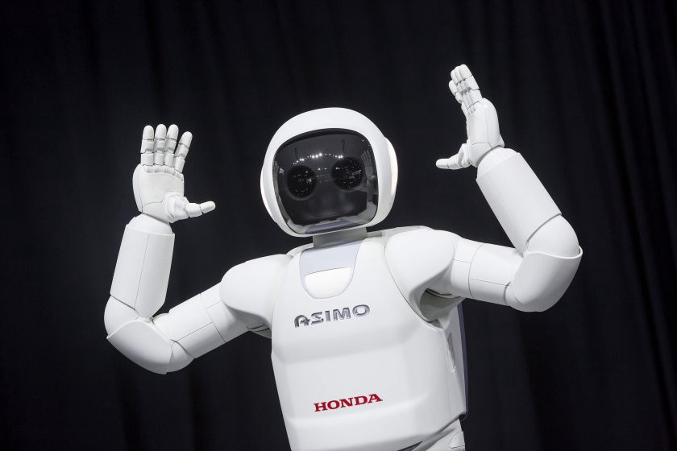
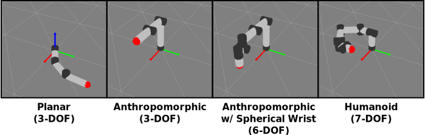

In a [blog post early this year](https://nrotella.github.io/journal/initial-simulator-graphics-opengl.html) I stated my intention to develop a python-based robotics simulator piece-by-piece, adding new content alongside explanations of robotics-related theory. I started this project because I wanted to improve my python skills (I insisted on using only MATLAB for data analysis and plotting for the longest time), post some of my PhD notes, and contribute to open-access education in a small way. Plus, I'm pretty passionate about robotics simulators since I've spent lots of time using other ones, so I thought it might be a fun excercise to write my own from the basics.

The problem is that, similar to writing papers, making blog posts with lots of LaTeX, code, and graphics requires a *ton* of time - far more than I ever expected. So, even as I continued having fun developing my little robot manipulator simulation in my spare time, the blog posts lagged further and further behind. In this post I just want to showcase the current state of this project as a sort-of preview or sneak-peak (or spoiler?) of what I still intend to come.

I've pushed this version of the simulator to [its own branch](https://github.com/nrotella/python-robot-sim/tree/7dof_ik_working) and will walk through some of its features in this post. Let's take a quick look at the branch structure (generated using [tree](https://linux.die.net/man/1/tree) on command line):

```bash
python-robot-sim/
├── [dynamics.py](https://github.com/nrotella/python-robot-sim/blob/7dof_ik_working/dynamics.py): Rigid body dynamics algorithms (forward and inverse, using recursive Newton-Euler)
├── [graphics_defs.py](https://github.com/nrotella/python-robot-sim/blob/7dof_ik_working/graphics_defs.py): Defined constants for graphics 
├── [graphics_objects.py](https://github.com/nrotella/python-robot-sim/blob/7dof_ik_working/graphics_objects.py): Classes implementing object visuals, including robot and axes visuals
├── [graphics_options.py](https://github.com/nrotella/python-robot-sim/blob/7dof_ik_working/graphics_options.py): Options for rendering graphics
├── [inverse_kinematics.py](https://github.com/nrotella/python-robot-sim/blob/7dof_ik_working/inverse_kinematics.py): Basic differential inverse kinematics solver
├── [kinematics.py](https://github.com/nrotella/python-robot-sim/blob/7dof_ik_working/kinematics.py): Forward direct and differential kinematics based on Denavit-Hartenberg
├── [README.md](https://github.com/nrotella/python-robot-sim/blob/7dof_ik_working/README.md)
├── [robot_defs.py](https://github.com/nrotella/python-robot-sim/blob/7dof_ik_working/robot_defs.py): Defined constants for robot simulation
├── [simulator.py](https://github.com/nrotella/python-robot-sim/blob/7dof_ik_working/simulator.py): Main class implementing simulator using all others
└── [transformations.py](https://github.com/nrotella/python-robot-sim/blob/7dof_ik_working/transformations.py): Homoegeneous transforms and SO(3) conversion functions
```

Everything necessary for robot simulation and control is there, albeit in simple form.

## Okay, but honestly, is this simulator any good?

That's not really the point. In other words, no.

{: .center-image height="400px" width="400px"}

Would I recommend you use it for anything more than learning the basics of articulated robotics simulation and control? Probably not, honestly. This is a little side project for me to create educational content on my site, get better at developing in python, and keep some of my lesser-used robotics skills sharp. So where does my python robotics simulator fall short?

First, using DH parameters to specify robot geometry is not a popular choice; I chose this simply because it coincides with how manipulator kinematics are usually taught. A much more expressive framework is [Unified Robot Description Format (URDF)](http://wiki.ros.org/urdf) which is used in ROS and by many academic/open-source simulators in some form. URDF is nice because there are many libraries which consume it - for example, the [Kinematics and Dynamics Library (KDL)](https://www.orocos.org/wiki/orocos/kdl-wiki) which I've used in a few projects before.

"){: .center-image height="400px" width="400px"}

KDL makes it easy to work with a robot described in URDF: load the URDF into a description string, generate a KDL tree from the string, query the tree for chains between named links, and parse the chain into segments containing joint information. Since DH parameters only describe relative transformations between links, we don't have any structure to query in this way; it would have to be implemented as a layer on top.

A step further than URDF is the [Simulation Description Format (SDF)](http://sdformat.org/) used most prominently in the widespread [Gazebo](http://gazebosim.org/) simulator which effectively extends URDF to make it useful for description in a simulator.

{: .center-image height="300px" width="300px"}

This format describes not only robot kinematic but also dynamic properties, along with properties of the simulated "world" itself: objects, lighting, physics, etc. If I were really writing a simulator in the absence of educational blog posts/fun learning opportunities, I'd probably assemble it from the following:

* [SDF](http://sdformat.org/) for robot/world specification
* [KDL](https://www.orocos.org/wiki/orocos/kdl-wiki), [Bullet](https://pybullet.org/wordpress/), or [ODE](https://www.ode.org/) for kinematics and dynamics
* [Ogre3D](https://www.ogre3d.org/) for graphics (I picked OpenGL to force myself to learn the fundamentals)
* [ROS](https://www.ros.org/) for middleware/tools (or [start from scratch with something like ZeroMQ](https://design.ros2.org/articles/ros_with_zeromq.html))

Of course, the "glue" to hold all this together is still a significant undertaking to develop.  If this setup looks familiar, that's because it basically recreates Gazebo! And what's the fun in recreating something that already exists and works well?

{: .center-image height="400px" width="400px"}

# Multiple robot models

First of all, the simulator easily supports any manipulator models specified by DH parameters; these are encapsulated in the [RobotParams](https://github.com/nrotella/python-robot-sim/blob/7dof_ik_working/kinematics.py#L10) class.

{: .center-image}

The most interesting is the 7 DOF "humanoid" arm having a spherical (3 DOF) shoulder, an elbow (1 DOF), and spherical (3 DOF) wrist. This is the model we'll want to test our inverse kinematics and control algorithms on. The robot graphics model is very basic, being constructed from cylinder primitives for the links and joints, with spheres denoting the link COMs (normally obscured inside links) and endeffector.

# Forward and inverse kinematics

We describe the robot configuration and render it through the use of [homogeneous transformations](https://github.com/nrotella/python-robot-sim/blob/7dof_ik_working/transformations.py#L5) derived from DH parameters, and compute [Jacobians (first order derivatives of link poses) and link motion](https://github.com/nrotella/python-robot-sim/blob/7dof_ik_working/kinematics.py#L155-L252) from these parameters as well. We can then perform a very simple, differential inverse kinematics by prescribing an endeffector trajectory (for example, a circle in the x-z plane) and using the [Jacobian's pseudoinverse](https://github.com/nrotella/python-robot-sim/blob/7dof_ik_working/inverse_kinematics.py#L68) to find desired joint velocities:

$$
\dot{x} = J\dot{q}\rightarrow \dot{q} = J^{\dagger}\dot{x}
$$

The result is shown below for the 7 DOF manipulator:

"){: .center-image}

We render the desired robot state as semi-transparent to visually evaluate tracking as we add controllers into the simulator.

# Forward and inverse dynamics

We simulate the physical system by defining link masses and inertias, and computing forces/torques (wrenches) acting on each link through the [recursive Newton-Euler formulation](https://github.com/nrotella/python-robot-sim/blob/7dof_ik_working/dynamics.py#L12). The dynamics themselves get integrated into the actual robot state using either a simple [Euler integration step](https://github.com/nrotella/python-robot-sim/blob/7dof_ik_working/simulator.py#L336-L341), or a more numerically-robust [Runge-Kutta integration (RK4)](https://github.com/nrotella/python-robot-sim/blob/7dof_ik_working/simulator.py#L343-L382).

The recursive NE formulation is also used with special inputs in order to [compute the components of the full dynamic model](https://github.com/nrotella/python-robot-sim/blob/7dof_ik_working/dynamics.py#L102-L128) of the manipulator,  


$$
M\ddot{q} + h(q,\dot{q}) + g(q) = J^{T}F_{ext} + \tau
$$

namely the mass-inertia matrix $$M$$ and the nonlinear terms due to gravity, $$g(q)$$ and coriolis/centifugal forces, $$h(q,\dot{q})$$. These terms are used in controlling the simulated manipulator (finding a torque vector $$\tau$$ to track desired motion as explained below.

# Torque control

The input to the dynamic model is the torque $$\tau$$ which we can compute to achieve desired motion using a number of different controllers. These include simple [PD control on desired positions](https://github.com/nrotella/python-robot-sim/blob/7dof_ik_working/simulator.py#L274-L279), [gravity compensation plus PD control](https://github.com/nrotella/python-robot-sim/blob/7dof_ik_working/simulator.py#L281-L287) and full [inverse dynamics plus PD control](https://github.com/nrotella/python-robot-sim/blob/7dof_ik_working/simulator.py#L290-L298).

Below is an example of a gravity compensation plus PD controller running on the 3 DOF manipulator simulation while the desired joint states are modulated one-by-one. This controller essentially stabilizes the robot around a static pose, but with proper tuning of feedback gains is a popular choice for motion control. The gains in the example below were intentionally "tuned down" to show both the desired state (semi-transparent) and actual state being controlled (opaque).

"){: .center-image}

For more dynamic motion tracking we can use the full inverse dynamics controller which adds feedforward desired joint accelerations (eg from inverse kinematics or some more general motion planner) into the control.

# Graphics options

Finally, I've found that it's super useful to have some basic graphics options which can be toggled via keyboard for visualizing robots, so I added the ability to toggle link coordinate frames by number, toggle wireframe graphics, and toggle link motion (linear and angular velocity and acceleration) vectors.

"){: .center-image}

The above figure shows off these graphics options during a "sum of sines" joint trajectory tracking task, with much tighter gravity compensation + PD control.

# Wrapping up

This is a little glimpse into the basic simulator I've been working on, since I don't know how long it might take me to catch up with blog posts that mirror the code. However, I plan to keep adding incrementally alongside theory posts on the [master branch](https://github.com/nrotella/python-robot-sim/) and I hope someone can learn from them!