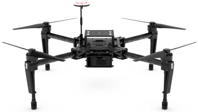
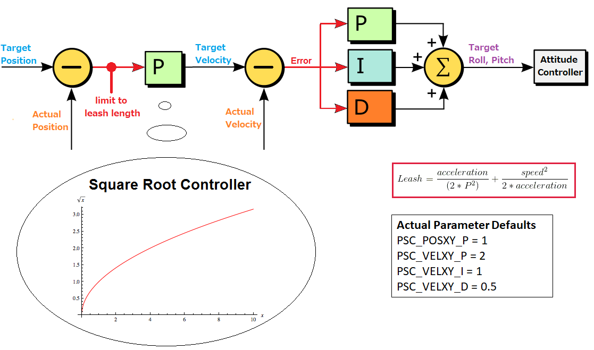
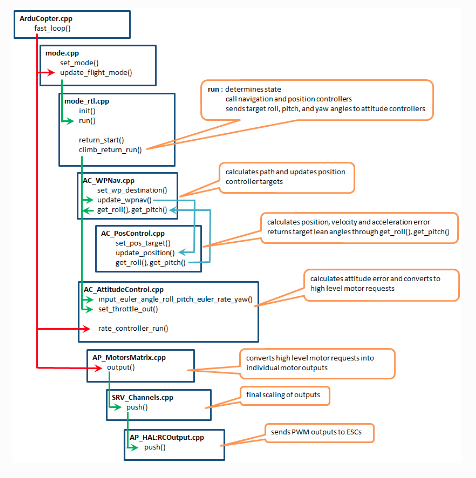
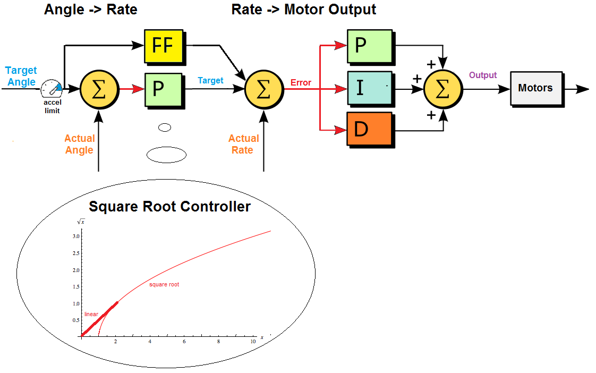
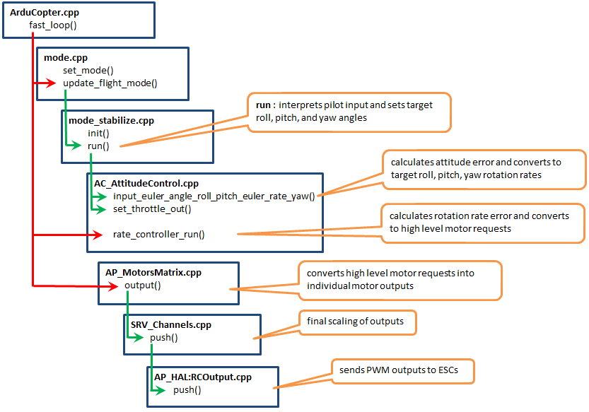
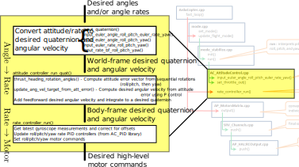
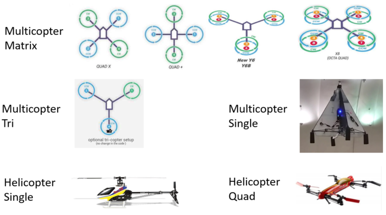
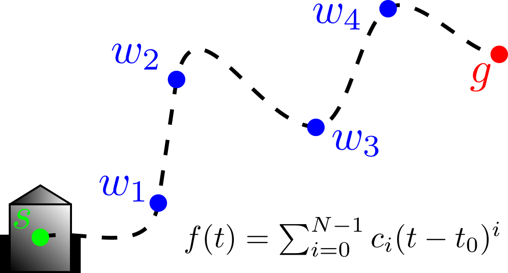
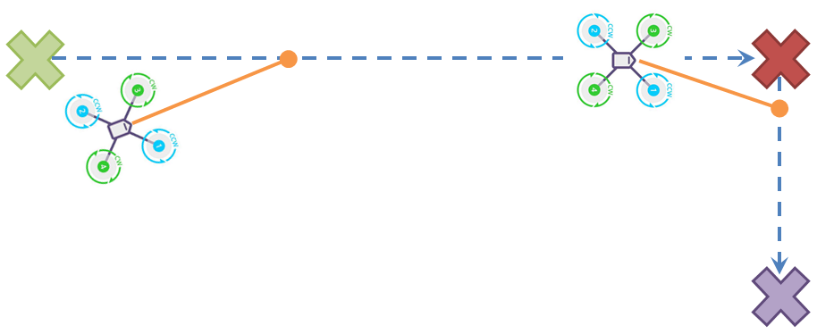

In a previous post, I detailed how to install Ardupilot for drone control - [ArduCopter](https://ardupilot.org/copter/), or *Copter* for short. We ran through a very basic high-level flight control example via the ROS/MAVLink interface provided by [MAVROS](http://wiki.ros.org/mavros), which relies on existing flight control modes in the core Ardupilot source. Today, let's delve a little deeper into ArduCopter and explore the codebase to gain a better inderstanding of how the different flight modes work, where they're implemented, and how we might use them.

* Table of contents:
{:toc}

# Background

Much of the information in this post was gleaned from the fantastic [Learning the ArduPilot Codebase](https://ardupilot.org/dev/docs/learning-the-ardupilot-codebase.html) pages, alongside lots of searching through the codebase itself - hence links to pieces of relevant code. Note that some of these permalinks may point to an older version of Ardupilot due to the nature of these notes, though the general structure has not changed.

# Flight Control Background

Before we dive into the main controllers in ArduCopter and their implementations, let's take a moment to better understand flight dynamics and how a robot like a quadrotor is controlled at a high level. Consider the quadcopter (or *quadrotor*, or less specifically, *drone* or *UAV*) below:

{: .center-image}

The *inputs* to the system are the four rotor thrusts, which can be controlled independently. We can consider the *state* of the system to be the three-dimensional **pose** (position + orientation) and **twist** (linear + angular velocity). In the absence of external forces (disturbances like wind, for example), the total thrust from the four rotors in the example above balances the weight of the airframe and keeps the drone hovering in place.

The interesting thing about controlling a multirotor system like the one shown is that a) we can only create **upward thrusts** and b) we can only create **thrust along each rotor axis**. How can we expect to control the drone in three dimensions - when *instantaneously* we can only apply forces along these axes? This control system is **underactuated**, meaning that there are more *degrees of freedom* (states, or directions to move) than there are inputs. While we can't directly change, say, the horizontal position of the drone instantaneously by applying any thrusts, we are able to fully control it - just with more careful planning.

In order for our control inputs (rotor thrusts) to affect the horizontal position of the drone, we need to change its orientation such that the thrust axes point at least partially in the direction we want to move - thereby allowing us to create force which accelerates the drone in that direction.

In order to reorient the drone, we must create a *moment* or *torque* around its center of mass, which results from an imbalance in thrust on opposite sides of the airframe as shown below. As the airframe rotates around its center of mass, the axes along which we can create thrust are changing. We reorient the drone so that a component of the applied thrust is now acting in the horizontal direction, causing the drone to accelerate horizontally. In other words, while vertical position can be controlled simply by modifying the (equal) rotor thrusts, **controlling horizontal position requires controlling the orientation of the airframe.**

We thus see that controlling the orientation - or *attitude* as its more commonly known in this field - is a prerequisite for controlling position/velocity. As we'll see, indeed the position control modes build on top of the attitude controller, and then flight modes build on top of these two core controllers. 

# ArduCopter Controllers

In the official docs, only the [attitude controller](http://ardupilot.org/dev/docs/apmcopter-programming-attitude-control-2.html) and [position controller](http://ardupilot.org/dev/docs/code-overview-copter-poscontrol-and-navigation.html) are documented.  We'll walk through these briefly and then discuss other modes.


The controllers themselves are instantiated in the main [Copter](https://github.com/ArduPilot/ardupilot/blob/master/ArduCopter/Copter.h#L180) class: the ```AC_PosControl```, ```AC_AttitudeControl```, ```AC_WPNav``` and ```AC_Loiter``` controllers are [defined here](https://github.com/ArduPilot/ardupilot/blob/master/ArduCopter/Copter.h#L436) and used like "globals" by any mode that needs them.

## Position Control

The block diagram for the position controller implemented in the ```AC_PosControl``` class is shown below.

{: .center-image}

Ignoring the *square root controller* and *leash length limit* for a moment, the structure of the position controller is simple: target or *desired* velocity, $$v_{des}$$, is computed from a proportional gain $$P_{pos}$$ on desired position, $$p_{des}$$:

$$
v_{des} = P_{pos}(p_{des}-p_{actual})
$$

and then desired roll and pitch angles, $$\theta$$ and $$\phi$$, are computed from a PID controller on desired velocity:

$$
\{\theta, \phi\} = \mbox{PID}(v_{des}-v_{actual})
$$

The desired angles (together, termed the *attitude*) are fed into the attitude controller which we'll dig into deeper in the next section.

### Square Root Controller and Leash Length

The purpose of the so-called *square root controller*, as described in [this nice developer talk from 2018](https://youtu.be/-PC69jcMizA?t=1581), is to essentially limit the accelerations resulting from the outer proportional loop on position error; this ensures that the vehicle will approach the setpoint more smoothly and without overshooting. The square root controller achieves this by **scheduling** the position gain based on the current position error, $$p_{err}$$, with the shape of the gain curve determined by the maximum tolerable acceleration.

$$
P_{pos} \propto \sqrt{p_{err}}
$$

The *leash length* is used to limit the maximum allowable position error [here](https://github.com/ArduPilot/ardupilot/blob/master/libraries/AC_AttitudeControl/AC_PosControl.cpp#L1027), with the [leash length computed](https://github.com/ArduPilot/ardupilot/blob/master/libraries/AC_AttitudeControl/AC_PosControl.cpp#L1131-L1161) using the position gain $$P_{pos}$$ (according to the square root gain schedlule), current velocity, $$v_{actual}$$, and current acceleration, $$a_{actual}$$, according to:

$$
p_{err, max} = \frac{a_{actual}}{2P_{pos}^{2}} + \frac{v_{actual}^{2}}{2a_{actual}}
$$

The general idea here is that the higher the current speed and/or acceleration, the larger position error we allow to be fed into the next stage of the controller. The position error is like a "leash" because we can think of the vehicle as getting pulled toward the desired position with a force dependent on the scheduled gain. By limiting the leash based on current motion, we can ensure a smooth ramp from stationary and generally prevent the desired position from getting out too far "ahead" of the current position so that we can never catch it.

### Ardupilot code

Let's take a look at an example code flow for using position control in ArduCopter:

{: .center-image}


## Attitude (Orientation) Controller

The position control is built on top of the attitude control, so let's dig into this lower-level controller now. The block diagram for the attitude controller implemented in the ```AC_AttitudeControl``` class is shown below.

{: .center-image}

Analogous to the position controller, the **Angle $$\rightarrow$$ Rate** portion of the above attitude controller first computes a desired orientation rate of change - in terms of roll rate $$\dot{\theta}$$ and pitch rate $$\dot{\phi}$$ - using proportional gain $$P_{att}$$ on the input desired angles, $$\theta$$ and $$\phi$$, with the possible addition of *feedforward* rates (output from the FF block above) as well:

$$
\begin{align*}
\dot{\theta}_{des} &= P_{att}(\theta_{des}-\theta) + \dot{\theta}_{FF}\\
\dot{\phi}_{des} &= P_{att}(\phi_{des}-\phi) + \dot{\phi}_{FF}
\end{align*}
$$

where again we have a limiter (this time based in current acceleration) and a square root controller for gain scheduling for similar purposes as in position control.

The **Rate $$\rightarrow$$ Motor Output** portion of the controller then uses the actual gyroscope-measured angle rates, $$\dot{\theta}$$ and $$\dot{\phi}$$, to compute desired high-level motor commands (we'll call these $$\tau$$) using PID control:

$$
\begin{align*}
\tau_{\theta} &= PID(\dot{\theta}_{des}, \dot{\theta})\\
\tau_{\phi} &= PID(\dot{\phi}_{des}, \dot{\phi})
\end{align*}
$$

The following figure shows an example of the code flow for a particular flight mode which uses attitude control at its core:

{: .center-image}

However, there's quite a bit of detail in the central block of this diagram - the portion in ```AC_AttitudeControl.cpp``` - which gets glossed over. We expand the diagram below to help better understand how attitude control generally works:

{: .center-image}

We break this detail down further based on the **Angle $$\rightarrow$$ Rate** and **Rate $$\rightarrow$$ Motor Output** portions of the attitude control system block diagram.

## Angle $$\rightarrow$$ Rate
As shown, the attitude controller receives some combination of desired angles and/or angle rates from the controller above it, which it must convert into desired attitude and angular velocity in the first block above; this is the **Angle $$\rightarrow$$ Rate** portion of the controller block diagram. Depending on the information passed in, there are a [number of different input functions](https://github.com/ArduPilot/ardupilot/blob/8681911a0b3676cf676933e8e0610b609440ba61/libraries/AC_AttitudeControl/AC_AttitudeControl.h#L114-L127) which translate the input desired states into a desired attitude rate of change.

Each input method sets the desired attitude (quaternion) called ```_attitude_target_quat``` and attitude rates (angular velocities, in *world* frame) called ```_attitude_target_ang_vel``` and then calls [attitude_controller_run_quat()](https://github.com/ArduPilot/ardupilot
/blob/8681911a0b3676cf676933e8e0610b609440ba61/libraries/AC_AttitudeControl/AC_AttitudeControl.cpp#L375-L420) which uses these desired values to compute a desired angular velocity in *body* frame.

### Rate $$\rightarrow$$ Motor

Once desired body frame angular rates have been computed, these are used in the *rate controller* to compute motor outputs. This happens in [rate_controller_run()](https://github.com/ArduPilot/ardupilot/blob/8681911a0b3676cf676933e8e0610b609440ba61/libraries/AC_AttitudeControl/AC_AttitudeControl.h#L130), however we see **this function is pure virtual** - the ```AC_AttitudeControl``` class is **abstract**, meaning that it must be derived from in order to implement the rate controller.

Up until this point, the attitude controller has been completely agnostic of the vehicle type! Computing motor commands from desired body angular velocity, however, depends on the dynamics of the specific vehicle. Thus, we have implementations of the rate controller and related functionality for different types of systems - [multirotor](https://github.com/ArduPilot/ardupilot/blob/64461dba5e74682ff3204d3dbe7026bf6ef6b08a/libraries/AC_AttitudeControl/AC_AttitudeControl_Multi.cpp#L307-L329), [helicopter](https://github.com/ArduPilot/ardupilot/blob/8681911a0b3676cf676933e8e0610b609440ba61/libraries/AC_AttitudeControl/AC_AttitudeControl_Heli.cpp#L230-L245), and [sub]($$\mbox{Angle}\rightarrow \mbox{Rate}$$).

In each of these implementations, a PID controller from the [AC_PID](https://github.com/ArduPilot/ardupilot/tree/master/libraries/AC_PID) library is used to compute high-level "motor commands" from current and desired angular velocity. These are not true motor commands; at the lowest level, down at the *Hardware Abstraction Layer (HAL)*, the motors require PWM inputs. In acuality, the rate controller sets desired roll, pitch, and yaw rate commands in an instance of the [AP_Motors](https://github.com/ArduPilot/ardupilot/blob/master/libraries/AP_Motors/AP_Motors_Class.h) where they will be resolved into low-level PWM signals. Like the attitude controller class, **the motors class is also abstract** and thus has implementations for each vehicle type, examples of which are shown below.

{: .center-image}

In our case, a quadrotor is a type of *Multicopter Matrix* frame, and thus uses the [AP_Motors_Matrix](https://github.com/ArduPilot/ardupilot/blob/master/libraries/AP_Motors/AP_MotorsMatrix.cpp) class. The nice thing about this setup is that it's possible to easily [add support for a new type of Multicopter frame](https://ardupilot.org/dev/docs/code-overview-copter-motors-library.html#adding-support-for-a-new-multicopter-matrix-frame).

## Position Control with Feed-Forward Velocity

{: .center-image height="400px" width="400px"}

Trajectory planning methods can range from simple [cubic splines](https://nrotella.github.io/journal/data-fitting-kalman-filter.html#cubic-splines) connecting waypoints at goal times, to model-based controllers than take system dynamics into account. Even the simplest motion planners typically provide some number of time derivatives in addition to a position trajectory, allowing us to **set position, velocity, and even acceleration targets in our low-level controllers**.

Consider the simple position controller below

$$
v_{des} = P_{pos}(p_{des}-p_{actual}) + v_{ff}
$$

where the proportional gain $$P_{pos}$$ translates position error into a commanded velocity to be sent to a lower-level controller. The term $$v_{ff}$$ is termed the *feed-forward* velocity; it comes from time-differentiating the planned position trajectory $$p_{des}$$.

We don't necessarily need this feed-forward term in order to track position - the feedback controller may already be enough to handle this - but adding a velocity reference typically **improves the tracking performance while allowing the feedback controller gain(s) to be reduced.** We generally prefer lower feedback gains because they introduce *compliance* into the system, allowing it to **better reject disturbances while avoiding instability**.

{: .center-image height="400px" width="400px"}

It appears that such a feed-forward velocity - which can be set in MAVROS by publishing to the */setpoint_velocity* topic - is not used by ArduCopter for control. However, a closer look at eg the ```GUIDED``` mode and reading user discussions reveals that there is a [combined position-velocity control mode](https://github.com/ArduPilot/ardupilot/blob/2d898c8feac86b74aade980b1122399617daef90/ArduCopter/mode_guided.cpp#L128-L152).  These seem to use the same [AC_PosControl](https://github.com/ArduPilot/ardupilot/blob/2d898c8feac86b74aade980b1122399617daef90/ArduCopter/Copter.h#L469) class we detailed above, but with a different setup.  This controller is implemented in one of the [AC_AttitudeControl](https://github.com/ArduPilot/ardupilot/tree/master/libraries/AC_AttitudeControl) libraries.

The guided mode's position-velocity controller forwards position and velocity setpoints to the [AC_PosControl](https://github.com/ArduPilot/ardupilot/blob/master/libraries/AC_AttitudeControl/AC_PosControl.cpp) controller, however the position here is integrated from the desired velocity!

## GUIDED Mode Structure

There are a [number of different GUIDED modes](https://github.com/ArduPilot/ardupilot/blob/master/ArduCopter/defines.h#L153) defined, namely position, velocity, position+velocity and angle.  The [no-GPS guided mode](https://github.com/ArduPilot/ardupilot/blob/master/ArduCopter/mode_guided_nogps.cpp) uses the [angle controller](https://github.com/ArduPilot/ardupilot/blob/master/ArduCopter/mode_guided_nogps.cpp#L13) instead.

### Position Control

In the initialization for [GPS-enabled GUIDED mode](https://github.com/ArduPilot/ardupilot/blob/master/ArduCopter/mode_guided.cpp), the [position only controller is started](https://github.com/ArduPilot/ardupilot/blob/master/ArduCopter/mode_guided.cpp#L41) by default.  The other modes, [velocity](https://github.com/ArduPilot/ardupilot/blob/master/ArduCopter/mode_guided.cpp#L255), [position + velocity](https://github.com/ArduPilot/ardupilot/blob/master/ArduCopter/mode_guided.cpp#L276) and [angle](https://github.com/ArduPilot/ardupilot/blob/master/ArduCopter/mode_guided.cpp#L308) control, are only started if and when their respective "set" commands are issued: [set_velocity](https://github.com/ArduPilot/ardupilot/blob/master/ArduCopter/mode_guided.cpp#L251), etc.  These "set" commands are called from the [GCS_MAVLINK_Copter](https://github.com/ArduPilot/ardupilot/blob/master/ArduCopter/GCS_Mavlink.h#L5) class function [GCS_MAVLINK_Copter::handleMessage](https://github.com/ArduPilot/ardupilot/blob/master/ArduCopter/GCS_Mavlink.cpp#L893) which parses MAVLINK messages  - in this case, the [MAVLINK_MSG_ID_SET_POSITION_TARGET_LOCAL_NED](https://github.com/ArduPilot/ardupilot/blob/master/ArduCopter/GCS_Mavlink.cpp#L977) - and sets controller parameters accordingly.

The position controller [start](https://github.com/ArduPilot/ardupilot/blob/master/ArduCopter/mode_guided.cpp#L78) function uses the 

### PosVel Control

In the [start](https://github.com/ArduPilot/ardupilot/blob/master/ArduCopter/mode_guided.cpp#L116) function, the desired position and velocity are set to the current position and velocity.
 
 ### SET_POSITION_TARGET_LOCAL_NED Message Callback
 
This callback for setting position targets is structured as follows.  First, the [message is decoded](https://github.com/ArduPilot/ardupilot/blob/master/ArduCopter/GCS_Mavlink.cpp#L981), basically just unpacked into the "packet" struct.  Then, the different targets are "prepared" based on other settings from the message.
 
For position, first the target position is [rotated into body frame](https://github.com/ArduPilot/ardupilot/blob/master/ArduCopter/GCS_Mavlink.cpp#L1013) if specified, and then [added to the current position](https://github.com/ArduPilot/ardupilot/blob/master/ArduCopter/GCS_Mavlink.cpp#L1017) if specified as an "offset" target instead of (implied) absolute.

Finally, the targets for position, velocity and yaw angle (acceleration is always ignored!) are set in the guided mode controller [using the set commands mentioned above](https://github.com/ArduPilot/ardupilot/blob/master/ArduCopter/GCS_Mavlink.cpp#L1056).
 
### SET_POSITION_TARGET_GLOBAL_INT Message Callback


 
 ## Setting targets from MAVROS
 ### Position-only control
 
 Digging deep into MAVROS' source, we see that the target position is set in its [setpoint_position"plugin"](https://github.com/mavlink/mavros/blob/master/mavros/src/plugins/setpoint_position.cpp).  The [local position callback](https://github.com/mavlink/mavros/blob/master/mavros/src/plugins/setpoint_position.cpp#L175) simply translates the ROS message position request to a desired pose and calls [send_position_target](https://github.com/mavlink/mavros/blob/master/mavros/src/plugins/setpoint_position.cpp#L124), however the and [global position callback](https://github.com/mavlink/mavros/blob/master/mavros/src/plugins/setpoint_position.cpp#L186) function takes in desired LLA (latitude-longitude-altitude) which requires conversion to local coordinates before calling the same [send_position_target](https://github.com/mavlink/mavros/blob/master/mavros/src/plugins/setpoint_position.cpp#L124).  This is a little involved because it requires the conversion:
 
 LLA -> ECEF -> ENU
 
The function [send_position_target](https://github.com/mavlink/mavros/blob/master/mavros/src/plugins/setpoint_position.cpp#L124) calls the [set_position_local_target_ned](https://github.com/mavlink/mavros/blob/master/mavros/src/plugins/setpoint_position.cpp#L153) which is defined [here](https://github.com/mavlink/mavros/blob/master/mavros/include/mavros/setpoint_mixin.h#L38) and ultimately calls sends a MAVLINK SET_POSITION_TARGET_LOCAL_NED message to be [decoded on the ArduCopter side](https://github.com/ArduPilot/ardupilot/blob/master/ArduCopter/GCS_Mavlink.cpp#L977) when received.  Similarly, [MAVROS sends a SET_POSITION_TARGET_GLOBAL_INT message](https://github.com/mavlink/mavros/blob/master/mavros/include/mavros/setpoint_mixin.h#L92) for global setpoints, and [SET_ATTITUDE_TARGET](https://github.com/mavlink/mavros/blob/master/mavros/include/mavros/setpoint_mixin.h#L137) for pure angle control.  **These appear to be the three control modes interfaced by MAVROS.**
 
 The MAVROS set_position_local_target_ned function has parameters documented [here](http://ardupilot.org/dev/docs/copter-commands-in-guided-mode.html#copter-commands-in-guided-mode-set-position-target-local-ned) which mirror the MAVLINK message's fields; note that the [bitmask](https://mavlink.io/en/messages/common.html#POSITION_TARGET_TYPEMASK) is what configures the controller to use different information! In this case, it is set up [here to ignore all but xyz position and yaw](https://github.com/mavlink/mavros/blob/master/mavros/src/plugins/setpoint_position.cpp#L134).
 
 ### Velocity control
 
 The same [set_position_target_local_ned](https://github.com/mavlink/mavros/blob/master/mavros/include/mavros/setpoint_mixin.h#L38) function is used for the [velocity controller plugin](https://github.com/mavlink/mavros/blob/master/mavros/src/plugins/setpoint_velocity.cpp#L105), except using a [different bitmask and setpoints](https://github.com/mavlink/mavros/blob/master/mavros/src/plugins/setpoint_velocity.cpp#L105).  However, it's clear from the use of this function that **velocity control sets position to zero, so sending both position and velocity commands appears to create an inconsistency!!**
## Configuring the Controller Type

There are [MAVLink "Movement Commands"](http://ardupilot.org/dev/docs/copter-commands-in-guided-mode.html) which imply different controller configurations, but it's unclear if there's a way to eg use feedforward velocity inputs or not.

## Tuning the Controller

Although not mentioned in the online docs, there appears to be a low pass filter on the PD inputs to the velocity PID controller, and low pass filtering on the acceleration control inputs as well.  

The relevant gains for Copter are defined [here]( https://github.com/ArduPilot/ardupilot/blob/master/libraries/AC_AttitudeControl/AC_PosControl.cpp#L44) and can be found in the [parameter list](http://ardupilot.org/copter/docs/parameters.html#psc-parameters), however this is auto-generated from the latest version and parameters depend on the ArduCopter version. In loiter mode (position control) for example, the position P gain changed from ```POS_XY_P``` to ```PSC_POSXY_P``` [after version 3.5](http://ardupilot.org/copter/docs/loiter-mode.html).

To change a controller gain, either use ```param set <GAIN> <VALUE>``` in MAVProxy or use MAVROS to set the gain with either 1) the parameter [pull/push services](http://wiki.ros.org/mavros#mavros.2BAC8-Plugins.Services-2) or 2) using the [mavparam](http://wiki.ros.org/mavros#mavparam) script with eg ```rosrun mavros mavparam set PSC_POSXY_P 2.0```
# Wrapping Up

This post was mostly taken from some of my old notes on using ArduCopter for SITL flight control - if something doesn't work as of this writing, please feel free to comment below! Next post, I'll share some of my notes from setting up an airframe, configuring the flight control unit, and running flight controllers onactual hardware outdoors.