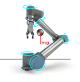
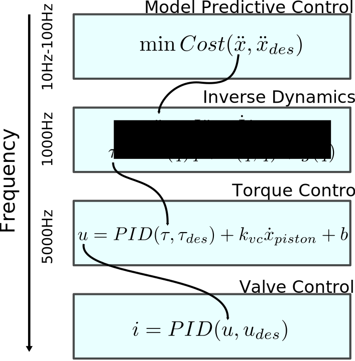

I was looking back through LaTeX notes from my PhD and found some interesting ones on Model Predictive Control (MPC) for humanoid locomotion which I never published or included in my thesis. I thought it might be useful to someone if used them to talk through Model Predictive Control a bit, then introduce the controller I was working on as an example. For now I'll stick to text and equations so that I can publish the post more quickly, but hope to come back and add some visuals later.

* Table of contents:
{:toc}

# Background

Model Predictive Control (MPC) is an interesting controls topic that has gotten a lot of attention in recent years both in the humanoids community and beyond - especially within the autonomous driving space. It's often discussed a bit incorrectly as a result, or sometimes used to solve problems that aren't suitable. Let's talk briefly about what MPC is and isn't, and when it should be applied.

## What is MPC and how does it work?

MPC methods fall within a larger class of **model-based controllers** because, you guessed it, they utilize some model of the system dynamics. This is in contrast to pure **feedback** controllers which can operate without any system model - for example, classical PID control. A simple feedback controller uses the difference between the current and desired states of the system to compute a control input, with controller gains tuned empirically. Feedback control is attractive because it doesn't require any time spent on explicit system modeling; instead, the work is shifted to the controller gain tuning process, which can be tedious and may not always give the best results.

The main downside of a simple feedback controller (in addition to the often time-consuming nature of tuning feedback gains) is that it's a **purely reactive** approach - the control input to the system only changes when the **setpoint** changes. This works well for the vast majority of simple control systems out in the world; for example, the temperature regulator in your espresso machine or basic home thermostat. Feedback control methods like PID are thus often used in simpler systems for so-called **setpoint control** because the desired state (eg temperature) doesn't change rapidly over time or require precise tracking since it's safe to overshoot a bit or take while to settle.

## Thought Excercise: Autonomous Driving

Consider using a simple, hand-tuned feedback controller on a more complex system like an autonomous passenger vehicle navigating real-world streets. For some scenarios this may prove sufficient - for example, driving down a straight road with no lights at slow speed. In this case, PID control on forward speed and heading direction would work fine.

"){: .center-image width="600px"}

Now, suppose the perception system recognizes a stop sign 20 meters down the road and passes this information to the control system. How do we ensure the vehicle stops in time? We could continue cruising at our set speed until we reach the stop sign and then fully brake - if moving slowly enough this might work, but probably wouldn't result in the best user experience since the car has far too much momentum to stop instantaneously. Or, even worse, we may overshoot the stop sign and oscillate back and forth until we hopefully settle on the correct spot - not ideal.  Instead, *we want to take advantage of the fact that we know the stop sign is ahead, and start modifying our control accordingly in advance using our model*.

"){: .center-image width="400px"}

This is the same idea as driving faster on a winding road. Your eyes aren't focused on the road directly in front of the car while you steer reactively, else you'll quickly veer off the road. Rather, you **look ahead** a certain distance to estimate the curvature of the road 10-20m in front of you and adjust your speed accordingly so your vehicle can handle the curve. We as human drivers can do this because we have **some internalized model of the dynamics of our vehicle.**

Though the average driver can't write down the equations of motion for their SUV, they have a sense of how tightly it steers at different speeds, how quickly it can brake or accelerate on different slopes, etc. We use this implicit **model** of the vehicle's dynamics in a **predictive** fashion, constantly replanning our **control** strategy based on our current state and the road ahead.  

# Controller Properties

To summarize the high-level ideas in the previous section, MPC is not a controller in and of itself but rather a **class of controllers which use the dynamic model of a system to plan control inputs such that the system tracks a desired trajectory over a certain time window into the future**. MPC methods are ideal for systems with complex dynamics which require high control bandwidth and enforcement of physical constraints, however they come at the cost of higher algorithmic and computational complexity, as well as require a dynamic model of the system.

MPC not only results in plans which satisfy the hard constraints imposed by our dynamics and environment, but also acts as a sort of **dynamic filter** which smooths a coarse plan into one which is **dynamically-feasible**. Consider again the self-driving vehicle scenario - at low speeds, we might simply use the perception system plan a trajectory which follows the road, sample this trajectory to change a PID controller setpoint, and replan the trajectory every few control cycles. However:

1. There is nothing in the "planner" to prevent us from trying to follow a plan which is **inconsistent with the dynamics and/or violates hard physical constraints** like steering radius, acceleration limits, etc
2. Low speed - in general for robots, not just cars - basically means a lot of the complexities of our dynamics dissappear; at higher speeds, this is not the case - **real-world dynamics are always nonlinear!**
3. Control gains for complex, nonlinear systems are generally state-dependent; this means our **tuned gains will only likely work around a small window** of the state we tuned them for!

## Robustness and Bandwidth

One of the most fundamental limitations of a pure feedback controller is a lack of **robustness** to perturbations and associated limited **control bandwidth** (very simply, the ability of the system to react to changes in setpoint quickly).

Consider a car driving on cruise control (at constant speed) - the engine torque determines the force the tires exert on the road to push the car forward, while the road exerts frictional forces on the tires and air resistance exerts a force on the chassis. For any steady-state speed, we can sum forces to determine the control effort needed for the car to maintain that speed. This is known as the **feedforward** control, in other words, the control necessary to compensate for vehicle dynamics and external forces and keep the car in *dynamic equilibrium*. 

"){: .center-image width="600px"}

Now, suppose we wish to accelerate to a new, higher speed with the help of an additional **feedback** controller. **Because we used knowledge of the vehicle dynamics to compute the feedforward control, we can tune our feedback gains just high enough to allow for fast responses around our  feedforward control**. If we had no feedforward control at all, we'd need much higher gains just to maintain a steady-state speed - and higher gains mean that any disturbance (like a strong gust of wind) could cause the controller to go unstable!

{: .center-image width="400px"}

Another example is commonly found in industrial manipulator robot control. Consider a robot arm holding a specific pose, even in the presence of small disturbances (a person pushing on the gripper, for example). In this case, we can compute the torque at each joint of the arm required to balance the force of gravity for any static configuration - this is a feedforward control known as **gravity compensation**. On top of this feedforward control, we add a feedback control with relatively small feedback gains so that when the arm is disturbed, it pushes back against the disturbance - like a spring. We could equivalently reach this equilibrium with PID control, but since feedback control would be doing the "heavy lifting" to keep the arm up in the presence of gravity, we'd need much higher gains. The result is a very *stiff* controller which can go unstable more easily due to disturbances (and is generally dangerous for a human to interact with!)

Hopefully these examples motivate why it's generally a good idea to use a combination of model-based feedforward control in addition to feedback control. MPC methods don't distinguish between the two, instead solving for a combination of both feedforward and feedback control - both taking advantage of knowledge of the system dynamics!

# Dynamics Models

In an ideal world you would know the dynamics of your system perfectly in closed-form, allowing you to apply any kind of crazy optimization-based control approaches which result in control inputs that achieve perfect tracking of your desired trajectory. Of course, **perfect models don't exist** in practice - there will always be effects that are unknown or too difficult to model. And because complex models generally translate to higher computational complexity of algorithms that use them, we actually **may not always want to use a "perfect" model!**

"){: .center-image width="1000px"}

In the field of humanoid locomotion for example, there are different schools of thought on how to control a complex, high-dimensional robot. One school advocates for building as accurate kinematic and dynamic models as possible and using these models for every step of the control pipeline - footstep planning, whole-body planning, and whole-body control - sometimes simultaneously. These methods are typically optimizations using the full, **nonlinear** dynamics of the system. The challenge here is not necessarily modeling the system accurately or incorporating the complex model into optimization algorithms, but rather **finding ways to improve computational efficiency** so these methods can be run **online** (replanning every so often) rather than **offline** (pre-planning a whole sequence of motions and executing it). When controlling high-performance robots we usually do so within a **real-time operating system** (RTOS) which provides guarantees on task priority/latency, so that eg our planning module doesn't eat into our control module's CPU time. With complex planners it can difficult to satisfy the timing requirements of the RTOS.

{: .center-image width="400px"}

The second school of thought advocates for using *simplified* - often **linearized** - models of the complex dynamics for high-level planning (generating eg footstep locations, center of mass and swing leg trajectories) while using the full, nonlinear model for low-level planning/control. This allows recomputing high-level plans at a much faster rate than if using the full dynamics, while still resolving high-level plans into whole-body control (joint torques) using as accurate dynamics as possible. In terms of robustness to disturbances, there's a strong argument to be made in favor of using simple models for planning with MPC at a fast rate, rather than using the full model in MPC at a slow rate.

{: .center-image width="400px"}

These types of control stacks are generally the ones being used in videos of real humanoids and quadrupeds walking around in challenging environments. Of course, as processors become smaller, more powerful, and more cost-effective, it may be possible to use the full dynamics for every step of planning - but even still, there are many good reasons to stick with simpler, provably-stable controllers (and save those extra CPU cycles for other greedy subsystems!)

# Wrapping Up

This post was intended to be a casual introduction to the concept of Model Predictive Control and some of the considerations involved in applying this class of trajectory planning methods. In the next post, I'll introduce the MPC problem for humanoid momentum control (which, at least for now, will be largely copied from my PhD notes).