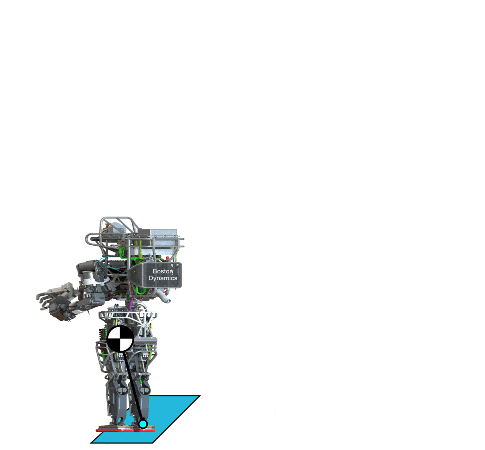
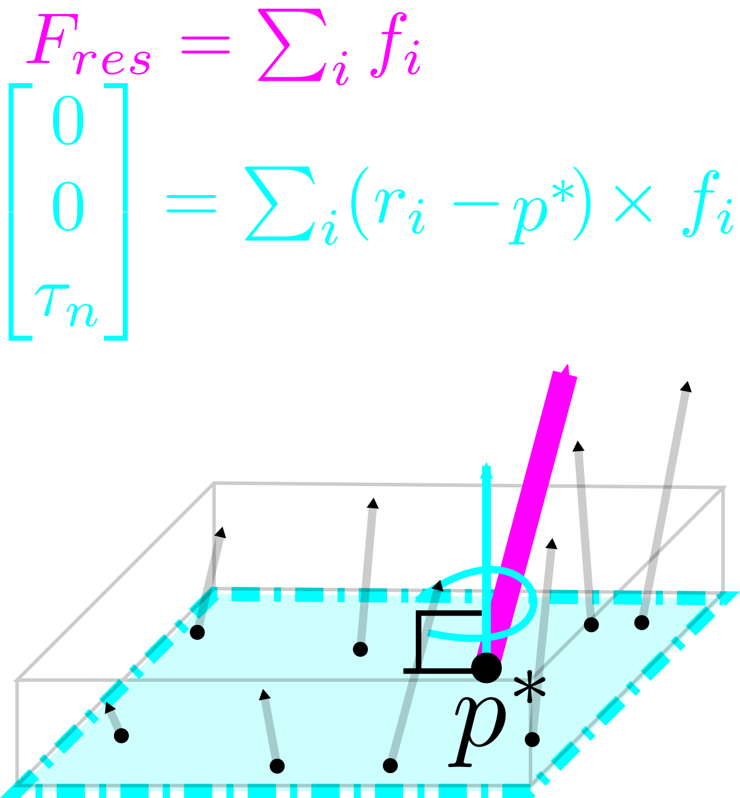
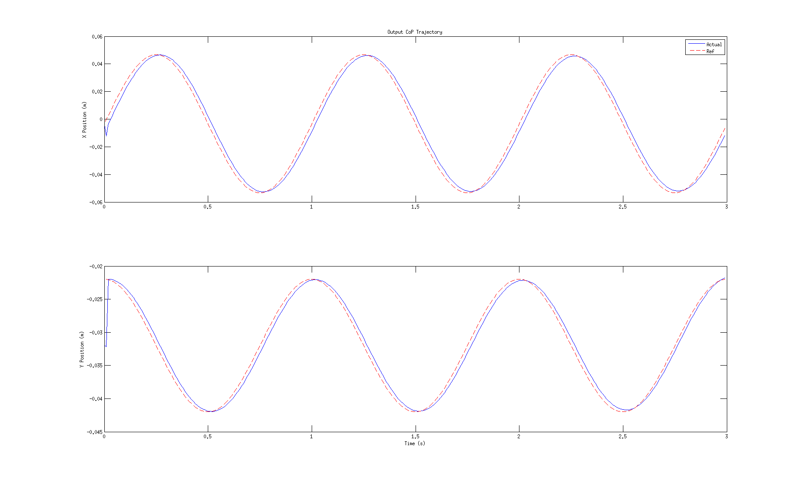

In this post, we'll move from discussing MPC at a high level to introducing humanoid robot dynamic models used for MPC, followed by the momentum MPC problem which motivated this series of posts. For the time being, the content of this post will laregly be copied from my PhD notes without much editing; figures and more context to come soon.

* Table of contents:
{:toc}

# Humanoid Dynamics

In the following subsections, we'll explore some different dynamics models used for humanoid control and how they fit into the context of MPC.

## LIPM Dynamics

Most simplified-model-based approaches to humanoid locomotion (specifically, center of mass and footstep trajecotry planning) use what's known as the **Linear Inverted Pendulum Model (LIPM)** which essentially linearizes the full robot center of mass dynamics by making a few limiting assumptions:

* The robot is treated as a point mass, ie its angular momentum is neglected
* The center of mass (COM) is constrained to move within a plane (typically the plane parallel to the floor, forcing constant-height motion)

These assumptions give us a linear model which can be readily used for MPC, however at the cost of imposing quasi-static motion and very simple terrain. 

{: .center-image width="400px"}

In reality, there is a wide spectrum of simplified models which can be used for different kinds of motion, and in fact, **it's arguable that the best approaches should combine many different simplified models depending on the task or terrain at hand**. Nonetheless, the LIPM remains a powerful tool in that it linearizes the robot's full dynamics and thus allows using linear MPC methods.

## Full Dynamics

"){: .center-image width="400px"}

The dynamics of a *fixed-base* manipulator in contact with the environment at its endeffector take the form

$$
M(q)\ddot{q} + h(q,\dot{q}) = \tau + J^{T}\lambda
$$

where $$\ddot{q}\in R^{n}$$ is the vector of joint accelerations, $$\lambda\in R^{6m}$$ is the vector of endeffector contact wrenches and $$\tau\in R^{n}$$ is the vector of joint torques; $$n$$ denotes the number of DoFs and $$m$$ denotes the number of endeffector contact points.  The matrix $$M(q)\in R^{n\times n}$$ is the configuration-dependent mass inertia matrix of the robot, and $$h(q,\dot{q})\in R^{n}$$ is the configuration-dependent vector of nonlinear terms (Coriolis, centripetal and gravity forces) acting on the robot. $$J\in R^{6m\times n}$$ denotes the endeffector Jacobian which (by the principle of virtual work) relates contact wrenches applied at the endeffector to joint torques through its transpose.  

{: .center-image width="400px"}

In contrast to fixed-base robots, floating base robots such as quadrupeds and humanoids have an additional six DoFs corresponding to the pose of the base (root) link; these robots are thus *underactuated*.  The dynamics become

$$
M(q)\ddot{q} + h(q,\dot{q}) = S^{T}\tau + J^{T}\lambda
$$

where the matrix $$S\in R^{n+6\times n}$$ is a selector matrix which encodes the underactuation of the system.  Joint torques corresponding to a desired joint plus floating base acceleration vector $$\ddot{q}\in R^{n+6}$$ thus cannot be solved directly from Eq ($$\ref{eq:floating_base_dynamics}$$); we require an additional six constraints to determine $$\tau$$.  These come from contact constraints in the form

$$
J_{c}\ddot{q} + \dot{J}_{c}\dot{q} = 0
$$

Here, $$J_{c}\in R^{m_{c}\times n+6}$$ denotes the portion of the Jacobian corresponding to the $$m_{c}$$ endeffectors assumed to be in rigid contact with the ground.  A single planar foot contact adds six constraints; when both feet are in planar contact with the ground, the robot becomes overactuated which allows for redundancy in inverse dynamics.  The dynamics of a floating base robot thus vary over time as contacts are made and broken, resulting in discrete changes in the number of constrained degrees of freedom over time

## Momentum Dynamics

While the full robot dynamics are highly nonlinear and simplified model dynamics (for example, the LIPM) are very restrictive, there is a sort-of intermediate model which has shown good results for dynamic locomotion tasks: the so-called **momentum (centroidal) dynamics** of the system. As shown in *Herzog et al., 2014*, the above full dynamics can be decomposed into the actuated and unactuated (floating base) dynamics, respectively:

$$
\begin{align*}
M_{u}(q)\ddot{q} + h_{u}(q,\dot{q}) &= \tau + J_{c,u}^{T}\lambda\\
M_{l}(q)\ddot{q} + h_{l}(q,\dot{q}) &= J_{c,l}^{T}\lambda
\end{align*}
$$

The first set of equations above are the rate of change of linear and angular momentum expressed in terms of joint variables, however this can equivalently be written in terms of the contact forces and torques acting on the robot.

{: .center-image width="600px"}

Essentially, the momentum dynamics are the equations of motion governing rate of change of momenta due to summed forces and torques acting on the entire robot. These are not *simplified* but instead **reduced** because they are actually just a reduction of the full multibody dynamics which focuses on the center of mass and angular motion rather than the motions of all individual joints.

 dynamics"){: .center-image width="400px"}

The momentum dynamics of a humanoid robot in double support can be written in state-space form as

$$
\begin{align*}
\dot{c} &= \frac{1}{m}l\\ 
\dot{l} &= \sum_{i} F_{i} + mg = F_{R} + F_{L} + mg\\ 
\dot{k} &= \sum_{i}(p_{i}-c)\times F_{i} + \sum_{i}\tau_{i} = (p_{R}-c)\times F_{R} + (p_{L}-c)\times F_{L} + \tau_{R}  + \tau_{L}
\end{align*}
$$

where $$m$$ is the mass of the robot, $$c$$ denotes the center of mass (CoM) position, $$l$$ denotes the linear momentum and $$k$$ denotes the angular momentum about the CoM. It is assumed that the right and left feet are in contact with the ground at positions $$p_{R}$$ and $$p_{L}$$ respectively; the inputs to the system are the contact forces and torques at the right and left feet, denoted $$F_{R}$$, $$F_{L}$$, $$\tau_{R}$$ and $$\tau_{L}$$ respectively. All quantities are measured in a global reference frame unless otherwise noted.

### Humanoid Stability

Stability (in a general sense) of a humanoid robot is guaranteed by constraining the **center of pressure (CoP)** to lie strictly within the support polygon defined by the feet in contact with the ground. Recall that we're free to sum forces and moments acting at the foot contact surface about any point in space; **the CoP is a special point at which the net moment is perpendicular to the contact surface**, meaning the foot cannot topple but only rotate.

{: .center-image width="300px"}

As long as the feet are coplanar then the CoP is well-defined and it can be expressed in terms of the momentum dynamics as

$$
\begin{align*}
x_{CoP} &= c_{x} - \frac{1}{\dot{l}_{z}-mG}\left(c_{z}\dot{l}_{x}+\dot{k}_{y}\right)\\
y_{CoP} &= c_{y} - \frac{1}{\dot{l}_{z}-mG}\left(c_{z}\dot{l}_{y}-\dot{k}_{y}\right)
\end{align*}
$$

However, we can express $$\dot{l}$$ and $$\dot{k}$$ in terms of the contact wrenches and center of mass position, resulting in

$$
\begin{align*}
x_{CoP} &= c_{x} - \frac{1}{\sum F_{z}}\left(c_{z}\sum F_{x}+\dot{\bar{k}}_{y}\right)\\
y_{CoP} &= c_{y} - \frac{1}{\sum F_{z}}\left(c_{z}\sum F_{y}-\dot{\bar{k}}_{x}\right)
\end{align*}
$$

where $$\bar{k}$$ is still the centroidal angular momentum computed but computed using measured contact forces at the feet (ankles), ie

$$
\dot{\bar{k}} = [p_{R}-c]^{\times}F_{R} + [p_{L}-c]^{\times}F_{L} + \tau_{R} + \tau_{L}
$$

### Linearizing the Momentum Dynamics

We have now expressed the position of the CoP in world frame in terms of only the CoM position and the measured contact wrenches.  Taking the state of our system to be $$x = [c^{T}, l^{T}, k^{T}]^{T}$$, the input to be $$u = [F_{R}^{T}, \tau_{R}^{T}, F_{L}^{T}, \tau_{L}^{T}]^{T}$$ and the output to be $$y = [x_{CoP}, y_{CoP}]^{T}$$, we wish to write the momentum dynamics and CoP output equations in the continuous, time-varying state-space form

$$
\begin{align*}
\dot{x}(t) &= A(t)x(t) + B(t)u(t)\\
y(t) &= C(t)x(t) + D(t)u(t)
\end{align*}
$$

in order to leverage linear control algorithms.  However, both sets of equations are nonlinear functions of the state and input; taking a first-order expansion of these equations about nominal state and control vectors $$\bar{x}$$ and $$\bar{u}$$ results in the linearized but time-varying state-space system

$$
\begin{align*}
\begin{bmatrix}
\delta \dot{c}\\ \delta \dot{l}\\ \delta \dot{k}
\end{bmatrix}
&=
\begin{bmatrix}
0 & \frac{1}{m}I & 0\\ 0 & 0 & 0\\ -(\bar{F}_{R}+\bar{F}_{L})^{\times} & 0 & 0
\end{bmatrix}
\begin{bmatrix}
\delta c\\ \delta l\\ \delta k
\end{bmatrix}
+
\begin{bmatrix}
0 & 0 & 0 & 0\\
I & 0 & I & 0\\
[\bar{p}_{R}-\bar{c}]^{\times} & I & [\bar{p}_{L}-\bar{c}]^{\times} & I
\end{bmatrix}
\begin{bmatrix}
\delta F_{R}\\ \delta \tau_{R}\\ \delta F_{L}\\ \delta \tau_{L}
\end{bmatrix}\\
\begin{bmatrix}
\delta x_{CoP}\\ \delta y_{CoP}
\end{bmatrix}
&=
\begin{bmatrix}
2 & 0 & \frac{-2(\bar{F}_{R_{x}}+\bar{F}_{L_{x}})}{(\bar{F}_{R_{z}}+\bar{F}_{L_{z}})} & 0 & 0 & 0 & 0 & 0 & 0\\
0 & 2 & \frac{-2(\bar{F}_{R_{y}}+\bar{F}_{L_{y}})}{(\bar{F}_{R_{z}}+\bar{F}_{L_{z}})} & 0 & 0 & 0 & 0 & 0 & 0
\end{bmatrix}
\begin{bmatrix}
\delta c\\ \delta l\\ \delta k
\end{bmatrix}\\
&+
\begin{bmatrix}
D_{1,1}&0&D_{1,3}&0&D_{1,5}&0&D_{1,7}&0&D_{1,9}&0&D_{1,11}&0\\
0&D_{2,2}&D_{2,3}&D_{2,4}&0&0&0&D_{2,8}&D_{2,9}&D_{2,10}&0&0
\end{bmatrix}
\begin{bmatrix}
\delta F_{R}\\ \delta \tau_{R}\\ \delta F_{L}\\ \delta \tau_{L}
\end{bmatrix}
\end{align*}
$$

where the linearized state, controls, outputs and all nominal values are implicitly functions of time and 

$$
\begin{align*}
D_{1,1} &= \frac{\bar{p}_{R_{z}}-2\bar{c}_{z}}{\sum \bar{F}_{z}} & \\
D_{1,3} &= \frac{-(\bar{p}_{R_{x}}-\bar{c}_{x})}{\sum \bar{F}_{z}} - \frac{1}{(\sum \bar{F}_{z})^{2}}\left[(\sum [(\bar{p}_{z}-2\bar{c}_{z})\bar{F}_{x}] - \sum [(\bar{p}_{x}-\bar{c}_{x})\bar{F}_{z}]+\sum \bar{\tau}_{y}\right]\\
D_{1,5} &= \frac{1}{\sum \bar{F}_{z}}\\
D_{1,7} &= \frac{\bar{p}_{L_{z}}-2\bar{c}_{z}}{\sum \bar{F}_{z}}\\
D_{1,9} &= \frac{-(\bar{p}_{L_{x}}-\bar{c}_{x})}{\sum \bar{F}_{z}} - \frac{1}{(\sum \bar{F}_{z})^{2}}\left[(\sum [(\bar{p}_{z}-2\bar{c}_{z})\bar{F}_{x}] - \sum [(\bar{p}_{x}-\bar{c}_{x})\bar{F}_{z}]+\sum \bar{\tau}_{y}\right]\\
D_{1,11} &= \frac{1}{\sum \bar{F}_{z}}\\
D_{2,2} &= \frac{\bar{p}_{R_{z}}-2\bar{c}_{z}}{\sum \bar{F}_{z}}\\
D_{2,3} &= \frac{-(\bar{p}_{R_{y}}-\bar{c}_{y})}{\sum \bar{F}_{z}} + \frac{1}{(\sum \bar{F}_{z})^{2}}\left[(\sum [(\bar{p}_{z}-2\bar{c}_{z})\bar{F}_{x}] - \sum [(\bar{p}_{x}-\bar{c}_{x})\bar{F}_{z}]+\sum \bar{\tau}_{x}\right]\\
D_{2,4} &= \frac{-1}{\sum \bar{F}_{z}}\\
D_{2,8} &= \frac{\bar{p}_{L_{z}}-2\bar{c}_{z}}{\sum \bar{F}_{z}}\\
D_{2,9} &= \frac{-(\bar{p}_{L_{y}}-\bar{c}_{y})}{\sum \bar{F}_{z}} + \frac{1}{(\sum \bar{F}_{z})^{2}}\left[(\sum [(\bar{p}_{z}-2\bar{c}_{z})\bar{F}_{x}] - \sum [(\bar{p}_{x}-\bar{c}_{x})\bar{F}_{z}]+\sum \bar{\tau}_{x}\right]\\
D_{1,10} &= \frac{-1}{\sum \bar{F}_{z}}
\end{align*}
$$

where all sums are taken over $$\{R,L\}$$ when both feet are in contact. We now have the momentum dynamics linearized around a nominal state, with the CoP position as the output we wish to track. The inputs are the contact wrenches (force and torque) at each foot. Our goal will be to plan contact wrench trajectories which achieve tracking desired CoP and momenta trajectories, and then use force control to resolve desired contact wrenches to whole-body control (joint torques).

# Linear MPC

In this section, we'll walk through the general formulation for MPC of a linear, continuous, time-varying state-space system like we had after linearizing the momentum/CoP dynamics above.

## Discretization

We can discretize such a system as 

$$
\begin{align*}
x_{k+1} &= A_{k}x_{k} + B_{k}u_{k}\\
y_{k} &= C_{k}x_{k} + D_{k}u_{k}
\end{align*}
$$

where

$$
A_{k} = e^{A(t)\Delta t}\quad B_{k} = \left(\int_{\tau=0}^{\Delta t}e^{A(\tau)\tau}d\tau\right)B(t)
$$

and $$C_{k}=C(t)$$ and $$D_{k}=D(t)$$.  In practice, we can compute both $$A_{k}$$ and $$B_{k}$$ at once by computing

$$
e^{\begin{bmatrix}A&B\\0&0\end{bmatrix}\Delta t} = \begin{bmatrix}M_{11}&M_{12}\\0&I\end{bmatrix}
$$

and setting $$A_{k}=M_{11}$$ and $$B_{k}=M_{12}$$.  Further, we can approximate $$e^{A\Delta t}\approx I + A\Delta t$$ for use in the above computation.

After discretizing the momentum dynamics and CoP output equations (assuming that all quantities involved in these equations are constant over the control interval $$\Delta t$$), we can use linear MPC techniques for planning.

## Cost Function (CoP Tracking)

The goal of this work is to find a sequence of controls (ground reaction forces and torques) at each timestep $$k$$ over a horizon of $$N$$ which realize a **desired CoP trajectory** by solving the finite-horizon optimal control problem

$$
\min_{u_{k},u_{k+1},\cdots,u_{k+N}} \frac{1}{2}\sum_{i=k}^{k+N-1} (y_{i+1}-\bar{y}_{i+1})^{T}Q(y_{i+1}-\bar{y}_{i+1}) + u_{i}^{T}Ru_{i}
$$

where $$\bar{y_{k}}\in R^{2}$$ is the desired CoP location on the ground at time $$k$$ and matrices $$Q\succeq 0$$ and $$R\succ 0$$ trade off CoP tracking and control effort.

The reason we choose to use a discrete-time, finite-horizon approach is because the above can be converted into a least-squares problem which can be solved efficiently in an online fashion, ideally permitting replanning at every control cycle (or every five, or ten).

## Solving the Finite-Horizon Problem

Let's take a look at how to rewrite the above cost function to put it in a solvable form. **Note that the derivations in this section apply to any linear, time-varying, discrete system - not just for this specific humanoid control problem!**

Given the above cost function and the dynamics of our discrete, linear system (which we will assume here is time-invariant for simplicity) having $$n$$ states, $$m$$ inputs and $$p$$ outputs, we can write

$$
\begin{align*}
y_{k+1} &= Cx_{k+1}+Du_{k+1} = CAx_{k} + CBu_{k} + Du_{k+1}\\
y_{k+2} &= Cx_{k+2}+Du_{k+2} = CA^{2}x_{k}+CABu_{k}+CBu_{k+1}+Du_{k+2}\\
y_{k+3} &= Cx_{k+3}+Du_{k+3} = CA^{3}x_{k}+CA^{2}Bu_{k}+CABu_{k+1}+CBu_{k+2}+Du_{k+3}
\end{align*}
$$

and so on in order to get

$$
Y = P_{x}x_{k} + P_{u}U
$$

where $$Y=[y_{k+1}^{T},y_{k+2}^{T},\cdots,y_{k+N}^{T}]^{T}\in R^{Np}$$, $$U=[u_{k}^{T},u_{k+1}^{T},\cdots,u_{k+N-1}^{T}]^{T}\in R^{Nm}$$ and

$$
P_{x} = 
\begin{bmatrix}
CA\\ CA^{2}\\ \vdots\\ CA^{N}
\end{bmatrix}\in R^{Np\times n}, \quad
P_{u} =
\begin{bmatrix}
CB & D & \cdots & 0\\
CAB & CB & \ddots & \vdots\\
\vdots & \ddots & \ddots & D\\
CA^{N-1}B & \cdots & CAB & CB
\end{bmatrix}\in R^{Np\times Nm}
$$

This simplification allows us to rewrite the preview control problem as the least-squares problem

$$
\min_{U} \frac{1}{2}\left[(Y-\bar{Y})^{T}Q(Y-\bar{Y}) + U^{T}RU\right]
$$

Substituting the equation for $$Y$$ into the above cost, multiplying out, removing all terms with no dependence on $$U$$ and simplifying eventually yields

$$
\frac{1}{2}U^{T}(P_{u}^{T}QP_{u} + R)U + 2(\bar{Y}^{T}QP_{u}-x_{k}^{T}P_{x}^{T}QP_{u})U
$$

which is minimized by the controls

$$
U^{*} = (P_{u}^{T}QP_{u}+R)^{-1}P_{u}^{T}Q(\bar{Y}-P_{x}x_{k})
$$

There are several things to note about this solution.  First, the matrix $$(P_{u}^{T}QP_{u}+R)^{-1}P_{u}^{T}Q$$ essentially acts as a gain on the preview error $$e = (\bar{Y}-P_{x}x_{k})$$ which is the difference between the desired output trajectory $$\bar{Y}$$ and the unactuated evolution of the current state given by $$P_{x}x_{k}$$.  Second, the matrix $$(P_{u}^{T}QP_{u}+R)$$ is symmetric which means it can be inverted efficiently via its Cholesky decomposition.

In the CoP tracking preview control problem, our discretized system is time-varying so the matrices $$P_{x}$$ and $$P_{u}$$ become

$$
P_{x,k} = 
\begin{bmatrix}
C_{k}A_{k}\\ C_{k}A_{k+1}A_{k}\\ C_{k}A_{k+2}A_{k+1}A_{k}\\ \vdots\\ C_{k}\prod_{i=k}^{N-1}A_{i}
\end{bmatrix}, \quad
P_{u,k} =
\begin{bmatrix}
C_{k}B_{k} & D_{k} & 0 & \cdots & 0\\
C_{k}A_{k}B_{k} & C_{k}B_{k} & D_{k} & \ddots & \vdots\\
\vdots & \ddots & \ddots & \ddots & 0\\
C_{k}\prod_{i=k}^{N-2}A_{i}B_{k} & C_{k}\prod_{i=k}^{N-3}A_{i}B_{k} & C_{k}\prod_{i=k}^{N-4}A_{i}B_{k} & \cdots & D_{k}
\end{bmatrix}
$$

This is even further complicated because we don't know what $$\{A_{k},B_{k},C_{k},D_{k}\}$$ look like for arbitrary $$k$$ since they depend on the state of the system which is what we're planning!  

These technicalities suggest an iterative approach such as iLQG where the system is linearized around a nominal trajectory rather than a nominal pose, solved, simulated forward to obtain a new nominal trajectory around which the system is linearized for the next step and so on until convergence of both trajectory and policy.  In practice, though, we may be able to use the time-invariant form of the problem without issue - especially if the problem is solved online at every control cycle since only the first $$m$$ elements in the solution vector $$U$$ will be used at each timestep.

### Adding State Tracking

In addition to accomplishing CoP tracking, we can accomplish tracking of a desired state trajectory by adding another term into the original preview control cost function.  The problem now becomes

$$
\min_{u_{k},u_{k+1},\cdots,u_{k+N}} \frac{1}{2}\sum_{i=k}^{k+N-1} (y_{i+1}-\bar{y}_{i+1})^{T}Q_{y}(y_{i+1}-\bar{y}_{i+1}) + (x_{i+1}-\bar{x}_{i+1})^{T}Q_{x}(x_{i+1}-\bar{x}_{i+1}) + u_{i}^{T}Ru_{i}
$$

In the same way as before, we can define $$X=[x_{k+1}^{T},x_{k+2}^{T},\cdots,x_{k+N}^{T}]^{T}\in R^{Nn}$$ and convert this problem into the least-squares problem

$$
\min_{U} \frac{1}{2}\left[(Y-\bar{Y})^{T}Q_{y}(Y-\bar{Y}) + (X-\bar{X})^{T}Q_{x}(X-\bar{X}) + U^{T}RU\right]
$$

where $$Y = P_{x}x_{k} + P_{u}U$, $X = \tilde{P}_{x}x_{k} + \tilde{P}_{u}U$$ and

$$
\tilde{P}_{x} = 
\begin{bmatrix}
A\\ A^{2}\\ \vdots\\ A^{N}
\end{bmatrix}\in R^{Nn\times n}, \quad
\tilde{P}_{u} =
\begin{bmatrix}
B & 0 & \cdots & 0\\
AB & B & \ddots & \vdots\\
\vdots & \ddots & \ddots & 0\\
A^{N-1}B & \cdots & AB & B
\end{bmatrix}\in R^{Nn\times Nm}
$$

This leads to the solution

$$
U^{*} = (P_{u}^{T}Q_{y}P_{u}+\tilde{P}_{u}^{T}Q_{x}\tilde{P}_{u}+R)^{-1}\left[P_{u}^{T}Q_{y}(\bar{Y}-P_{x}x_{k}) + \tilde{P}_{u}^{T}Q_{x}(\bar{X}-\tilde{P}_{x}x_{k})\right]
$$

The optimal control is now essentially the sum of two separate tracking errors multiplied by respective gains; setting the state cost to zero recovers the solution to the original problem.

## Implementation

We can write the solution to the problem in the preceding section as

$$
U^{*} = K_{Y}(\bar{Y}-P_{x}x_{k}) + K_{X}(\bar{X}-\tilde{P}_{x}x_{k})
$$

where the gains $$K_{Y}$$ and $$K_{X}$$ trade off tracking output versus state trajectories.  Since we've derived this control policy for a system linearized around $$\{\bar{x},\bar{u}\}$$, the actual control policy resulting from the finite-horizon planning is $$U = \bar{U} + U^{*}$$ where $$\bar{U}$$ is simply $$\bar{u}$$ replicated $$N$$ times.  In addition, while the gains $$K_{Y}$$ and $$K_{X}$$ are derived using the linearized dynamics, the tracking error between references and nominal motions should use the nonlinear dynamics.  In other words, we actually have

$$
U = \bar{U} + K_{Y}(\bar{Y}-f(x_{k},\bar{u})) + K_{X}(\bar{X}-\tilde{f}(x_{k},\bar{u}))
$$

where the nonlinear functions $$f(x,u)$$ and $$\tilde{f}(x,u)$$ compute the evolution of the current state over a horizon of $$N$$ steps.

Thus, at each timestep $$k$$, we:

* Linearize the system around $$\{\bar{x}_{k},\bar{u}_{k}\}$$. 
* Solve the MPC problem for $$U_{k}^{*}$$.
* Obtain the input contact wrenches $$u_{k} = \bar{u}_{k} + u^{*}_{k}$$ where $$u^{*}_{k}$$ is simply the first $$m=12$$ elements of $$U^{*}_{k}$$.
* Attempt to track these forces/torques using our favorite inverse dynamics solver.

The advantage of replanning at every step is that if the current state deviates from the expected state due to inability to achieve the optimal contact wrenches, external perturbations, modeling errors etc, then the plan for the following step will take this into account.

If we cannot plan at every $$k$$ due to computational limits, we can instead use $$U^{*}_{k}$$ to generate controls for subsequent timesteps at the expense of losing this feedback control-like policy.

## Momentum Estimation

Of course, our ability to perform feedback control on the error between the predicted and desired CoP and state trajectories requires that we have a good estimate of the current state, denoted henceforth as $\hat{x}_{k}$.  Our center of mass and momentum estimates rely on the kinematic and dynamic models of the robot, respectively; they are computed as

$$
\begin{align*}
s_{CoM} &= f_{CoM}(x,q)\\
s_{linmom} &= f_{linmom}(x,\dot{x},q,\dot{q})\\
s_{angmom} &= f_{angmom}(x,\dot{x},q,\dot{q})
\end{align*}
$$

where $$x$$ and $$q$$ here denote the cartesian and joint states of the robot.  However, we know that modeling errors exist.  Further, our momentum estimates rely on numerically-differentiated joint position measurements which are known to be very noisy in practice.  The strategy thus far has been to rely on low-pass filtering the noisy estimates but this can create significant delays which can destabilize feedback control.  In addition, the global cartesian robot state and its velocity are estimated in a separate EKF and may be subject to drift.

However, we have additional information about how our center of mass and momentum change over time: by using the momentum dynamics

$$
\begin{align*}
\dot{c} &= \frac{1}{m}l\\ 
\dot{l} &= \sum_{i} F_{i} + mg = F_{R} + F_{L} + mg\\ 
\dot{k} &= \sum_{i}(p_{i}-c)\times F_{i} + \sum_{i}\tau_{i} = (p_{R}-c)\times F_{R} + (p_{L}-c)\times F_{L} + \tau_{R}  + \tau_{L}
\end{align*}
$$

we can integrate measured contact forces and torques to track the state of the robot.  Integration of contact wrenches, which themselves are subject to noise and possibly offset errors due to improper calibration, leads to estimates which drift.  

We thus have two sources of estimates: the force-based estimates are responsive and low-noise but drifting while the model-based estimates are stable but noisy (unless filtered, in which case they're delayed).  By combining the two sources in a Kalman filter we can expect to obtain estimates which are low-noise and responsive.     

A number of estimators based on the momentum dynamics were described in my paper [Humanoid Momentum Estimation Using Sensed Contact Wrenches](https://arxiv.org/abs/1507.04401); please refer to this work for the rest of the details.

## Results

Preliminary results using the above formulation demonstrate that tracking arbitrary CoP trajectories is possible despite using a system linearized around a single nominal state and input.  Using as a desired CoP trajectory a circle in the plane, this MPC approach was run once using momentum dynamics linearized around $\{\bar{x},\bar{u}\}$ obtained from the SL simulator when the robot was standing still.  The resulting contact wrench trajectories in the solution $U^{*}$ were then played back through the nonlinear momentum dynamics to generate the actual CoP resulting from these planned forces/torques.  The desired and actual outputs are compared in the figure below.

{: .center-image}

We can also look at the state trajectories resulting from applying these forces to the momentum dynamics; interestingly, the CoM is utilized very little in tracking the CoP reference and instead the angular momentum is used.  This experiment was performed without using a reference state trajectory, so it may be possible to find a solution which moves the CoM more and relies less on angular momentum.  The fact that angular momentum can be used (and is used) to control the CoP already shows that this preview control method has more flexibility than LIPM-based methods.  The state trajectories are shown below.

."){: .center-image}

# Conclusions

The humanoid momentum control MPC introduced in this post may seem a bit esoteric, but I thought some of the details involved might be interesting for someone working on similar problems either in humanoid control or model-based control in general. The approach outlined here is certainly not something state-of-the-art anymore - nonlinear MPC has been running on real robots for years in this field - but I feel that the methodology of using a "simplified" dynamics model to solve a linear version of the problem is still valuable and likely at the core of some of the most successful real robot control approaches to date.