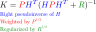

This post will detail a first-principles derivation of the discrete-time Kalman Filter, beginning with some probabalistic background and ending with a linear-algebraic interpretation. We'll also take a look at some practical considerations of applying the Kalman Filter - what if the state space is nonlinear? How are rotational states - for example, those belonging to $$SO(2)$$ or $$SO(3)$$ - handled?

The majority of this content comes from my personal notes; it's a bit denser than other posts, but I find this the most satisfying derivation and insightful interpretation.

* Table of contents:
{:toc}

## Problem Setup

We can derive the Kalman Filter in continuous-time from a control theory perspective, but I find this discrete-time, probabalistic derivation to be a little more accessible. The resulting filter update equations are the same as the continuous time version.

### Discrete-Time Model

Consider the following discrete time model in state-space form.

$$
\begin{align*}
x_{k+1} &= F_{k}x_{k} + G_{k}w_{k}\\
z_{k} &= y_{k} + v_{k} = H_{k}x_{k} + v_{k}
\end{align*}
$$

where $$w_{k}$$ denotes process noise and $$v_{k}$$ denotes measurement noise.  The
goal is to solve the *filtering* problem; that is, to produce an estimate at
time $$k$$ of the state $$x_{k}$$ given measurements $$z_{0}, z_{1}, \ldots, z_{k}$$
leading up to time $$k$$.

### Noise assumptions

We assume that the processes $$\{w_{k}\}$$ and $$\{v_{k}\}$$ are

* individually white, meaning that for any $$k \not= l$$, $$v_{k}$$ and $$v_{l}$$ are independent of one another and $$w_{k}$$ and $$w_{l}$$ are independent of one another.
* individually zero mean, gaussian processes with known covariances $$Q_{k}$$ and $$R_{k}$$, respectively.
* independent processes

In summary, it is assumed that the processes $$\{w_{k}\}$$ and $$\{v_{k}\}$$ are
zero mean, independent gaussian processes with covariances denoted by $$Q_{k}$$
and $$R_{k}$$, respectively.

### Initial state assumptions

The initial state of the system $$x_{0}$$ is assumed to be a gaussian random
variable with known mean and covariance given by

$$
\begin{align*}
E[x_{0}] &= \bar{x}_{0}\\
E\{[x_{0} - \bar{x}_{0}][x_{0} - \bar{x}_{0}]^{T}\} &= P_{0}
\end{align*}
$$

It is also assumed that $$x_{0}$$ is independent of $$w_{k}$$ and $$v_{k}$$ for all
$$k$$.

## Background

In this section, we'll work through some necessary background material needed for the Kalman Filter derivation.

### Propagation of Means and Covariances

Let's derive how means and covariances propagate through the dynamics of our system. The solution to the difference equation given above is

$$
x_{k} = \Phi_{k,0}x_{0} + \sum_{l=0}^{k-1}\Phi_{k,l+1}G_{l}w_{l}
$$

where 

$$
\Phi_{k,l} = F_{k}F_{k-1}\cdots F_{l} \quad (k>l)
$$

is the state-transition matrix which, in the (homogeneous) case of no input
(noise), transfers the state from $$x_{l}$$ to $$x_{k}$$.  Note that $$\Phi_{k,l}
= \Phi_{k,m}\Phi_{m,l}$$ and $$\Phi_{k,k} = I$$.

Since $$x_{0},w_{0},w_{1},\ldots,w_{k-1}$$ are jointly gaussian random vectors, it
follows that $$x_{k}$$ - which is a linear combination of these vectors - is also gaussian.  This is due to the fact that linear transformations of gaussian
random variables are gaussian.  In addition, note that $$\{x_{k}\}$$ is a Markov
process.

#### Mean Propogation

Taking the expected value of both sides of the solution to the original
difference equation yields

$$
E[x_{k}] = \Phi_{k,0}\bar{x}_{0}
$$

and therefore, from the definition of the state-transition matrix,

$$
E[x_{k+1}] = F_{k}E[x_{k}] \quad \square
$$

Additionally, from the measurement model, we have

$$
E[z_{k}] = H_{k}E[x_{k}]
$$

#### Covariance Propogation

Propogating the covariance through the system is not as straightforward as for the mean. The covariance of $$x_{k}$$ for $$k\geq l$$ is

$$
\begin{align*}
P_{k,l} &= E\left\{[x_{k}-\bar{x}_{k}][x_{l}-\bar{x}_{l}]^{T}\right\}\\
&=E\left\{\left[\left(\Phi_{k,0}x_{0} +
\sum_{m=0}^{k-1}\Phi_{k,m+1}G_{m}w_{m}\right) - \Phi_{k,0}\bar{x}_{0}\right] \left[\left(\Phi_{l,0}x_{0} +
\sum_{n=0}^{l-1}\Phi_{l,n+1}G_{n}w_{n}\right) - \Phi_{l,0}\bar{x}_{0}\right]^{T}\right\}\\
&=E\left\{\left[\Phi_{k,0}(x_{0}-\bar{x}_{0}) +
\sum_{m=0}^{k-1}\Phi_{k,m+1}G_{m}w_{m}\right] \left[\Phi_{l,0}(x_{0} -
\bar{x}_{0}) + \sum_{n=0}^{l-1}\Phi_{l,n+1}G_{n}w_{n}\right]^{T}\right\}
\end{align*}
$$

Now, since $$x_{0}-\bar{x}_{0},w_{0},\ldots,w_{k-1}$$ are all independent, the
cross terms of the expression inside the expectation disappear, leaving

$$
P_{k,l} =
\Phi_{k,0}E\{[x_{0}-\bar{x}_{0}][x_{0}-\bar{x}_{0}]^{T}\}\Phi_{l,0}^{T} +
\sum_{m=0}^{l-1}\Phi_{k,m+1}G_{m}E[w_{m}w_{m}^{T}]G_{m}^{T}\Phi_{l,m+1}^{T}\\
$$

The second term in the above expression is the result of the whiteness of
$$\{w_{k}\}$$; in the product of the two sums in the original expression, only
those terms for which $$m=n$$ have nonzero expectations.

Substituting the definitions for $$P_{0}$$ and $$Q_{m}$$ into the
preceding expression and using properties of the state transition matrix yields

$$
P_{k,l} = \Phi_{k,l}\left\{\Phi_{l,0}P_{0}\Phi_{l,0}^{T} +
\sum_{m=0}^{l-1}\Phi_{l,m+1}G_{m}Q_{m}G_{m}^{T}\Phi_{l,m+1}^{T}\right\}
$$

This is the general expression for the covariance of the state at different
times.  When $$k=l$$ this simplifies to

$$
P_{k} = P_{k,k} = \Phi_{k,0}P_{0}\Phi_{k,0}^{T} +
\sum_{m=0}^{k-1}\Phi_{k,m+1}G_{m}Q_{m}G_{m}^{T}\Phi_{k,m+1}^{T}
$$

which implies that

$$
P_{k,l} = \Phi_{k,l}P_{l}, \quad k\geq l
$$

Note also that $$P_{k,l} = P_{l,k}^{T}$$ and thus 

$$
P_{k,l} = P_{k,k}\Phi_{l,k}^{T}, \quad k\leq l
$$

We now seek to derive a recursive equation for $$P_{k}=P_{k,k}$$.  Using the
definition of the state-transition matrix, we can write the above as

$$
P_{k} = F_{k-1}\left[\Phi_{k-1,0}P_{0}\Phi_{k,0}^{T}\right]F_{k-1}^{T} +
\left[\sum_{m=0}^{k-2}\Phi_{k-1,m+1}G_{m}Q_{m}G_{m}^{T}\Phi_{k-1,m+1}^{T}\right]
+
\Phi_{k,k}G_{k}Q_{k}G_{k}^{T}\Phi_{k,k}^{T}
$$

where we have factored out the final term from the sum.  Again using the
definition of $$\Phi$$ and the property that $$\Phi_{k,k}=I$$ we have

$$
P_{k} = F_{k-1}\left[\Phi_{k-1,0}P_{0}\Phi_{k,0}^{T} +
\sum_{m=0}^{k-2}\Phi_{k-2,m+1}G_{m}Q_{m}G_{m}^{T}\Phi_{k-2,m+1}^{T}\right]F_{k-1}^{T}
+ G_{k}Q_{k}G_{k}^{T}
$$

The expression inside the parentheses is the definition of $$P_{k-1}$$, leading to
the difference equation

$$
P_{k} = F_{k-1}P_{k-1}F_{k-1}^{T} + G_{k}Q_{k}G_{k}^{T}
$$

which recursively describes the time evolution of the covariance of the
state. $$\square$$

The covariance of the measurement is computed similarly as follows.

$$
\begin{align*}
S_{k,l} &= E\left\{[z_{k}-\bar{z}_{k}][z_{l}-\bar{z}_{l}]^{T}\right\}\\
&=
E\left\{[(H_{k}x_{k}+v_{k})-H_{k}\bar{x}_{k}][(H_{l}x_{l}+v_{l})-H_{l}\bar{x}_{l}]^{T}\right\}\\
&=
E\left\{[(H_{k}(x_{k}-\bar{x}_{k})+v_{k}][H_{l}(x_{l}-\bar{x}_{l})
+v_{l}]^{T}\right\}\\
\end{align*}
$$

Note that $$\{v_{k}\}$$ is independent of $$\{x_{k}-\bar{x}_{k}\}$$ because the
latter process is determined entirely by $$X_{0}$$ and $$\{w_{k}\}$$, both of which
were assumed to be independent of $$\{v_{k}\}$$.  Thus the cross terms in the
above expression disappear.  This yields

$$
S_{k,l} =
H_{k}E\left\{[x_{k}-\bar{x}_{k}][x_{l}-\bar{x}_{l}]^{T}\right\}H_{l}^{T} +
E[v_{k}v_{l}^{T}]
$$

and thus

$$
S_{k,l} = H_{k}P_{k,l}H_{l}^{T} + R_{k}\delta_{kl}
$$

In addition, we can compute the covariance between $$x_{k}$$ and $$z_{k}$$ as

$$
\begin{align*}
cov(x_{k},z_{k}) &= E\{[x_{k}-\bar{x}_{k}][z_{k}-\bar{z}_{k}]^{T}\}\\
&= E\{[x_{k}-\bar{x}_{k}][H_{k}(x_{k}-\bar{x}_{k})]^{T}\}\\
&= E\{[x_{k}-\bar{x}_{k}][(x_{k}-\bar{x}_{k})]^{T}\}H_{k}^{T}\\
&= P_{k}H_{k}^{T}
\end{align*}
$$

Likewise, we find that 

$$
cov(z_{k},x_{k}) = H_{k}P_{k}
$$

### Probabilistic Properties

We have already stated that $$x_{k}$$ is gaussian since it is a linear combination
of $$x_{0}$$ and $$w_{0},\ldots,w_{k-1}$$ (all of which are gaussian); we also know
that $$z_{k}$$ is gaussian since $$x_{k}$$ and $$v_{k}$$ are gaussian.  

Our goal in filtering, however, is to produce an estimate of $$x_{k}$$ by
conditioning on $$z_{k}$$.  That is, we seek to use the information provided by
process $$\{z_{k}\}$$ to estimate the state.  What form does $$x_{k}$$ conditioned
on $$z_{k}$$ have?

Let the pair of vectors $$X$$ and $$Y$$ be *jointly
gaussian*, ie the vector composed as $$Z=[X^{T} Y^{T}]^{T}$$ is gauassian with
mean and covariance

$$
\begin{align*}
\bar{z} = \begin{pmatrix}\bar{x}\\ \bar{y}\end{pmatrix} \quad
& \Sigma = 
\begin{pmatrix}
\Sigma_{xx} & \Sigma_{xy}\\ 
\Sigma_{yx} & \Sigma_{yy}
\end{pmatrix}
\end{align*}
$$

It can be shown that $$X$$ conditioned on $$Y$$ is also gaussian with
*conditional mean* and *conditional covariance* given by

$$
\begin{align*}
\tilde{x} &= \bar{x} + \Sigma_{xy}\Sigma_{yy}^{-1}(y-\bar{y})\\
\tilde{\Sigma} &= \Sigma_{xx} - \Sigma_{xy}\Sigma_{yy}^{-1}\Sigma_{yx}
\end{align*}
$$

These parameters describe the distribution $$p(x|y)$$ which, of course, is a
function; given a value of $$y$$, $$x$$ is regarded as a variable.  Since we seek to
estimate $$x$$ from $$y$$, we might logically wish to determine the value of $$x$$
which maximizes this probability given $$Y=y$$.  This is the *maximum a
posteriori (MAP)* estimate of $$x$$.  This is not the only (nor necessarily the
best) way to choose $$x$$, however!

### Minimum Variance Estimate

Instead of seeking the estimate of $$x$$ which maximizes the conditional
probability density given above, we wish to find the estimate $$\hat{x}$$ which is
closest to the true value of $$x$$ on average.  That is, we seek the
*minimum variance estimate* $$\hat{x}$$ for which

$$
E\{||X-\hat{x}||^{2}|Y=y\} \leq E\{||X-z||^{2}|Y=y\}
$$

for all other vectors $$z$$ which are determined in a different way from $$y$$ than
was $$x$$ (but are not dependent on $$x$$).  For any such $$z$$ we can write

$$
\begin{align*}
E\{||X-z||^{2}|Y=y\} 
&= \int_{-\infty}^{\infty}(x-z)^{T}(x-z)p(x|y)dx\\
&= \int_{-\infty}^{\infty}x^{T}xp(x|y)dx -
2z^{T}\int_{-\infty}^{\infty}xp(x|y)dx + z^{T}z\int_{-\infty}^{\infty}p(x|y)dx\\
&= \left[z^{T} - \int_{-\infty}^{\infty}x^{T}p(x|y)dx\right]\left[z -
\int_{-\infty}^{\infty}xp(x|y)dx\right] + \cdots\\
&+ \int_{-\infty}^{\infty}x^{T}xp(x|y)dx +
\left|\left|\int_{-\infty}^{\infty}xp(x|y)dx\right|\right|^{2}
\end{align*}
$$

Clearly, the above expression is minimized when the first term disappears; this
follows from the choice

$$
z = \int_{-\infty}^{\infty}xp(x|y)dx
$$

Hence, the minimum variance estimate of $$x$$ is the conditional mean estimate

$$
\hat{x} = E\{X|Y=y\}
$$

With this choice, the variance becomes

$$
\begin{align*}
E\{||X-z||^{2}|Y=y\} 
&= \int_{-\infty}^{\infty}x^{T}xp(x|y)dx +
\left|\left|\int_{-\infty}^{\infty}xp(x|y)dx\right|\right|^{2}\\
&= E\{||X||^{2}|Y=y\} - ||\hat{x}||^{2}
\end{align*}
$$

The variance is also given by the trace of the corresponding error covariance
matrix which, since the estimate is simply the conditional mean, is the
covariance matrix

$$
\hat{\Sigma} = \Sigma_{xx} - \Sigma_{xx}\Sigma_{yy}^{-1}\Sigma_{yx}
$$

associated with the conditional density.  

Note that an estimate is termed *unbiased* when the expected value of the
the estimation error $$e = x-\hat{x}$$ given $$y$$ is zero.  Since the minimum
variance estimate is equal to the conditional mean, this estimate must be
unbiased.

$$
E\{X-\hat{x}|Y=y\} = E\{X|Y=y\} - \hat{x} = 0
$$ 

# Derivation of the Kalman Filter

The first-principles derivation of the Kalman Filter follows directly from the
results of previous sections.  We seek to form an estimate $$\hat{x}_{k}$$ of the
state of the system at time $$k$$ from the measurements $$z_{0},\ldots,z_{k}$$. 
We begin with the initial state and use the results of preceding sections to
develop general formulas. 

The initial state $$x_{0}$$ is assumed to have known mean $$\bar{x}_{0} =
\hat{x}_{0}^{-}$$ and covariance $$P_{0}^{-}$$.  As noted previously, $$x_{k}$$ and
$$z_{k}$$ are jointly gaussian for all $$k$$ with mean and covariance

$$
\begin{align*}
mean = \begin{pmatrix}\bar{x}_{k}\\ H_{k}\bar{x}_{k} \end{pmatrix} \quad & 
cov = \begin{pmatrix}
P_{k} & P_{k}H_{k}^{T}\\
H_{k}P_{k} & H_{k}P_{k}H_{k}^{T}+R_{k}
\end{pmatrix}
\end{align*}
$$

Therefore for $$k=0$$, $$x_{0}$$ conditioned on $$z_{0}$$ is also gaussian with mean

$$
\hat{x}_{0}^{+} = \hat{x}_{0}^{-} +
P_{0}H_{0}^{T}\left(H_{0}P_{0}^{-}H_{0}^{T}+R_{0}\right)^{-1}(z_{0}-H_{0}\hat{x}_{0}^{-})
$$

and covariance

$$
P_{0}^{+} = P_{0}^{-} -
P_{0}^{-}H_{0}^{T}\left(H_{0}P_{0}^{-}H_{0}^{T}+R_{0}\right)^{-1}H_{0}P_{0}^{-}
$$

Based on how how the mean and covariance of the state propagate through the
system, it follows that $$x_{1}$$ conditioned on $$z_{0}$$ is gaussian with mean and
covariance

$$
\begin{align*}
\hat{x}_{1}^{-} = F_{0}\hat{x}_{0}^{+} \quad & \mbox{and} \quad P_{1}^{-} =
F_{0}P_{0}^{+}F_{0}^{T} + G_{0}Q_{0}G_{0}^{T}
\end{align*}
$$

Now, the random variable $$[x_{1}^{T} z_{1}^{T}]$$ conditioned on $$z_{0}$$ is
gaussian with mean and covariance

$$
\begin{align*}
\begin{pmatrix}\hat{x}_{1}^{-}\\ H_{1}\hat{x}_{1}^{-}\end{pmatrix} \quad &
\mbox{and} \quad 
\begin{pmatrix}
P_{1}^{-} & P_{1}^{-}H_{1}^{T}\\
H_{1}P_{1}^{-} & H_{1}P_{1}^{-}H_{1}^{T}+R_{1}
\end{pmatrix}
\end{align*}
$$

It follows that $$x_{1}$$ conditioned on $$z_{0},z_{1}$$ then has mean

$$
\hat{x}_{1}^{+} = \hat{x}_{1}^{-} +
P_{1}H_{1}^{T}\left(H_{1}P_{1}^{-}H_{1}^{T}+R_{1}\right)^{-1}(z_{1}-H_{1}\hat{x}_{1}^{-})
$$

and covariance

$$
P_{1}^{+} = P_{1}^{-} -
P_{1}^{-}H_{1}^{T}\left(H_{1}P_{1}^{-}H_{1}^{T}+R_{1}\right)^{-1}H_{1}P_{1}^{-}
$$

In general, then, we can write in the same way that

$$
\begin{align*}
\hat{x}_{k}^{-} &= F_{k-1}\hat{x}_{k-1}^{+}\\
P_{k}^{-} &= F_{k-1}P_{k-1}^{+}F_{k-1}^{T} + G_{k-1}Q_{k-1}G_{k-1}^{T}\\
K_{k} &= P_{k}H_{k}^{T}\left(H_{k}P_{k}^{-}H_{k}^{T}+R_{k}\right)^{-1}\\
\hat{x}_{k}^{+} &= \hat{x}_{k}^{-} + K_{k}(z_{k}-H_{k}\hat{x}_{k}^{-})\\
P_{k}^{+} &= P_{k}^{-} -
K_{k}H_{k}P_{k}^{-}
\end{align*}
$$

The above are the discrete-time Kalman Filter update equations. $$\square$$

# Further Thoughts

## Linear Algebraic Interpretation

Recall the problem of solving $$Ax=b$$ given matrix $$A\in R^{m\times n}$$ and vector $$b\in R^{m}$$ for the solution vector $$x\in R^{n}$$. When $$A$$ is *invertible*, we can of course compute $$x=A^{-1}b$$ - however, when $$A$$ is *singular*, $$A^{-1}$$ does not exist and we must seek an alternative solution.

### The Left Pseudoinverse (Overdetermined)

Naturally, we seek a solution vector $$x$$ for which $$Ax$$ is **as close as possible** to $$b$$. In other words, we wish to solve:

$$
\min_{x} \frac{1}{2} ||b-Ax||^{2}
$$

where $$\|v\|$$ denotes the $$L^{2}$$ or *Euclidean* norm of $$v$$.  As shown in a previous post, we can expand out the expression in the minimization to

$$
\begin{align*}
||b-Ax||^{2} &= (b-Ax)^{T}(b-Ax)\\
&= x^{T}A^{T}Ax - x^{T}A^{T}b - b^{T}Ax + b^{T}b\\
&= x^{T}A^{T}Ax - 2x^{T}A^{T}b + b^{T}b
\end{align*}
$$

We then solve for the $$x$$ which minimizes the expression by setting its *gradient* equal to zero:

$$
\nabla f(x) = \nabla \left(x^{T}A^{T}Ax - 2A^{T}x + b^{T}b\right) = 0
$$

which leads to the least-squares solution

$$
x = (A^{T}A)^{-1}A^{T}b\quad \square
$$

The matrix $$(A^{T}A)^{-1}A^{T}$$ thus replaces $$A^{-1}$$ in solving $$Ax=b$$ - we call this matrix the **left pseudoinverse** of $$A$$. This solution is clearly only valid when the matrix $$(A^{T}A)^{-1}$$ is invertible, which is the case as long as $$A$$ has **full column rank**. Typically, this is true of problems where $$m>n$$ which we call **overdetermined** because there are more equations than unknowns.

### The Right Pseudoinverse (Underdetermined)

On the other hand, if the matrix $$A$$ is has **full row rank** (typically when $$n>m$$) then we call the system **underdetermined** as there are more unknowns than equations. In this case, there exist an *infinite* number of solution vectors $$x$$ which satisfy $$Ax=b$$ exactly. Which one, then, do we choose? A natural choice is the solution which has the smallest norm $$\|x\|$$; for example, if we're solving for a control input vector then we'd certainly want to use as little effort as possible. The minimization thus becomes:

$$
\min_{x} ||x||^{2}\\ \mbox{subject to} Ax=b
$$

This itself is a least-squares problem, but with *equality constraints* to be imposed. Equality-constrained least-squares can be solved using a *Lagrange multiplier* vector $$\lambda$$; essentially, we solve the simultaneous equations:

$$
\begin{align*}
\frac{\partial}{\partial x}\left(x^{T}x+\lambda (Ax-b)\right) &= 0\\
\frac{\partial}{\partial \lambda}\left(x^{T}x+\lambda (Ax-b)\right) &= 0
\end{align*}
$$

for $$x$$ (and $$\lambda$$), with the result

$$
x = A^{T}(AA^{T})^{-1}b
$$

Similar to the overconstrained case, in the underconstrained case the matrix $$A^{T}(AA^{T})^{-1}$$ is called the **right pseudoinverse** of $$A$$.

### Weight Least-Squares

Returning to the overconstrained case, recall that we chose to use the $$L^{2}$$ (Euclidean) norm in the minimization. However, we can choose *any* valid 2-norm instead, for example one which weights different dimensions of the space more or less:

$$
\min_{x} \frac{1}{2} ||b-Ax||_{W}^{2}
$$

where $$W$$ is a positive-definite weighting matrix (often diagonal) such that $$\|v\|_{W}^{2} = v^{T}Wv$$. The purpose of this modification is to emphasize different dimensions of the data forming the problem, biasing the least-squares solution to minimize errors in these dimensions over others. Without going into detail, the solution has the form

$$
x = (A^{T}WA)^{-1}A^{T}Wb
$$

### Regularized Least-Squares

Now consider the case in which $$A$$ has **neither full row nor column rank** - we seek a least-squares solution, but there are inifinite such approximate solutions. We modify the least-squares problem to have the form

$$
\min_{x} ||b-Ax||^{2} + ||\Lambda x||^{2}
$$

where $$\Lambda$$ is a suitable regularization matrix (often chosen as $$\Lambda = \alpha I$$). The solution to this problem has the form

$$
x = (A^{T}A + \Lambda^{T}\Lambda)^{-1}A^{T}b
$$

The purpose of regularization in regression is often to bias the solution vector $$x$$ toward zero, which is achieved by shifting the eigenvalues of $$A^{T}A$$ to improve its *conditioning*. A poorly-conditioned matrix causes the solution to "blow up" without regularization.

## The Kalman Filter as a Least-Squares Problem

Recall that the Kalman Filter gain matrix has the form

$$
K = PH^{T}\left(HPH^{T}+R\right)^{-1}
$$

which, as we've seen above, is a **right pseudoinverse** solving the relationship $$Hx=z$$ between the state $$x$$ and the measurement $$z$$. The solution uses $$P^{1/2}$$ as a **weighting matrix** and $$R^{1/2}$$ as a **regularization matrix**.

{: .center-image width="400px"}

By weighting the least-squares norm using the state covariance matrix $$P$$, **states with higher variance have more impact on the gain**; small changes in these states cause larger changes in the measurement.

By regularizing the problem using the measurement noise matrix $$R$$, **states associated with measurements having higher noise variance have less impact on the gain**; high-variance measurements thus cause smaller changes in the state during Kalman updates.